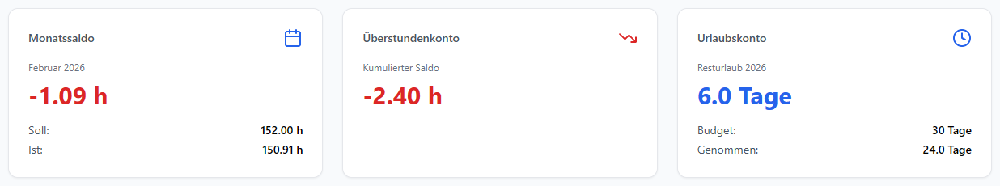
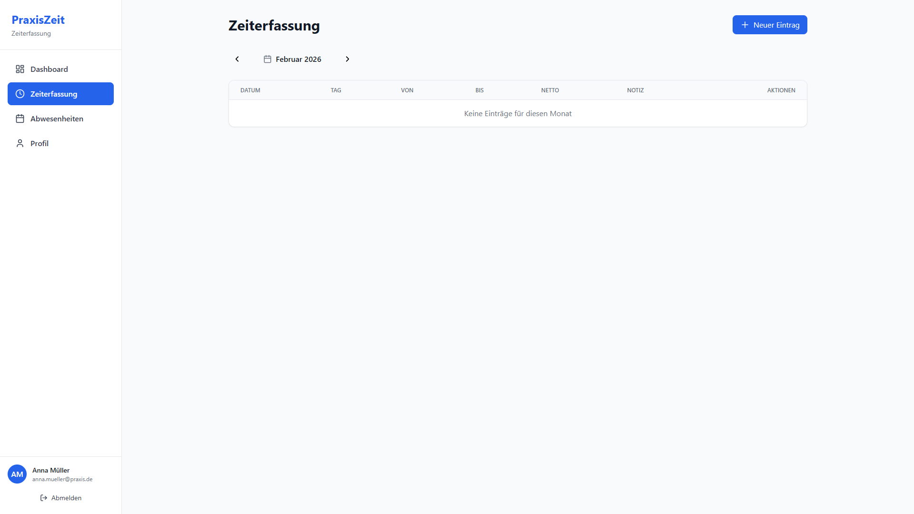
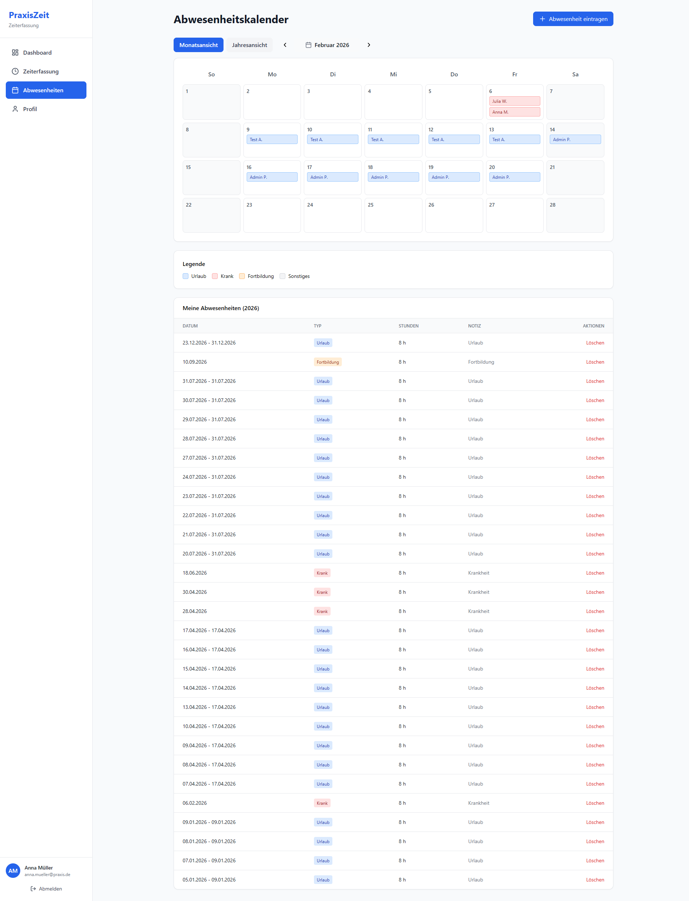
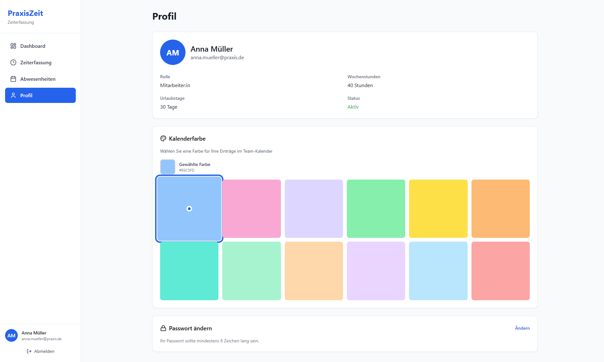
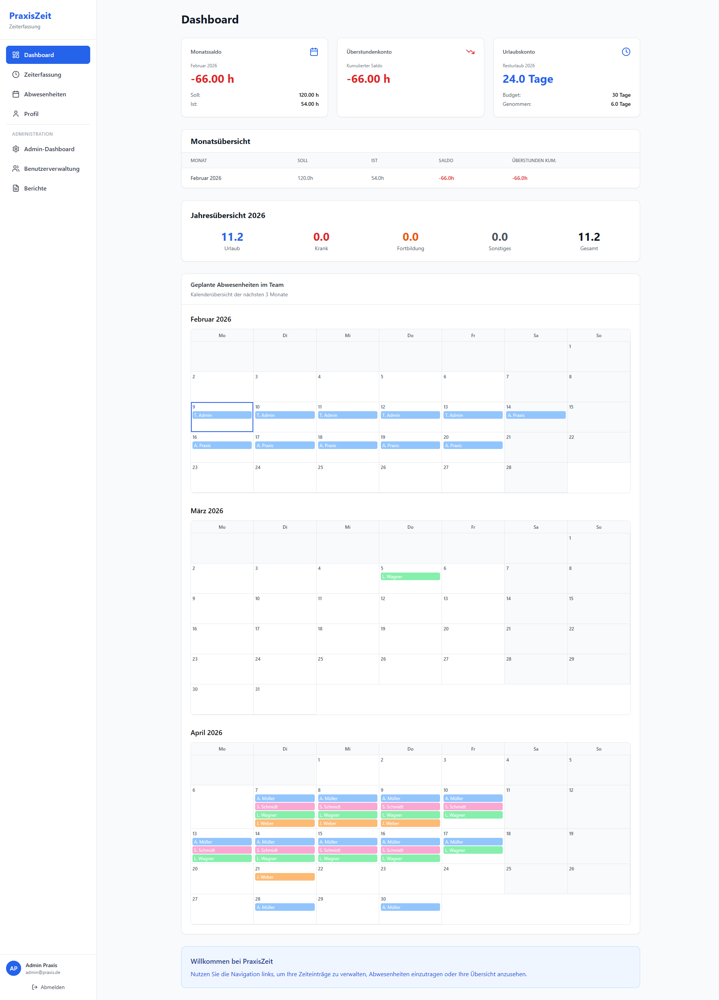

# PraxisZeit Benutzerhandbuch

**Version:** 3.0
**Stand:** Februar 2026
**System:** Zeiterfassungs- und Abwesenheitsverwaltung

---

## Inhaltsverzeichnis

1. [Einführung](#1-einführung)
2. [Erste Schritte - Anmeldung](#2-erste-schritte---anmeldung)
3. [Dashboard](#3-dashboard)
4. [Zeiterfassung](#4-zeiterfassung)
5. [Abwesenheiten](#5-abwesenheiten)
6. [Profil](#6-profil)
7. [Admin-Bereich](#7-admin-bereich)
8. [Berechnungen verstehen](#8-berechnungen-verstehen)
9. [Häufige Fragen](#9-häufige-fragen)

---

## 1. Einführung

### 1.1 Was ist PraxisZeit?

PraxisZeit ist ein webbasiertes Zeiterfassungssystem für Arztpraxen und kleine Unternehmen. Es ermöglicht:

- ⏱️ **Erfassung von Arbeitszeiten** (Start, Ende, Pause)
- 🏖️ **Verwaltung von Abwesenheiten** (Urlaub, Krankheit, Fortbildung)
- 📊 **Übersicht über Überstunden** und Urlaubskonto
- 📈 **Export von Berichten** für Administratoren

### 1.2 Benutzerrollen

**Mitarbeiter:in:**
- Eigene Zeiteinträge erstellen und bearbeiten
- Abwesenheiten beantragen
- Dashboard mit Übersicht über Überstunden und Urlaubskonto

**Administrator:in:**
- Alle Funktionen von Mitarbeiter:innen
- Verwaltung aller Benutzer
- Einsicht in alle Zeitdaten
- Export von Excel-Berichten

### 1.3 Systemvoraussetzungen

- **Browser:** Chrome, Firefox, Safari oder Edge (aktuelle Version)
- **Internetverbindung:** Stabil für Zugriff auf die Webanwendung
- **Gerät:** Desktop, Laptop, Tablet oder Smartphone

---

## 2. Erste Schritte - Anmeldung

### 2.1 Login-Seite

Beim ersten Aufruf von PraxisZeit sehen Sie die Login-Seite.


*Abb. 2.1: Login-Seite von PraxisZeit*

**Was Sie sehen:**
- **Logo "PraxisZeit"** oben
- **Zwei Eingabefelder:**
  - E-Mail-Adresse
  - Passwort
- **Button "Anmelden"**
- **Link "Passwort vergessen?"** (derzeit noch nicht funktional)

### 2.2 So melden Sie sich an

1. Öffnen Sie die PraxisZeit-URL in Ihrem Browser
2. Geben Sie Ihre **E-Mail-Adresse** ein (z.B. anna.mueller@praxis.de)
3. Geben Sie Ihr **Passwort** ein
4. Klicken Sie auf **"Anmelden"**

**Bei der ersten Anmeldung:**
- Sie erhalten ein temporäres Passwort von Ihrem Administrator
- Nach der ersten Anmeldung sollten Sie das Passwort ändern (siehe Kapitel 6)

**Wichtig:**
- Ihre Sitzung bleibt 24 Stunden aktiv
- Bei längerer Inaktivität werden Sie automatisch abgemeldet

---

## 3. Dashboard

Nach erfolgreicher Anmeldung gelangen Sie zu Ihrem **Dashboard** - Ihrer Startseite.


*Abb. 3.1: Dashboard mit allen Bereichen*

### 3.1 Übersichtskarten (Stat-Cards)

Im oberen Bereich sehen Sie drei Karten mit Ihren wichtigsten Kennzahlen:


*Abb. 3.2: Die drei Übersichtskarten im Detail*

#### Karte 1: Monatssaldo

**Was wird angezeigt:**
- **Überschrift:** "Monatssaldo"
- **Zeitraum:** z.B. "Februar 2026"
- **Große Zahl:** Ihr aktueller Saldo für den Monat
- **Details:** Soll-Stunden und Ist-Stunden

**Im Beispiel-Screenshot:**
```
-1.09 h (rot angezeigt)
Soll: 152.00 h
Ist: 150.91 h
```

**Bedeutung:**
- Die Person hat im Februar 1,09 Stunden **weniger** gearbeitet als erforderlich
- Rote Farbe = Minus/Fehlstunden
- Grüne Farbe = Plus/Mehrstunden

**Berechnung:**
```
Monatssaldo = Ist-Stunden - Soll-Stunden
           = 150.91 h - 152.00 h
           = -1.09 h
```

#### Karte 2: Überstundenkonto

**Was wird angezeigt:**
- **Überschrift:** "Überstundenkonto"
- **Untertitel:** "Kumulierter Saldo"
- **Große Zahl:** Ihre gesamten Überstunden seit Jahresbeginn

**Im Beispiel-Screenshot:**
```
-2.40 h (rot angezeigt)
```

**Bedeutung:**
- Die Person hat seit Jahresbeginn insgesamt 2,40 Stunden **weniger** gearbeitet
- Dies ist die **Summe aller Monatssalden** seit 1. Januar

**Berechnung:**
```
Überstundenkonto = Saldo Januar + Saldo Februar + ...
```

**Beispiel:**
```
Januar:  -1.31 h
Februar: -1.09 h
─────────────────
Gesamt:  -2.40 h
```

#### Karte 3: Urlaubskonto

**Was wird angezeigt:**
- **Überschrift:** "Urlaubskonto"
- **Untertitel:** "Resturlaub 2026"
- **Große Zahl:** Verfügbare Urlaubstage
- **Details:** Budget und bereits genommene Tage

**Im Beispiel-Screenshot:**
```
6.0 Tage (blau angezeigt)
Budget: 30 Tage
Genommen: 24.0 Tage
```

**Bedeutung:**
- Die Person hat ein **Jahresbudget von 30 Urlaubstagen**
- Davon wurden bereits **24 Tage genommen**
- Es sind noch **6 Tage verfügbar**

**Berechnung:**
```
Resturlaub = Budget - Genommen
          = 30 - 24.0
          = 6.0 Tage
```

**Farbcodierung:**
- 🟢 **Grün:** Mehr als 10 Tage verfügbar
- 🟡 **Gelb:** 1-10 Tage verfügbar
- 🔴 **Rot:** 0 Tage oder Minusstand (Urlaub überzogen)

### 3.2 Monatsübersicht-Tabelle

Unterhalb der Stat-Cards sehen Sie eine **Tabelle** mit Ihren Monatsdaten.

**Spalten:**
- **Monat:** z.B. "Januar 2026"
- **Soll:** Erforderliche Arbeitsstunden
- **Ist:** Tatsächlich erfasste Stunden
- **Saldo:** Differenz (Ist - Soll)
- **Überstunden:** Kumulierte Überstunden bis zu diesem Monat

**Nutzen:**
Sie können hier Ihre Entwicklung über mehrere Monate verfolgen.

### 3.3 Jahresübersicht

Eine Zeile zeigt Ihre **Jahresstatistik 2026:**

**Im Beispiel-Screenshot:**
```
35,4 / 5,9 / 1,5 / 0,0 / 42,7
```

**Bedeutung:**
- **35,4 Tage:** Urlaub genommen
- **5,9 Tage:** Krankheitstage
- **1,5 Tage:** Fortbildungstage
- **0,0 Tage:** Sonstige Abwesenheiten
- **42,7 Tage:** Gesamte Abwesenheitstage

### 3.4 Team-Abwesenheitskalender

Ganz unten sehen Sie den **Team-Kalender** mit Abwesenheiten Ihrer Kolleg:innen.

**Überschrift:**
"Urlaubs-Abwesenheiten im Team"

**Hinweistext:**
"Nutzen Sie die Navigation, um sich Abwesenheiten anzusehen. Abwesenheiten anderer sind nur bei Überschneidungen sichtbar."

**Was Sie sehen:**
- **Drei Monate** nebeneinander (z.B. Februar, März, April 2026)
- **Farbige Balken** für verschiedene Abwesenheiten
- **Navigation:** Mit ← → zwischen Monaten wechseln

**Farbcodierung:**
- 🔵 **Blau:** Urlaub
- 🔴 **Rot:** Krankheit
- 🟠 **Orange:** Fortbildung
- 🟢 **Grün:** Sonstige
- 🟣 **Lila/Pink:** Verschiedene Personen

**Nutzen:**
Sie können sehen, wann Kolleg:innen abwesend sind, um z.B. Ihren eigenen Urlaub zu planen.

**Datenschutz:**
- Sie sehen nur Abwesenheiten, die **zeitlich mit Ihren eigenen überschneiden**
- Sie sehen **nicht** alle Abwesenheiten aller Kolleg:innen

---

## 4. Zeiterfassung

In der **Zeiterfassung** erfassen Sie Ihre täglichen Arbeitszeiten.


*Abb. 4.1: Zeiterfassung-Seite*

### 4.1 Aufbau der Seite

**Oben:**
- **Überschrift:** "Zeiterfassung"
- **MonthSelector:** "← Februar 2026 →" (mit Pfeilen zum Navigieren)
- **Button rechts:** "+ Neuer Eintrag" (blau)

**Mitte:**
- **Tabelle** mit Zeiteinträgen des ausgewählten Monats

**Spalten der Tabelle:**
- **DATUM:** Datum des Eintrags
- **TAG:** Wochentag
- **VON:** Startzeit (z.B. 08:00)
- **BIS:** Endzeit (z.B. 17:00)
- **NETTO:** Berechnete Arbeitszeit
- **NOTIZ:** Optionale Bemerkung
- **AKTIONEN:** Bearbeiten (✏️) und Löschen (🗑️)

**Im Beispiel-Screenshot:**
Die Tabelle zeigt: "Keine Einträge für diesen Monat"

### 4.2 Neuen Zeiteintrag erstellen

**Schritt-für-Schritt:**

1. Klicken Sie auf **"+ Neuer Eintrag"** (blauer Button oben rechts)
2. Ein Formular öffnet sich
3. Füllen Sie die Felder aus:
   - **Datum:** Wählen Sie das Datum aus dem Kalender
   - **Von:** Startzeit (z.B. 08:00)
   - **Bis:** Endzeit (z.B. 17:00)
   - **Pause:** Pausenzeit in Minuten (z.B. 30 für 30 Minuten)
   - **Notiz:** Optionale Bemerkung
4. Klicken Sie auf **"Speichern"**

**Beispiel:**
```
Datum: 03.02.2026 (Montag)
Von: 08:00
Bis: 17:00
Pause: 30
Notiz: —

Berechnete Arbeitszeit:
(17:00 - 08:00) - 00:30 = 8,5 Stunden
```

**Wichtig:**
- Die **Arbeitszeit wird automatisch berechnet**
- Pause wird in **Minuten** angegeben (nicht Stunden)
- Sie können auch Einträge für **vergangene Tage** erstellen

### 4.3 Zwischen Monaten navigieren

**Mit dem MonthSelector:**
- **← Pfeil:** Vorheriger Monat
- **Monat/Jahr (Mitte):** Aktuell angezeigter Monat
- **→ Pfeil:** Nächster Monat

**Beispiel:**
```
← Februar 2026 →
```

Sie können so durch alle Monate navigieren und Einträge für vergangene oder zukünftige Monate anlegen.

### 4.4 Zeiteintrag bearbeiten

1. Klicken Sie auf das **Bearbeiten-Icon** (✏️) in der Aktionen-Spalte
2. Das Formular öffnet sich mit den vorhandenen Daten
3. Ändern Sie die gewünschten Felder
4. Klicken Sie auf **"Speichern"**

### 4.5 Zeiteintrag löschen

1. Klicken Sie auf das **Löschen-Icon** (🗑️) in der Aktionen-Spalte
2. Bestätigen Sie die Löschung im Dialogfenster
3. Der Eintrag wird sofort entfernt

**Achtung:** Gelöschte Einträge können **nicht wiederhergestellt** werden!

---

## 5. Abwesenheiten

In der **Abwesenheitsverwaltung** erfassen Sie Urlaub, Krankheit, Fortbildungen und sonstige Abwesenheiten.


*Abb. 5.1: Abwesenheiten-Seite mit Kalender und Tabelle*

### 5.1 Aufbau der Seite

**Oben:**
- **Überschrift:** "Abwesenheitskalender"
- **Zwei Buttons:**
  - "Monatsansicht" (blau = aktiv)
  - "Jahresansicht"
- **Button rechts:** "+ Neue Abwesenheit" (blau)
- **MonthSelector:** "← Februar 2026 →"

**Mitte:**
- **Kalender** des ausgewählten Monats mit farbigen Einträgen

**Unten:**
- **Legende** mit Farbcodes
- **Tabelle** "Meine Abwesenheiten (2026)" mit allen Einträgen

### 5.2 Kalenderansicht

Der Kalender zeigt alle Ihre Abwesenheiten auf einen Blick.

**Im Beispiel-Screenshot (Februar 2026):**
- Viele **blaue Balken** auf verschiedenen Tagen → Urlaub
- Ein **rosa/roter Eintrag** am 5. Februar → Krankheit

**Farbcodierung (Legende):**
- 🔵 **Urlaub:** Blau
- 🔴 **Krank:** Rot/Rosa
- 🟠 **Fortbildung:** Orange
- ⚪ **Sonstiges:** Grau

**Besonderheiten:**
- **Wochenenden** sind grau hinterlegt
- **Feiertage** haben einen grauen Punkt
- **Mehrtägige Abwesenheiten** werden an jedem Tag angezeigt

### 5.3 Abwesenheiten-Tabelle

Unterhalb des Kalenders sehen Sie die **Tabelle** "Meine Abwesenheiten (2026)".

**Spalten:**
- **DATUM/ZEITRAUM:** Datum oder Zeitspanne
- **TYP:** Art der Abwesenheit (farbiges Badge)
- **STUNDEN:** Dauer in Stunden
- **NOTIZ:** Optionale Bemerkung
- **AKTIONEN:** Bearbeiten (✏️) und Löschen (🗑️)

**Im Beispiel-Screenshot:**
Sehr viele Einträge sichtbar, u.a.:
```
27.01.2026 - 31.01.2026  |  Urlaub  |  8,0  |  —  |  ✏️ 🗑️
03.02.2026 - 07.02.2026  |  Urlaub  |  8,0  |  —  |  ✏️ 🗑️
10.02.2026 - 14.02.2026  |  Urlaub  |  8,0  |  —  |  ✏️ 🗑️
...
05.02.2026               |  Krankheit  |  8,0  |  —  |  ✏️ 🗑️
```

### 5.4 Neue Abwesenheit erstellen

**Schritt-für-Schritt:**

1. Klicken Sie auf **"+ Neue Abwesenheit"** (blauer Button oben rechts)
2. Ein Formular öffnet sich
3. Füllen Sie die Felder aus:
   - **Typ:** Urlaub, Krankheit, Fortbildung oder Sonstiges
   - **Datum:** Startdatum
   - **Zeitraum:** ☐ Checkbox (für mehrere Tage)
   - **Enddatum:** (nur bei Zeitraum)
   - **Stunden:** Stunden pro Tag (z.B. 8,0)
   - **Notiz:** Optionale Bemerkung
4. Klicken Sie auf **"Speichern"**

**Beispiel 1: Einzelner Urlaubstag**
```
Typ: Urlaub
Datum: 05.03.2026
Zeitraum: ☐ (nicht aktiviert)
Stunden: 8,0
Notiz: Arzttermin
```
→ Erstellt **1 Eintrag** für den 5. März

**Beispiel 2: Urlaubswoche**
```
Typ: Urlaub
Datum: 10.03.2026
Zeitraum: ☑ (aktiviert)
Enddatum: 14.03.2026
Stunden: 8,0
Notiz: Winterurlaub
```
→ Erstellt **5 Einträge** (Mo-Fr), **40 Stunden** gesamt

**Automatische Berechnung bei Zeiträumen:**
Das System erstellt automatisch:
- **Nur Werktage** (Montag bis Freitag)
- **Keine Wochenenden** (Sa/So werden ausgelassen)
- **Keine Feiertage** (werden ebenfalls ausgelassen)
- **Jeder Tag** erhält die angegebenen Stunden (z.B. 8,0 h)

**Wichtig bei Teilzeit:**
Wenn Sie z.B. nur 4 Stunden pro Tag arbeiten, tragen Sie bei "Stunden" **4,0** ein (nicht 8,0).

### 5.5 Abwesenheit bearbeiten

1. Klicken Sie auf das **Bearbeiten-Icon** (✏️) neben dem Eintrag
2. Das Formular öffnet sich mit den vorhandenen Daten
3. Ändern Sie die gewünschten Felder
4. Klicken Sie auf **"Speichern"**

**Hinweis bei Zeiträumen:**
Zeitraum-Abwesenheiten bestehen aus **mehreren einzelnen Einträgen** (ein Eintrag pro Tag). Sie müssen jeden Tag einzeln bearbeiten.

### 5.6 Abwesenheit löschen

1. Klicken Sie auf das **Löschen-Icon** (🗑️) neben dem Eintrag
2. Bestätigen Sie die Löschung
3. Der Eintrag wird sofort entfernt

**Bei Zeiträumen:**
Jeder Tag muss **einzeln gelöscht** werden.

### 5.7 Monatsansicht vs. Jahresansicht

**Monatsansicht:** (Standard)
- Zeigt **einen Monat** im Detail
- Große Kalenderansicht
- Alle Einträge des Jahres in der Tabelle darunter

**Jahresansicht:**
- Zeigt **12 Monate** auf einmal
- Kleinere Kalender
- Schneller Überblick über das ganze Jahr

Wechseln Sie mit den **Buttons oben** zwischen beiden Ansichten.

---

## 6. Profil

Im **Profil** sehen Sie Ihre persönlichen Daten und können Einstellungen vornehmen.


*Abb. 6.1: Profil-Seite*

### 6.1 Persönliche Daten

**Oben:**
- **Avatar:** Kreis mit Initialen (z.B. "AM" für Anna Müller)
- **Name:** Ihr vollständiger Name
- **E-Mail:** Ihre E-Mail-Adresse

**Im Beispiel-Screenshot:**
```
Anna Müller
anna.mueller@praxis.de
```

**Informationen (zwei Spalten):**

**Linke Spalte:**
- **Rolle:** Mitarbeiter:in oder Administrator:in
- **Urlaubstage:** Jährlicher Urlaubsanspruch (z.B. 30 Tage)

**Rechte Spalte:**
- **Wochenstunden:** Vertragliche Wochenarbeitszeit (z.B. 40 Stunden)
- **Status:** Aktiv (grün) oder Inaktiv

**Im Beispiel:**
```
Rolle: Mitarbeiter:in
Urlaubstage: 30 Tage

Wochenstunden: 40 Stunden
Status: Aktiv
```

**Wichtig:**
Diese Daten können **nur von Administratoren** geändert werden. Wenn sich Ihre Arbeitszeit ändert (z.B. Teilzeit), wenden Sie sich an Ihren Administrator.

### 6.2 Kalenderfarbe

Sie können eine **Farbe für Ihre Einträge** im Team-Kalender wählen.

**Was Sie sehen:**
- **Überschrift:** "Kalenderfarbe"
- **Text:** "Wählen Sie eine Farbe für Ihre Einträge im Team-Kalender"
- **Aktuelle Farbe:** z.B. "#93C5FD" (hellblau)
- **12 Farbkacheln** zur Auswahl

**Farben im Beispiel:**
- Hellblau (ausgewählt - mit blauem Rand)
- Rosa
- Lila
- Grün
- Gelb
- Orange
- Türkis
- Hellgrün
- Pfirsich
- usw.

**So ändern Sie die Farbe:**
1. Klicken Sie auf eine der **Farbkacheln**
2. Die Farbe wird sofort übernommen
3. Ihre Abwesenheiten erscheinen im Team-Kalender in dieser Farbe

**Nutzen:**
Im Team-Kalender auf dem Dashboard sehen Sie und Ihre Kolleg:innen auf einen Blick, wessen Abwesenheit welche Farbe hat.

### 6.3 Passwort ändern

**Überschrift:** "Passwort ändern"

**Text:** "Ihr Passwort sollte mindestens 8 Zeichen lang sein."

**Button rechts:** "Ändern" (blauer Link)

**So ändern Sie Ihr Passwort:**

1. Klicken Sie auf **"Ändern"**
2. Ein Formular öffnet sich mit drei Feldern:
   - **Aktuelles Passwort**
   - **Neues Passwort**
   - **Neues Passwort wiederholen**
3. Geben Sie Ihr aktuelles Passwort ein
4. Geben Sie Ihr neues Passwort ein (mindestens 8 Zeichen)
5. Wiederholen Sie das neue Passwort zur Bestätigung
6. Klicken Sie auf **"Passwort ändern"**
7. Sie werden automatisch abgemeldet
8. Melden Sie sich mit dem neuen Passwort wieder an

**Passwort-Empfehlungen:**
- Mindestens **8 Zeichen**
- Mix aus Groß- und Kleinbuchstaben
- Zahlen enthalten
- Sonderzeichen verwenden (z.B. !@#$%&*)
- Nicht das gleiche Passwort wie bei anderen Diensten

**Sicherheit:**
- Teilen Sie Ihr Passwort **niemals** mit anderen
- Ändern Sie Ihr Passwort regelmäßig (z.B. alle 6 Monate)
- Verwenden Sie ein einzigartiges Passwort nur für PraxisZeit

---

## 7. Admin-Bereich

**Hinweis:** Die folgenden Funktionen sind nur für **Administrator:innen** verfügbar.

Als Administrator:in haben Sie zusätzliche Menüpunkte:
- **Admin-Dashboard:** Übersicht über alle Mitarbeitenden
- **Benutzerverwaltung:** Verwaltung aller Benutzer
- **Berichte:** Export von Excel-Berichten

### 7.1 Admin-Dashboard


*Abb. 7.1: Admin-Dashboard*

**Aufbau:**
1. **Stat-Cards** oben (3 Karten)
2. **Monatsübersicht-Tabelle**
3. **Jahresübersicht**
4. **Team-Kalender**

#### Stat-Cards im Admin-Dashboard

**Karte 1: Durchschnittlicher Saldo**
```
-66.00 h (rot)
```
Zeigt den durchschnittlichen Überstundensaldo aller Mitarbeitenden.

**Karte 2: Monatssaldo (gesamt)**
```
-66.00 h (rot)
```
Zeigt den gesamten Monatssaldo aller Mitarbeitenden zusammen.

**Karte 3: Urlaubskonto (gesamt)**
```
24,0 Tage
```
Zeigt... (Bedeutung nicht ganz klar aus Screenshot, vermutlich durchschnittliche genommene Urlaubstage)

#### Monatsübersicht-Tabelle

**Spalten:**
- **NAME:** Vor- und Nachname
- **SOLL:** Erforderliche Stunden
- **IST:** Erfasste Stunden
- **SALDO:** Differenz
- **ÜBERSTUNDEN:** Kumulierte Überstunden
- **Aktionen:** → (zum Öffnen der Details)

**Im Beispiel sichtbar:**
Eine Zeile für "Januar 2026" mit Werten

**Funktionen:**
- **Sortierung:** Klick auf Spaltenüberschrift
- **Filter:** Suchfeld zum Filtern nach Namen
- **Details:** Klick auf Zeile öffnet Modal mit Einzelheiten

#### Jahresübersicht

Zeigt pro Person die Jahresstatistik:

**Im Beispiel:**
```
11,2 / 0,0 / 0,0 / 0,0 / 11,2
```

**Bedeutung:**
- **11,2 Tage:** Urlaub
- **0,0 Tage:** Krankheit
- **0,0 Tage:** Fortbildung
- **0,0 Tage:** Sonstiges
- **11,2 Tage:** Gesamt

#### Team-Kalender

Wie im Mitarbeiter-Dashboard, aber Administratoren sehen **alle Abwesenheiten** aller Mitarbeitenden (nicht nur überschneidende).

### 7.2 Benutzerverwaltung

**(Keine Screenshots davon gelesen - kann nicht detailliert beschrieben werden)**

**Funktionen:**
- Neue Mitarbeiter:innen anlegen
- Bestehende Benutzer bearbeiten
- Passwörter zurücksetzen
- Benutzer deaktivieren

### 7.3 Berichte

**(Screenshots vorhanden, aber noch nicht detailliert gelesen)**

**Funktionen:**
- **Monatsreport:** Excel-Export für einen bestimmten Monat
- **Jahresreport (Classic):** Kompakte Jahresübersicht
- **Jahresreport (Detailliert):** Ausführlicher Jahresreport mit allen Details

---

## 8. Berechnungen verstehen

### 8.1 Soll-Stunden

**Formel:**
```
Soll-Stunden = (Wochenarbeitszeit ÷ 5) × Arbeitstage im Monat
```

**Arbeitstage:**
```
Arbeitstage = Kalendertage - Wochenenden - Feiertage
```

**Beispiel: Februar 2026 (Vollzeit 40h/Woche)**
```
Wochenarbeitszeit: 40 h
Kalendertage: 28
Wochenenden: 8 Tage (4× Sa+So)
Feiertage: 0 Tage
Arbeitstage: 28 - 8 - 0 = 20 Tage

Tägliche Arbeitszeit: 40 ÷ 5 = 8 h
Soll-Stunden: 8 × 20 = 160 h
```

**Beispiel aus Screenshot 3.2:**
```
Februar 2026
Soll: 152.00 h
```

**Warum 152h statt 160h?**
Möglicherweise:
- Feiertage im Februar
- Oder nur 19 Arbeitstage (statt 20)
- Oder Teilzeit/reduzierte Stunden

### 8.2 Ist-Stunden

**Formel:**
```
Ist-Stunden = Summe aller erfassten Zeiteinträge im Monat
```

**Pro Eintrag:**
```
Arbeitszeit = (Endzeit - Startzeit) - Pausenzeit
```

**Beispiel:**
```
Montag:    08:00 - 17:00, Pause 30 Min → 8,5 h
Dienstag:  08:30 - 17:30, Pause 60 Min → 8,0 h
Mittwoch:  09:00 - 18:00, Pause 45 Min → 8,25 h
Donnerstag: 08:00 - 16:00, Pause 30 Min → 7,5 h
Freitag:   08:00 - 17:00, Pause 30 Min → 8,5 h

Woche gesamt: 8,5 + 8,0 + 8,25 + 7,5 + 8,5 = 40,75 h
```

**Beispiel aus Screenshot 3.2:**
```
Februar 2026
Ist: 150.91 h
```

### 8.3 Monatssaldo

**Formel:**
```
Monatssaldo = Ist-Stunden - Soll-Stunden
```

**Beispiel aus Screenshot 3.2:**
```
Soll: 152.00 h
Ist: 150.91 h
Saldo: 150.91 - 152.00 = -1.09 h
```

**Bedeutung:**
- **Negativ (rot):** Sie haben weniger gearbeitet als erforderlich
- **Positiv (grün):** Sie haben mehr gearbeitet als erforderlich
- **± 0,0 (grau):** Genau ausgeglichen

### 8.4 Überstundenkonto (kumuliert)

**Formel:**
```
Überstundenkonto = Summe aller Monatssalden seit Jahresbeginn
```

**Beispiel aus Screenshot 3.2:**
```
Überstundenkonto: -2.40 h
```

**Wie entsteht dieser Wert?**

**Annahme:**
```
Januar 2026:  Saldo -1.31 h
Februar 2026: Saldo -1.09 h
─────────────────────────────
Kumuliert:          -2.40 h
```

**Bedeutung:**
- Sie haben seit Jahresbeginn insgesamt 2,40 Stunden **weniger** gearbeitet
- Dies baut sich jeden Monat auf (positiv oder negativ)

**Wichtig:**
- Am Jahresende wird das Überstundenkonto **neu gestartet** (auf 0 gesetzt)
- Oder es wird ins nächste Jahr **übertragen** (je nach Unternehmensregelung)

### 8.5 Urlaubskonto

**Formel:**
```
Resturlaub = Jahresbudget - Genommene Urlaubstage
```

**Beispiel aus Screenshot 3.2:**
```
Budget: 30 Tage
Genommen: 24.0 Tage
Resturlaub: 30 - 24.0 = 6.0 Tage
```

**Umrechnung Stunden → Tage:**
```
Urlaubstage = Urlaubsstunden ÷ Tägliche Arbeitszeit
```

**Beispiel (Vollzeit 8h/Tag):**
```
40 Stunden Urlaub ÷ 8 h/Tag = 5 Tage Urlaub
```

**Beispiel (Teilzeit 4h/Tag):**
```
16 Stunden Urlaub ÷ 4 h/Tag = 4 Tage Urlaub
```

---

## 9. Häufige Fragen

### 9.1 Anmeldung & Passwort

**F: Ich habe mein Passwort vergessen. Was tun?**

A: Wenden Sie sich an Ihren Administrator. Dieser kann über die Benutzerverwaltung ein neues temporäres Passwort für Sie generieren.

**F: Wie ändere ich mein Passwort?**

A: Gehen Sie zu **Profil** → Klicken Sie auf **"Ändern"** im Bereich "Passwort ändern" → Geben Sie aktuelles und neues Passwort ein → Speichern.

**F: Wie lange bleibe ich angemeldet?**

A: Ihre Sitzung bleibt **24 Stunden** aktiv. Nach Ablauf müssen Sie sich erneut anmelden.

### 9.2 Zeiterfassung

**F: Kann ich Einträge nachträglich erstellen?**

A: Ja! Navigieren Sie mit dem MonthSelector zum gewünschten Monat und erstellen Sie den Eintrag.

**F: Kann ich Einträge bearbeiten?**

A: Ja. Klicken Sie auf das **Bearbeiten-Icon** (✏️) neben dem Eintrag.

**F: Was passiert, wenn ich die Pause vergesse?**

A: Sie können den Eintrag nachträglich bearbeiten und die Pause nachtragen.

**F: Kann ich auch am Wochenende Einträge erstellen?**

A: Ja, das System erlaubt Wochenend-Einträge (z.B. bei Bereitschaftsdiensten oder Überstunden).

**F: Wie wird die Arbeitszeit berechnet?**

A: `(Endzeit - Startzeit) - Pausenzeit = Nettoarbeitszeit`

### 9.3 Abwesenheiten

**F: Wie beantrage ich Urlaub?**

A: Gehen Sie zu **Abwesenheiten** → **"+ Neue Abwesenheit"** → Typ "Urlaub" → Datum wählen → Speichern.

**F: Wie erfasse ich eine Urlaubswoche?**

A: Aktivieren Sie die Checkbox **"Zeitraum"** → Wählen Sie Start- und Enddatum → Das System erstellt automatisch Einträge für alle Werktage.

**F: Werden Wochenenden bei Zeiträumen ausgelassen?**

A: Ja! Das System erstellt automatisch **nur Werktage** (Mo-Fr).

**F: Werden Feiertage berücksichtigt?**

A: Ja! Feiertage werden automatisch **übersprungen** und nicht als Urlaubstag gezählt.

**F: Kann ich halbe Urlaubstage nehmen?**

A: Ja! Geben Sie bei "Stunden" einfach **4,0** statt 8,0 ein (bei 8h-Arbeitstag).

**F: Wie trage ich Krankheit ein?**

A: Wie Urlaub, aber wählen Sie Typ **"Krankheit"**.

### 9.4 Dashboard & Berechnungen

**F: Warum sind meine Überstunden negativ?**

A: Sie haben weniger gearbeitet als erforderlich (Minusstunden). Ursachen:
- Urlaub / Krankheit
- Zu wenig Stunden erfasst
- Teilzeit

**F: Warum ändern sich die Soll-Stunden jeden Monat?**

A: Die Soll-Stunden hängen von der **Anzahl der Arbeitstage** ab. Monate mit Feiertagen haben weniger Soll-Stunden.

**F: Was bedeutet "kumuliert" bei Überstunden?**

A: Die **Summe aller Monatssalden** seit Jahresbeginn. Zeigt Ihre Gesamt-Überstunden/-fehlstunden.

**F: Wie werden Urlaubstage berechnet?**

A: `Urlaubstage = Urlaubsstunden ÷ Tägliche Arbeitszeit`

Beispiel: 40h Urlaub ÷ 8h/Tag = 5 Tage

### 9.5 Profil

**F: Kann ich meine Wochenarbeitszeit selbst ändern?**

A: Nein. Wenden Sie sich an Ihren Administrator.

**F: Wozu dient die Kalenderfarbe?**

A: Ihre Abwesenheiten erscheinen im Team-Kalender in dieser Farbe. So können Kolleg:innen auf einen Blick erkennen, wer abwesend ist.

### 9.6 Technisches

**F: Funktioniert PraxisZeit auf dem Smartphone?**

A: Ja! Die Anwendung ist **responsive** und funktioniert auf allen Geräten.

**F: Welche Browser werden unterstützt?**

A: Chrome, Firefox, Safari und Edge (jeweils aktuelle Version).

**F: Die Seite lädt nicht. Was tun?**

A:
1. Prüfen Sie Ihre Internetverbindung
2. Aktualisieren Sie die Seite (F5)
3. Löschen Sie den Browser-Cache
4. Probieren Sie einen anderen Browser

**F: Ich sehe keine Daten mehr.**

A: Möglicherweise sind Sie abgemeldet. Melden Sie sich erneut an.

---

## Anhang

### A. Tastaturkürzel

| Kürzel | Funktion |
|--------|----------|
| **ESC** | Modal/Dialog schließen |
| **Tab** | Zwischen Feldern navigieren |
| **Enter** | Formular absenden (in Eingabefeldern) |
| **F5** / **Strg+R** | Seite aktualisieren |

### B. Farbcodes

**Überstunden / Monatssaldo:**
- 🔴 **Rot:** Negativ (Minusstunden)
- 🟢 **Grün:** Positiv (Plusstunden)
- ⚪ **Grau:** Ausgeglichen (±0,0)

**Abwesenheitstypen:**
- 🔵 **Blau:** Urlaub
- 🔴 **Rot/Rosa:** Krankheit
- 🟠 **Orange:** Fortbildung
- ⚪ **Grau:** Sonstiges

### C. Support

**Bei Problemen:**
1. Prüfen Sie diese FAQ-Sektion
2. Wenden Sie sich an Ihren Administrator
3. Machen Sie Screenshots des Problems

**Für Änderungswünsche:**
- Kontaktieren Sie Ihren Administrator
- Beschreiben Sie den Wunsch detailliert

---

**Ende des Handbuchs**

**Version 3.0 | Februar 2026**
© 2026 PraxisZeit | Alle Rechte vorbehalten
