# PraxisZeit Benutzerhandbuch

**Version:** 1.0
**Stand:** Februar 2026
**System:** Zeiterfassungs- und Abwesenheitsverwaltung

---

## Inhaltsverzeichnis

1. [Einführung](#1-einführung)
2. [Anmeldung](#2-anmeldung)
3. [Dashboard (Mitarbeiter:in)](#3-dashboard-mitarbeiterin)
4. [Zeiterfassung](#4-zeiterfassung)
5. [Abwesenheiten](#5-abwesenheiten)
6. [Profil](#6-profil)
7. [Admin-Dashboard](#7-admin-dashboard)
8. [Benutzerverwaltung](#8-benutzerverwaltung)
9. [Berichte & Export](#9-berichte--export)
10. [Berechnungen & Beispiele](#10-berechnungen--beispiele)
11. [Häufig gestellte Fragen](#11-häufig-gestellte-fragen)

---

## 1. Einführung

### 1.1 Über PraxisZeit

PraxisZeit ist ein modernes Zeiterfassungssystem für kleine und mittlere Unternehmen. Es ermöglicht die einfache Erfassung von Arbeitszeiten, die Verwaltung von Abwesenheiten (Urlaub, Krankheit, Fortbildung) und bietet umfassende Auswertungsmöglichkeiten für Administratoren.

### 1.2 Hauptfunktionen

- ✅ **Zeiterfassung:** Erfassung von Start-, End- und Pausenzeiten
- 📊 **Dashboard:** Übersicht über Überstunden und Urlaubskonto
- 🏖️ **Abwesenheitsverwaltung:** Urlaub, Krankheit, Fortbildung, Sonstiges
- 👥 **Benutzerverwaltung:** Verwaltung von Mitarbeitenden (nur Admin)
- 📈 **Auswertungen:** Monats- und Jahresberichte als Excel-Export
- 📱 **Responsive Design:** Nutzbar auf Desktop, Tablet und Smartphone

### 1.3 Benutzerrollen

**Mitarbeiter:in (Employee):**
- Eigene Zeiten erfassen
- Abwesenheiten beantragen
- Eigenes Dashboard und Profil einsehen

**Administrator:in (Admin):**
- Alle Funktionen von Mitarbeiter:in
- Verwaltung aller Mitarbeitenden
- Einsicht in alle Zeiten und Abwesenheiten
- Export von Berichten
- Benutzerverwaltung

---

## 2. Anmeldung

### 2.1 Login-Seite

Die Anmeldung erfolgt über die Login-Seite mit E-Mail-Adresse und Passwort.

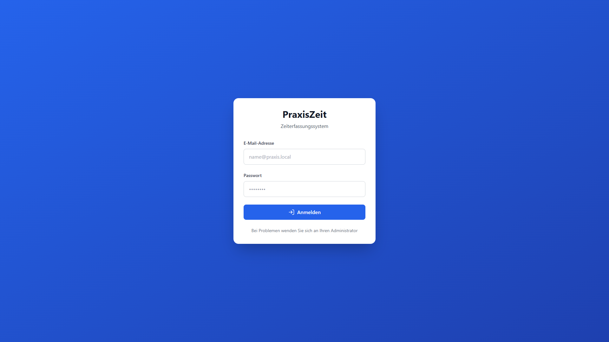
*Abbildung 2.1: Login-Seite mit E-Mail und Passwort-Feldern*

**Schritte:**
1. Öffnen Sie die PraxisZeit-URL in Ihrem Browser
2. Geben Sie Ihre **E-Mail-Adresse** ein
3. Geben Sie Ihr **Passwort** ein
4. Klicken Sie auf **"Anmelden"**

**Hinweise:**
- Bei der ersten Anmeldung erhalten Sie ein temporäres Passwort von Ihrem Administrator
- Sie können Ihr Passwort später in Ihrem Profil ändern
- Die Session bleibt für 24 Stunden aktiv

### 2.2 Passwort vergessen

Wenn Sie Ihr Passwort vergessen haben, wenden Sie sich bitte an Ihren Administrator. Dieser kann über die Benutzerverwaltung ein neues temporäres Passwort für Sie generieren.

---

## 3. Dashboard (Mitarbeiter:in)

Das Dashboard ist Ihre Startseite nach der Anmeldung und bietet eine Übersicht über Ihre aktuelle Arbeitszeitsituation.

### 3.1 Stat-Cards (Übersichtskarten)

Im oberen Bereich sehen Sie drei wichtige Kennzahlen:

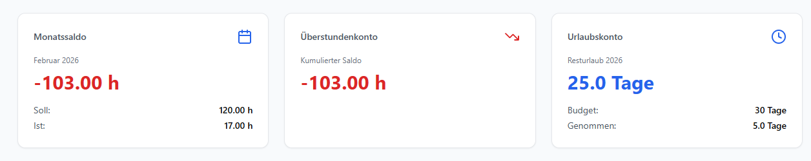
*Abbildung 3.1: Dashboard mit drei Stat-Cards (Überstunden, Urlaubskonto, Monatssaldo)*

#### 3.1.1 Überstunden (kumuliert)

Zeigt Ihren **aktuellen Überstundensaldo** (kumuliert seit Jahresbeginn).

- **Grün (+):** Plusstunden
- **Rot (-):** Minusstunden
- Aktualisiert sich automatisch bei neuen Zeiteinträgen

**Beispiel:**
```
+12,5h
```
Sie haben 12,5 Stunden mehr gearbeitet als erforderlich.

#### 3.1.2 Urlaubskonto

Zeigt Ihren **aktuellen Urlaubsstatus**.

**Anzeige:**
- **Budget:** Gesamte Urlaubstage pro Jahr (z.B. 30 Tage)
- **Verbraucht:** Bereits genommene Urlaubstage
- **Verfügbar:** Verbleibende Urlaubstage

**Farben:**
- 🟢 **Grün:** > 5 Tage verfügbar
- 🟡 **Gelb:** 1-5 Tage verfügbar
- 🔴 **Rot:** 0 oder negative Tage

**Beispiel:**
```
Budget: 30 Tage
Verbraucht: 12,5 Tage
Verfügbar: 17,5 Tage
```

#### 3.1.3 Monatssaldo

Zeigt Ihr **Soll/Ist-Verhältnis für den aktuellen Monat**.

- **Soll:** Erforderliche Arbeitsstunden (basiert auf Wochenarbeitszeit)
- **Ist:** Tatsächlich erfasste Stunden
- **Saldo:** Differenz (Ist - Soll)

**Beispiel:**
```
Soll: 160,0h
Ist: 165,5h
Saldo: +5,5h
```

### 3.2 Team Absences Calendar

Der **Team-Abwesenheitskalender** zeigt alle Abwesenheiten Ihrer Kolleg:innen für die nächsten 3 Monate.

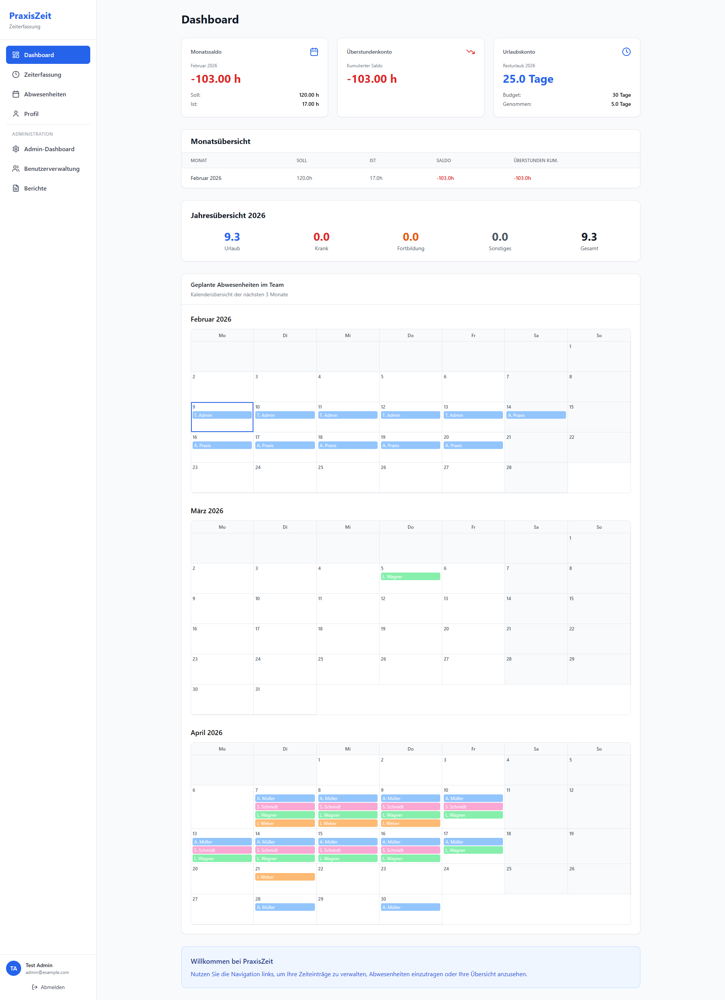
*Abbildung 3.2: Team-Abwesenheitskalender mit farbcodierten Abwesenheiten*

**Funktionen:**
- **Monatsnavigation:** Mit ← → durch Monate navigieren
- **Heute-Button:** Zurück zum aktuellen Monat springen
- **Farbcodierung:**
  - 🔵 **Blau:** Urlaub
  - 🔴 **Rot:** Krankheit
  - 🟠 **Orange:** Fortbildung
  - ⚪ **Grau:** Feiertage

**Hinweis:** Wochenenden sind grau hinterlegt und nicht klickbar.

### 3.3 Mobile Ansicht

Auf mobilen Geräten werden die Stat-Cards untereinander angezeigt, und der Kalender passt sich der Bildschirmbreite an.

---

## 4. Zeiterfassung

Die Zeiterfassung ermöglicht das Erfassen und Verwalten Ihrer täglichen Arbeitszeiten.

### 4.1 Wochenansicht

Die **Wochenansicht** zeigt alle Zeiteinträge der aktuellen Woche in einer Tabelle.

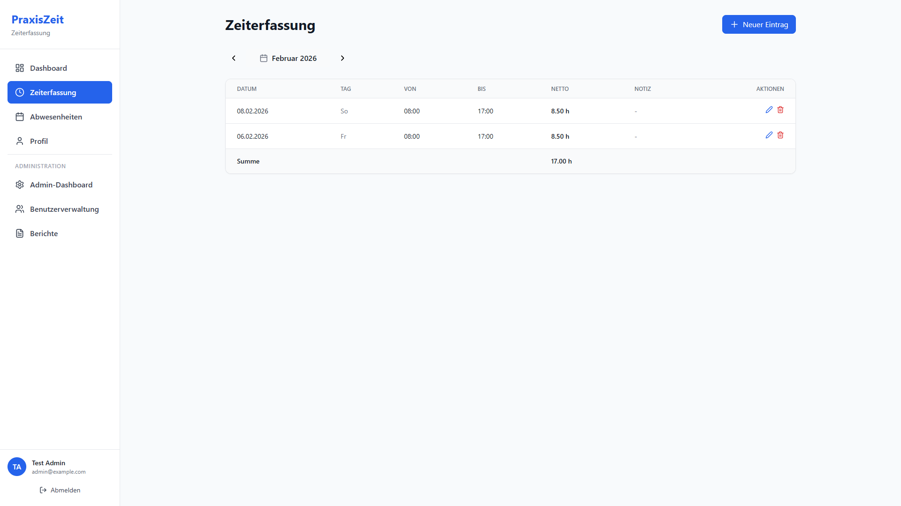
*Abbildung 4.1: Zeiterfassung mit Wochenansicht und MonthSelector*

**Spalten:**
- **Datum:** Wochentag und Datum (z.B. "Mo, 03.02.2026")
- **Start:** Arbeitsbeginn (z.B. "08:00")
- **Ende:** Arbeitsende (z.B. "17:00")
- **Stunden:** Gearbeitete Stunden (automatisch berechnet, z.B. "8,0h")
- **Aktionen:** Bearbeiten (✏️) und Löschen (🗑️)

### 4.2 MonthSelector (Monatsnavigation)

Über dem Kalender befindet sich der **MonthSelector** zur Navigation zwischen Monaten.

**Bedienung:**
- **← Pfeil links:** Vorheriger Monat
- **Monatname (Mitte):** Aktuell angezeigter Monat (z.B. "Februar 2026")
- **→ Pfeil rechts:** Nächster Monat
- **Heute-Button:** Springt zurück zum aktuellen Monat

### 4.3 Neuen Eintrag erstellen

**Schritte:**
1. Klicken Sie auf **"+ Neuer Eintrag"**
2. Wählen Sie das **Datum**
3. Geben Sie **Startzeit** ein (z.B. "08:00")
4. Geben Sie **Endzeit** ein (z.B. "17:00")
5. *Optional:* Geben Sie eine **Pausenzeit** ein (z.B. "00:30" für 30 Minuten)
6. Klicken Sie auf **"Speichern"**

**Beispiel:**
```
Datum: 03.02.2026
Start: 08:00
Ende: 17:00
Pause: 00:30
→ Ergibt: 8,5h Arbeitszeit
```

**Berechnung:**
```
Arbeitszeit = (Ende - Start) - Pause
           = (17:00 - 08:00) - 00:30
           = 9:00 - 00:30
           = 8,5h
```

### 4.4 Eintrag bearbeiten

**Schritte:**
1. Klicken Sie auf das **Bearbeiten-Icon** (✏️) neben dem Eintrag
2. Ändern Sie die gewünschten Felder
3. Klicken Sie auf **"Speichern"**

### 4.5 Eintrag löschen

**Schritte:**
1. Klicken Sie auf das **Löschen-Icon** (🗑️) neben dem Eintrag
2. Bestätigen Sie die Löschung im Dialog
3. Der Eintrag wird sofort entfernt

**Achtung:** Gelöschte Einträge können nicht wiederhergestellt werden!

### 4.6 Mobile Ansicht

Auf mobilen Geräten werden die Zeiteinträge als **Cards** (Karten) statt als Tabelle angezeigt. Jede Karte enthält alle Informationen eines Eintrags.

---

## 5. Abwesenheiten

Die Abwesenheitsverwaltung ermöglicht das Erfassen von Urlaub, Krankheit, Fortbildungen und sonstigen Abwesenheiten.

### 5.1 Kalenderansicht

Der **Abwesenheitskalender** zeigt alle Ihre Abwesenheiten in einer Monatsansicht.

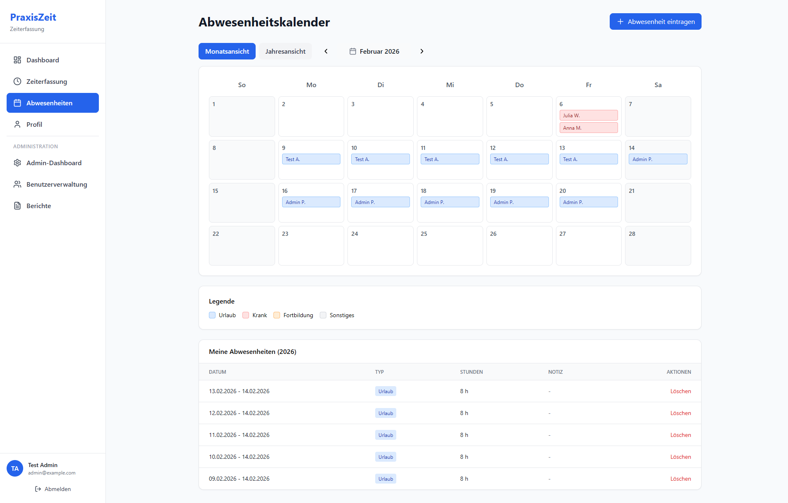
*Abbildung 5.1: Abwesenheitskalender mit farbcodierten Einträgen*

**Farbcodierung:**
- 🔵 **Blau:** Urlaub
- 🔴 **Rot:** Krankheit
- 🟠 **Orange:** Fortbildung
- ⚪ **Grau:** Sonstiges / Feiertage

**Navigation:**
- Mit **←→** zwischen Monaten navigieren
- Wochenenden sind grau hinterlegt

### 5.2 Abwesenheiten-Liste

Unterhalb des Kalenders sehen Sie eine **Tabelle mit allen Abwesenheiten** des aktuellen Monats.

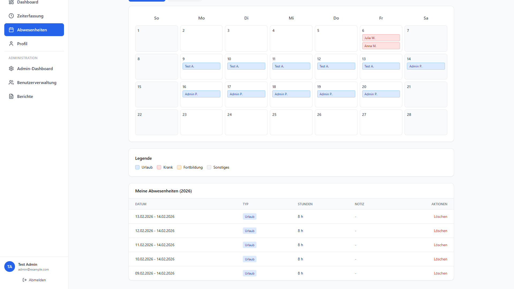
*Abbildung 5.2: Abwesenheiten-Tabelle mit Details*

**Spalten:**
- **Typ:** Art der Abwesenheit (Symbol + Text)
- **Datum:** Zeitraum der Abwesenheit
- **Stunden:** Dauer in Stunden
- **Notiz:** Optionale Bemerkung
- **Aktionen:** Bearbeiten und Löschen

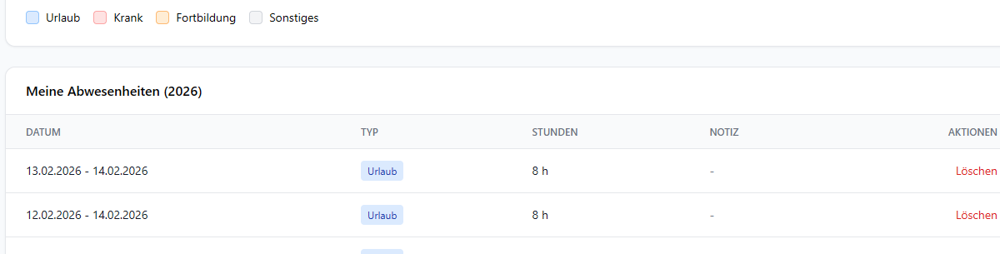
*Abbildung 5.3: Farbcodierung der verschiedenen Abwesenheitstypen*

### 5.3 Neue Abwesenheit erstellen

**Schritte:**
1. Klicken Sie auf **"+ Neue Abwesenheit"**
2. Wählen Sie den **Typ**:
   - Urlaub
   - Krankheit
   - Fortbildung
   - Sonstiges
3. Wählen Sie das **Datum**
4. *Optional:* Aktivieren Sie **"Zeitraum"** für mehrere Tage
5. Wählen Sie das **Enddatum** (bei Zeitraum)
6. Geben Sie die **Stunden** ein (z.B. "8,0" für einen ganzen Tag)
7. *Optional:* Fügen Sie eine **Notiz** hinzu
8. Klicken Sie auf **"Speichern"**

**Beispiel 1: Einzelner Tag**
```
Typ: Urlaub
Datum: 05.02.2026
Stunden: 8,0h
Notiz: Arzttermin
```

**Beispiel 2: Zeitraum (mehrere Tage)**
```
Typ: Urlaub
Zeitraum: ✓ aktiviert
Von: 10.02.2026
Bis: 14.02.2026
Stunden: 8,0h (pro Tag)
Notiz: Winterurlaub
```

**Automatische Berechnung bei Zeiträumen:**
- Das System erstellt automatisch **separate Einträge** für jeden Werktag (Mo-Fr)
- Wochenenden werden **automatisch ausgelassen**
- Feiertage werden **automatisch ausgelassen**

**Beispiel:**
```
Zeitraum: 10.02.2026 (Mo) - 14.02.2026 (Fr)
→ Erstellt 5 Einträge:
  - Mo, 10.02.2026: 8,0h
  - Di, 11.02.2026: 8,0h
  - Mi, 12.02.2026: 8,0h
  - Do, 13.02.2026: 8,0h
  - Fr, 14.02.2026: 8,0h
→ Gesamt: 40,0h (5 Tage × 8h)
```

### 5.4 Abwesenheit bearbeiten

**Schritte:**
1. Klicken Sie auf das **Bearbeiten-Icon** (✏️)
2. Ändern Sie die gewünschten Felder
3. Klicken Sie auf **"Speichern"**

**Hinweis:** Bei Zeiträumen müssen Sie jeden Eintrag einzeln bearbeiten.

### 5.5 Abwesenheit löschen

**Schritte:**
1. Klicken Sie auf das **Löschen-Icon** (🗑️)
2. Bestätigen Sie die Löschung
3. Der Eintrag wird sofort entfernt

### 5.6 Mobile Ansicht

Auf mobilen Geräten werden Abwesenheiten als **Cards** angezeigt. Der Kalender wird verkleinert dargestellt.

---

## 6. Profil

Im Profil können Sie Ihre persönlichen Daten einsehen und Ihr Passwort ändern.

### 6.1 Profildaten

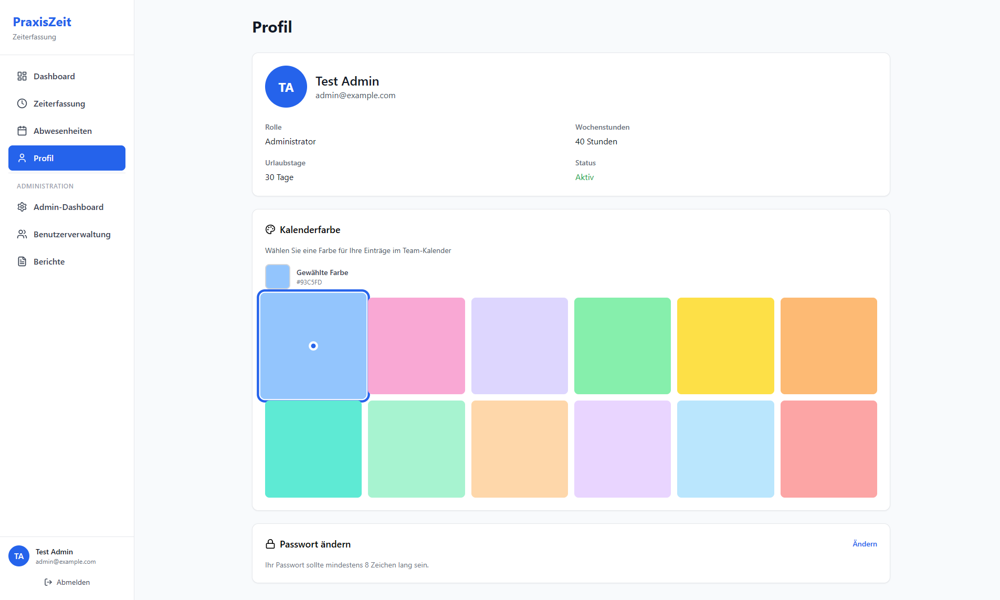
*Abbildung 6.1: Profil-Seite mit persönlichen Daten und Passwort-Ändern-Button*

**Angezeigte Informationen:**
- **Vorname**
- **Nachname**
- **E-Mail-Adresse**
- **Rolle:** Mitarbeiter:in oder Administrator:in
- **Wochenarbeitszeit:** Vertragliche Stunden pro Woche (z.B. 40,0h)
- **Urlaubstage pro Jahr:** Jährlicher Urlaubsanspruch (z.B. 30 Tage)
- **Zeiterfassung aktiv:** Ob für Sie Zeiten erfasst werden müssen

**Hinweis:** Diese Daten können nur von Administratoren geändert werden.

### 6.2 Passwort ändern

**Schritte:**
1. Klicken Sie auf **"Passwort ändern"**
2. Geben Sie Ihr **aktuelles Passwort** ein
3. Geben Sie Ihr **neues Passwort** ein (mindestens 8 Zeichen)
4. Wiederholen Sie das **neue Passwort**
5. Klicken Sie auf **"Passwort ändern"**

**Passwort-Anforderungen:**
- Mindestens **8 Zeichen** lang
- Sollte Groß- und Kleinbuchstaben enthalten
- Sollte Zahlen enthalten
- Sollte Sonderzeichen enthalten

**Hinweis:** Nach erfolgreicher Änderung werden Sie automatisch abgemeldet und müssen sich mit dem neuen Passwort erneut anmelden.

---

## 7. Admin-Dashboard

Das Admin-Dashboard bietet Administratoren eine Übersicht über alle Mitarbeitenden.

### 7.1 Stat-Cards (Übersichtskarten)

Im oberen Bereich sehen Administratoren:

- **Anzahl Mitarbeitende:** Gesamtzahl aller aktiven Benutzer:innen
- **Durchschnittlicher Saldo:** Durchschnittliche Überstunden aller Mitarbeitenden

### 7.2 Monatsübersicht

Die **Monatsübersicht-Tabelle** zeigt alle Mitarbeitenden mit ihren aktuellen Monatsdaten.

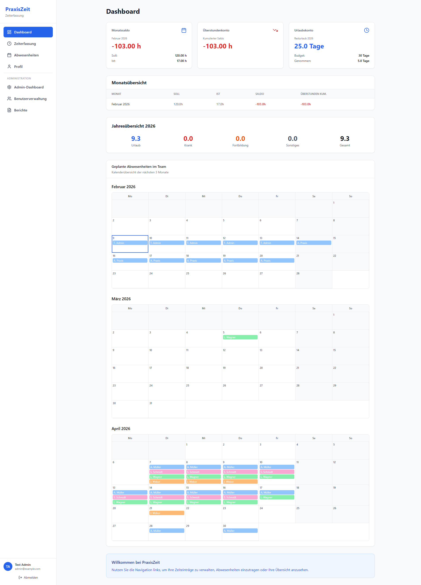
*Abbildung 7.1: Admin-Dashboard mit Monatsübersicht, Filter und Sortierung*

**Spalten:**
- **Name:** Vor- und Nachname
- **Soll:** Erforderliche Arbeitsstunden im aktuellen Monat
- **Ist:** Tatsächlich erfasste Stunden
- **Saldo:** Differenz (Ist - Soll)
- **Überstunden:** Kumulierte Überstunden (seit Jahresbeginn)
- **→:** ChevronRight-Icon (klickbar für Details)


*Abbildung 7.2: ChevronRight-Icons zeigen klickbare Zeilen an*

**Funktionen:**

#### 7.2.1 Sortierung

Klicken Sie auf eine **Spaltenüberschrift**, um die Tabelle zu sortieren.

- **1. Klick:** Sortierung aufsteigend (↑)
- **2. Klick:** Sortierung absteigend (↓)
- **3. Klick:** Sortierung zurücksetzen

**Beispiel:**
```
Klick auf "Name" → Alphabetisch A-Z
Klick auf "Name" → Alphabetisch Z-A
Klick auf "Saldo" → Niedrigster Saldo zuerst
```

#### 7.2.2 Filter

Geben Sie Text in das **Suchfeld** ein, um Mitarbeitende zu filtern.

**Suchkriterien:**
- Vorname
- Nachname
- E-Mail-Adresse

**Beispiel:**
```
Suche: "Müller" → Zeigt nur Personen mit "Müller" im Namen
Suche: "admin" → Zeigt nur Personen mit "admin" in E-Mail
```

#### 7.2.3 Mitarbeiter:in-Details

Klicken Sie auf eine **Zeile** oder das **→ Icon**, um Details anzuzeigen.

**Detail-Modal enthält:**
- **Persönliche Daten:** Name, E-Mail, Rolle
- **Vertragsdaten:** Wochenarbeitszeit, Urlaubstage
- **Monatliche Übersicht:** Soll/Ist/Saldo für jeden Monat
- **Monatsauswahl:** Dropdown zur Monatswahl

**Funktionen im Modal:**
- **Monat wechseln:** Dropdown-Auswahl
- **Schließen:** X-Button oder ESC-Taste

### 7.3 Jahresübersicht

Die **Jahresübersicht-Tabelle** zeigt alle Mitarbeitenden mit ihren Jahresdaten.

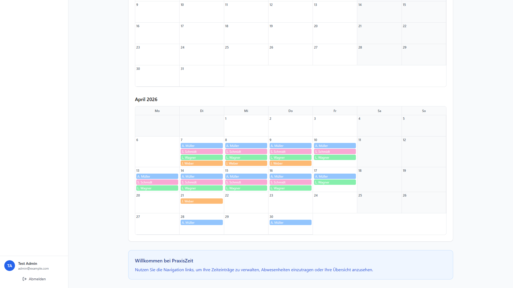
*Abbildung 7.3: Jahresübersicht mit Urlaubstagen und Überstunden*

**Spalten:**
- **Name:** Vor- und Nachname
- **Urlaub:** Genommene Urlaubstage (in Tagen)
- **Resturlaub:** Verbleibende Urlaubstage
- **Krank:** Krankheitstage
- **Fortbildung:** Fortbildungstage
- **Überstunden:** Kumulierte Überstunden für das Jahr
- **Gesamt:** Gesamte Abwesenheitstage

**Farbcodierung (Resturlaub):**
- 🟢 **Grün:** > 5 Tage verfügbar
- 🟡 **Gelb:** 1-5 Tage verfügbar
- 🔴 **Rot:** 0 oder negative Tage

**Farbcodierung (Überstunden):**
- 🟢 **Grün:** Positive Überstunden
- 🔴 **Rot:** Negative Überstunden

**Hinweis:** Die Jahresübersicht zeigt immer das aktuelle Jahr.

### 7.4 Mobile Ansicht

Auf mobilen Geräten werden beide Tabellen als **Cards** angezeigt. Sortierung und Filter bleiben verfügbar.

---

## 8. Benutzerverwaltung

Die Benutzerverwaltung ermöglicht Administratoren das Verwalten aller Mitarbeitenden.

### 8.1 Benutzerliste

Die **Benutzerliste** zeigt alle Benutzer:innen in einer Tabelle.

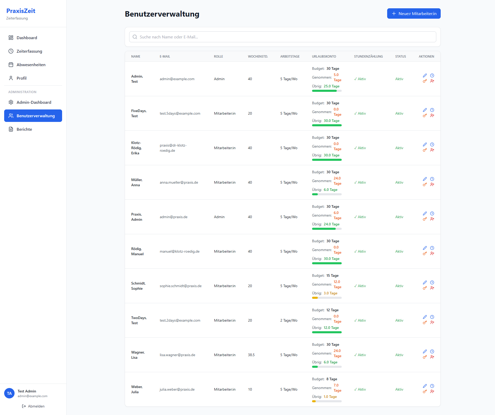
*Abbildung 8.1: Benutzerverwaltung mit Sortierung, Filter und Urlaubskonto-Ampel*


*Abbildung 8.2: Urlaubskonto-Ampel mit Farbcodierung (Grün/Gelb/Rot)*

**Spalten:**
- **Name:** Vor- und Nachname
- **E-Mail:** E-Mail-Adresse
- **Rolle:** Mitarbeiter:in oder Administrator:in
- **Wochenarbeitszeit:** Vertragliche Stunden (z.B. "40,0h")
- **Urlaubstage:** Jährlicher Anspruch (z.B. "30")
- **Urlaubskonto:** Aktueller Status (Budget/Verbraucht/Verfügbar)
- **Zeiterfassung:** Ob Zeiten erfasst werden müssen (✓ / ✗)
- **Aktionen:** Bearbeiten, Passwort zurücksetzen, Löschen

### 8.2 Sortierung und Filter

**Sortierung:**
- Klicken Sie auf **Spaltenüberschriften** zum Sortieren
- Funktioniert wie in der Admin-Dashboard-Tabelle

**Filter:**
- Geben Sie Text im **Suchfeld** ein
- Sucht in Name und E-Mail

**Beispiel:**
```
Suche: "admin" → Zeigt nur Admin-Benutzer:innen
Sortierung: "Urlaubskonto" → Sortiert nach verfügbaren Urlaubstagen
```

### 8.3 Neue:n Mitarbeiter:in anlegen

**Schritte:**
1. Klicken Sie auf **"+ Neue:r Mitarbeiter:in"**
2. Füllen Sie das Formular aus:
   - **Vorname**
   - **Nachname**
   - **E-Mail** (muss eindeutig sein)
   - **Rolle:** Mitarbeiter:in oder Administrator:in
   - **Wochenarbeitszeit:** z.B. "40" für 40h/Woche
   - **Urlaubstage pro Jahr:** z.B. "30"
   - **Zeiterfassung aktiv:** Checkbox aktivieren, wenn Zeiten erfasst werden sollen
3. Klicken Sie auf **"Speichern"**

**Nach dem Speichern:**
- Ein **temporäres Passwort** wird automatisch generiert
- Das Passwort wird in einem **Modal** angezeigt
- Kopieren Sie das Passwort mit dem **"Kopieren"-Button**
- Senden Sie das Passwort sicher an die neue Person

**Beispiel:**
```
Vorname: Max
Nachname: Mustermann
E-Mail: max.mustermann@beispiel.de
Rolle: Mitarbeiter:in
Wochenarbeitszeit: 40
Urlaubstage: 28
Zeiterfassung aktiv: ✓

→ Temporäres Passwort: AbC12#xY
```

### 8.4 Mitarbeiter:in bearbeiten

**Schritte:**
1. Klicken Sie auf das **Bearbeiten-Icon** (✏️)
2. Ändern Sie die gewünschten Felder
3. Klicken Sie auf **"Speichern"**

**Änderbare Felder:**
- Vorname, Nachname
- Rolle
- Wochenarbeitszeit
- Urlaubstage
- Zeiterfassung aktiv

**Hinweis:** Die E-Mail-Adresse kann nicht geändert werden.

### 8.5 Passwort zurücksetzen

**Schritte:**
1. Klicken Sie auf das **Schlüssel-Icon** (🔑) neben dem Benutzer
2. Bestätigen Sie den Reset im Dialog
3. Ein neues **temporäres Passwort** wird generiert
4. Das Passwort wird in einem **Modal** angezeigt
5. Kopieren Sie das Passwort mit dem **"Kopieren"-Button**
6. Senden Sie das Passwort sicher an die Person

**Warnung im Modal:**
```
⚠️ Wichtig: Dieses Passwort wird nur einmal angezeigt.
Bitte kopieren Sie es jetzt und senden Sie es sicher
an die:den Mitarbeiter:in.
```

**Beispiel:**
```
Neues temporäres Passwort für Max Mustermann:
xY98#qW3

[In Zwischenablage kopieren] [Schließen]
```

### 8.6 Mitarbeiter:in löschen

**Schritte:**
1. Klicken Sie auf das **Löschen-Icon** (🗑️)
2. Bestätigen Sie die Löschung im Dialog
3. Der/die Benutzer:in wird unwiderruflich gelöscht

**Achtung:**
- Gelöschte Benutzer:innen können **nicht wiederhergestellt** werden
- **Alle Daten** (Zeiteinträge, Abwesenheiten) werden gelöscht
- Verwenden Sie diese Funktion nur bei endgültigem Ausscheiden

**Alternative:** Deaktivieren Sie die Zeiterfassung, statt zu löschen.

### 8.7 Mobile Ansicht

Auf mobilen Geräten werden Benutzer:innen als **Cards** angezeigt. Alle Funktionen bleiben verfügbar.

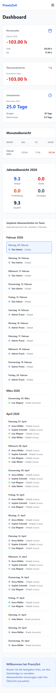
*Abbildung 8.3: Mobile Ansicht des Dashboards*

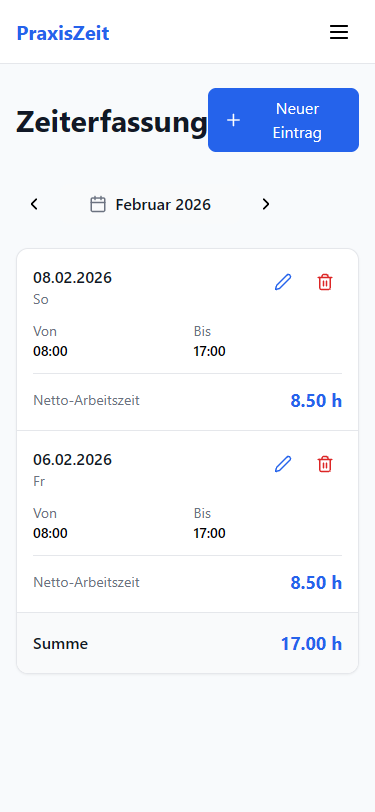
*Abbildung 8.4: Mobile Ansicht der Zeiterfassung*

---

## 9. Berichte & Export

Die Berichte-Seite ermöglicht den Export von Auswertungen als Excel-Dateien.

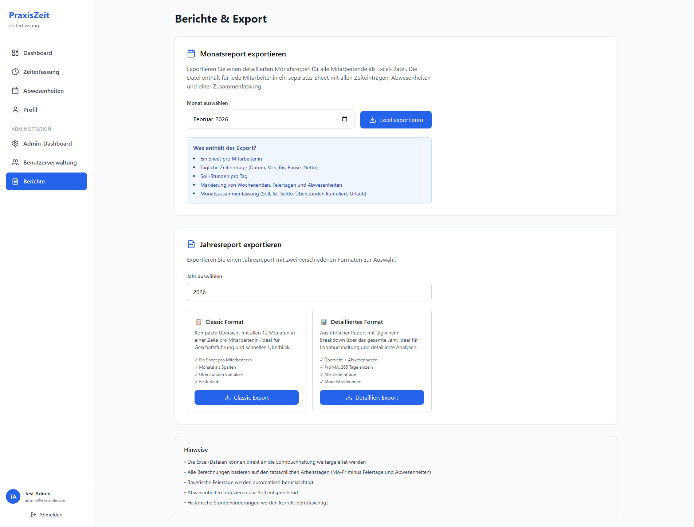
*Abbildung 9.1: Berichte-Seite mit Monats- und Jahresreport-Optionen*

### 9.1 Monatsreport

Der **Monatsreport** enthält detaillierte Zeitdaten für einen bestimmten Monat.

**Schritte:**
1. Wählen Sie **Monat** und **Jahr** aus
2. Klicken Sie auf **"Excel exportieren"**
3. Eine Excel-Datei wird heruntergeladen

**Inhalt der Excel-Datei:**

**Tabellenblatt 1: Mitarbeiter:innen-Übersicht**
- Name
- E-Mail
- Soll-Stunden
- Ist-Stunden
- Saldo
- Kumulierte Überstunden
- Urlaubstage genommen
- Krankheitstage

**Tabellenblatt 2: Detaillierte Zeiteinträge**
- Datum
- Name
- Start
- Ende
- Pause
- Stunden
- Typ (Arbeit/Abwesenheit)

**Beispiel-Dateiname:**
```
praxiszeit_report_2026-02.xlsx
```

### 9.2 Jahresreport (Classic)

Der **klassische Jahresreport** enthält eine Übersicht aller Mitarbeitenden für das gesamte Jahr.

**Schritte:**
1. Wählen Sie das **Jahr** aus
2. Klicken Sie auf **"Excel exportieren"**
3. Eine Excel-Datei wird heruntergeladen

**Inhalt der Excel-Datei:**
- Name
- E-Mail
- Gesamte Überstunden
- Urlaubstage genommen
- Resturlaub
- Krankheitstage
- Fortbildungstage
- Sonstige Abwesenheiten
- Gesamte Abwesenheitstage

**Beispiel-Dateiname:**
```
praxiszeit_report_yearly_2026.xlsx
```

### 9.3 Jahresreport (Detailliert)

Der **detaillierte Jahresreport** enthält alle Zeiteinträge des gesamten Jahres.

**Schritte:**
1. Wählen Sie das **Jahr** aus
2. Klicken Sie auf **"Detaillierten Excel-Report exportieren"**
3. Eine Excel-Datei wird heruntergeladen

**Inhalt der Excel-Datei:**

**Tabellenblatt 1: Jahresübersicht**
- Wie Classic-Report

**Tabellenblatt 2: Monatliche Übersicht**
- Name
- Januar Soll/Ist/Saldo
- Februar Soll/Ist/Saldo
- ... (alle 12 Monate)
- Jahressummen

**Tabellenblatt 3: Alle Zeiteinträge**
- Datum
- Name
- Start
- Ende
- Stunden
- Typ

**Beispiel-Dateiname:**
```
praxiszeit_report_yearly_detailed_2026.xlsx
```

### 9.4 Verwendung der Excel-Dateien

**Empfohlene Anwendungen:**
- Microsoft Excel 2016 oder neuer
- LibreOffice Calc
- Google Sheets

**Tipps:**
- Öffnen Sie die Datei mit **"Nur Lesen"**, um versehentliche Änderungen zu vermeiden
- Nutzen Sie **Filter** und **Sortierung** für weitere Auswertungen
- Erstellen Sie **Pivot-Tabellen** für komplexere Analysen

---

## 10. Berechnungen & Beispiele

### 10.1 Soll-Stunden Berechnung

Die **Soll-Stunden** werden basierend auf der Wochenarbeitszeit und den Arbeitstagen des Monats berechnet.

**Formel:**
```
Soll-Stunden = (Wochenarbeitszeit / 5) × Arbeitstage

Arbeitstage = Kalendertage - Wochenenden - Feiertage
```

**Beispiel 1: Februar 2026 (28 Tage)**
```
Wochenarbeitszeit: 40h
Kalendertage: 28
Wochenenden: 8 Tage (4 × Sa+So)
Feiertage: 0
Arbeitstage: 28 - 8 - 0 = 20 Tage

Tägliche Arbeitszeit: 40h / 5 = 8h

Soll-Stunden = 8h × 20 = 160,0h
```

**Beispiel 2: Dezember 2026 (mit Feiertagen)**
```
Wochenarbeitszeit: 40h
Kalendertage: 31
Wochenenden: 8 Tage
Feiertage: 2 Tage (25.12. + 26.12.)
Arbeitstage: 31 - 8 - 2 = 21 Tage

Tägliche Arbeitszeit: 40h / 5 = 8h

Soll-Stunden = 8h × 21 = 168,0h
```

**Beispiel 3: Teilzeit (20h/Woche)**
```
Wochenarbeitszeit: 20h
Kalendertage: 30
Wochenenden: 8 Tage
Feiertage: 0
Arbeitstage: 22 Tage

Tägliche Arbeitszeit: 20h / 5 = 4h

Soll-Stunden = 4h × 22 = 88,0h
```

### 10.2 Ist-Stunden Berechnung

Die **Ist-Stunden** sind die Summe aller erfassten Zeiteinträge im Monat.

**Formel:**
```
Ist-Stunden = Σ (Ende - Start - Pause) für alle Einträge
```

**Beispiel:**
```
Tag 1: 08:00 - 17:00, Pause 00:30 → 8,5h
Tag 2: 08:30 - 17:30, Pause 01:00 → 8,0h
Tag 3: 09:00 - 18:00, Pause 00:45 → 8,25h
Tag 4: 08:00 - 16:00, Pause 00:30 → 7,5h
Tag 5: 08:00 - 17:00, Pause 00:30 → 8,5h

Ist-Stunden (Woche) = 8,5 + 8,0 + 8,25 + 7,5 + 8,5 = 40,75h
```

### 10.3 Monatssaldo Berechnung

Der **Monatssaldo** ist die Differenz zwischen Ist- und Soll-Stunden.

**Formel:**
```
Monatssaldo = Ist-Stunden - Soll-Stunden
```

**Beispiel 1: Plusstunden**
```
Soll: 160,0h
Ist: 165,5h
Saldo: 165,5 - 160,0 = +5,5h
→ Sie haben 5,5 Stunden mehr gearbeitet
```

**Beispiel 2: Minusstunden**
```
Soll: 160,0h
Ist: 152,0h
Saldo: 152,0 - 160,0 = -8,0h
→ Sie haben 8,0 Stunden weniger gearbeitet
```

**Beispiel 3: Ausgeglichen**
```
Soll: 160,0h
Ist: 160,0h
Saldo: 160,0 - 160,0 = 0,0h
→ Ausgeglichen
```

### 10.4 Kumulierte Überstunden Berechnung

Die **kumulierten Überstunden** sind die Summe aller Monatssalden seit Jahresbeginn.

**Formel:**
```
Überstunden (kumuliert) = Σ Monatssalden

Überstunden = Saldo_Januar + Saldo_Februar + ... + Saldo_aktueller_Monat
```

**Beispiel: Stand März 2026**
```
Januar:
  Soll: 168,0h, Ist: 172,0h → Saldo: +4,0h

Februar:
  Soll: 160,0h, Ist: 158,5h → Saldo: -1,5h

März (bisher):
  Soll: 176,0h, Ist: 180,0h → Saldo: +4,0h

Kumulierte Überstunden = 4,0 + (-1,5) + 4,0 = +6,5h
```

**Interpretation:**
- **Positive Überstunden:** Sie haben insgesamt mehr gearbeitet
- **Negative Überstunden:** Sie haben insgesamt weniger gearbeitet
- Diese können durch Zeitausgleich oder Urlaub entstehen

### 10.5 Urlaubskonto Berechnung

Das **Urlaubskonto** zeigt die verfügbaren Urlaubstage.

**Formel:**
```
Verfügbare Tage = Urlaubsanspruch - Verbrauchte Tage
```

**Beispiel 1: Jahresanfang**
```
Urlaubsanspruch: 30 Tage
Verbraucht: 0 Tage
Verfügbar: 30 - 0 = 30 Tage
```

**Beispiel 2: Nach Urlaub**
```
Urlaubsanspruch: 30 Tage
Verbraucht: 12,5 Tage
Verfügbar: 30 - 12,5 = 17,5 Tage
```

**Beispiel 3: Überziehung**
```
Urlaubsanspruch: 30 Tage
Verbraucht: 32 Tage
Verfügbar: 30 - 32 = -2 Tage
→ Urlaubskonto überzogen!
```

**Umrechnung Stunden → Tage:**
```
Urlaubstage = Urlaubsstunden / Tägliche Arbeitszeit

Beispiel:
  40 Urlaubsstunden / 8h pro Tag = 5 Tage
```

### 10.6 Resturlaub Berechnung (Jahresende)

Der **Resturlaub** am Jahresende kann ggf. ins nächste Jahr übertragen werden.

**Beispiel:**
```
Urlaubsanspruch 2026: 30 Tage
Verbraucht 2026: 23 Tage
Resturlaub: 30 - 23 = 7 Tage

→ 7 Tage können ins Jahr 2027 übertragen werden
  (abhängig von Unternehmensregelung)
```

### 10.7 Abwesenheitstage Berechnung

**Vollständige Formel für Abwesenheitstage:**
```
Abwesenheitstage = Urlaubstage + Krankheitstage + Fortbildungstage + Sonstige Tage

Tage = Abwesenheitsstunden / Tägliche Arbeitszeit
```

**Beispiel:**
```
Urlaub: 80h → 80 / 8 = 10 Tage
Krank: 16h → 16 / 8 = 2 Tage
Fortbildung: 24h → 24 / 8 = 3 Tage
Sonstiges: 8h → 8 / 8 = 1 Tag

Gesamte Abwesenheit: 10 + 2 + 3 + 1 = 16 Tage
```

### 10.8 Arbeitszeitberechnung mit Abwesenheiten

Wenn Sie Abwesenheiten haben, werden die **Soll-Stunden reduziert**.

**Formel:**
```
Bereinigte Soll-Stunden = Standard-Soll - Abwesenheitsstunden

Saldo = Ist-Stunden - Bereinigte Soll-Stunden
```

**Beispiel:**
```
Standard-Soll (Februar): 160,0h
Urlaub genommen: 16,0h (2 Tage)

Bereinigte Soll-Stunden: 160,0 - 16,0 = 144,0h

Ist-Stunden (gearbeitet): 148,0h
Saldo: 148,0 - 144,0 = +4,0h

→ Trotz 2 Tagen Urlaub haben Sie 4 Plusstunden
```

### 10.9 Beispiel-Szenarien

#### Szenario 1: Normaler Vollzeit-Mitarbeiter

**Rahmenbedingungen:**
- Wochenarbeitszeit: 40h
- Urlaubsanspruch: 30 Tage/Jahr
- Start: 01.01.2026

**März 2026:**
```
Arbeitstage: 21 (keine Feiertage)
Soll: 21 × 8h = 168,0h
Ist: 172,5h (täglich 8h15m gearbeitet)
Saldo: +4,5h

Kumuliert (Jan-März):
  Januar: +2,0h
  Februar: -1,0h
  März: +4,5h
  → Gesamt: +5,5h
```

**Urlaub genommen:**
```
Februar: 1 Woche (5 Tage = 40h)
→ Verbraucht: 5 Tage
→ Verfügbar: 30 - 5 = 25 Tage
```

#### Szenario 2: Teilzeit-Mitarbeiterin

**Rahmenbedingungen:**
- Wochenarbeitszeit: 20h (50% Teilzeit)
- Urlaubsanspruch: 15 Tage/Jahr (anteilig)
- Arbeitet Mo, Di, Mi

**März 2026:**
```
Arbeitstage: 13 (nur Mo-Mi)
Tägliche Arbeitszeit: 20h / 5 = 4h (auf 3 Tage verteilt → ~6,67h/Tag)
Soll: 13 × 4h = 52,0h (anteilig auf 3 Tage/Woche)
Ist: 54,5h
Saldo: +2,5h
```

**Urlaub:**
```
Verbraucht: 3 Tage = 12h
Verfügbar: 15 - 3 = 12 Tage
```

#### Szenario 3: Administrator mit Überstunden

**Situation:**
```
Dezember 2026:
  Viele Projekte, Jahresabschluss
  Soll: 168,0h
  Ist: 192,0h
  Saldo: +24,0h (!)

Kumuliert (Jan-Dez):
  Summe Monatssalden: +48,5h

Interpretation:
  48,5h Überstunden = ~6 Tage Zeitausgleich möglich
  → Sollte im Januar abgebaut werden
```

---

## 11. Häufig gestellte Fragen

### 11.1 Allgemeine Fragen

**Q: Wie kann ich mein Passwort ändern?**
A: Gehen Sie zu **Profil** → **"Passwort ändern"**. Geben Sie Ihr aktuelles und Ihr neues Passwort ein.

**Q: Ich habe mein Passwort vergessen. Was kann ich tun?**
A: Wenden Sie sich an Ihren Administrator. Dieser kann über die Benutzerverwaltung ein neues temporäres Passwort generieren.

**Q: Wie lange bleibt meine Sitzung aktiv?**
A: Ihre Sitzung bleibt für 24 Stunden aktiv. Danach müssen Sie sich erneut anmelden.

**Q: Kann ich PraxisZeit auf meinem Smartphone nutzen?**
A: Ja! PraxisZeit ist vollständig responsive und funktioniert auf Smartphones und Tablets.

### 11.2 Zeiterfassung

**Q: Kann ich nachträglich Zeiteinträge ändern?**
A: Ja, klicken Sie auf das Bearbeiten-Icon (✏️) neben dem Eintrag.

**Q: Kann ich Einträge für vergangene Monate erstellen?**
A: Ja, navigieren Sie mit dem MonthSelector zum gewünschten Monat und erstellen Sie den Eintrag.

**Q: Was passiert, wenn ich vergessen habe, meine Pause einzutragen?**
A: Sie können den Eintrag nachträglich bearbeiten und die Pause hinzufügen.

**Q: Werden Wochenenden automatisch ausgeblendet?**
A: Nein, Sie können auch an Wochenenden Einträge erstellen (z.B. bei Bereitschaftsdiensten).

### 11.3 Abwesenheiten

**Q: Wie beantrage ich Urlaub?**
A: Erstellen Sie eine neue Abwesenheit mit Typ "Urlaub". Aktivieren Sie "Zeitraum" für mehrere Tage.

**Q: Werden Wochenenden bei Urlaub automatisch ausgelassen?**
A: Ja! Bei Zeiträumen werden nur Werktage (Mo-Fr) als Urlaub erfasst.

**Q: Werden Feiertage automatisch berücksichtigt?**
A: Ja! Feiertage werden automatisch ausgelassen und nicht als Urlaubstag gezählt.

**Q: Kann ich halbe Urlaubstage nehmen?**
A: Ja! Geben Sie statt 8,0h einfach 4,0h ein.

**Q: Wie trage ich Krankheit ein?**
A: Erstellen Sie eine neue Abwesenheit mit Typ "Krankheit" und geben Sie das Datum und die Stunden ein.

### 11.4 Dashboard & Berechnungen

**Q: Warum sind meine Überstunden negativ?**
A: Sie haben weniger gearbeitet als erforderlich. Dies kann durch Urlaub, Krankheit oder Teilzeit entstehen.

**Q: Warum ändern sich meine Soll-Stunden jeden Monat?**
A: Die Soll-Stunden hängen von der Anzahl der Arbeitstage ab. Monate mit Feiertagen haben weniger Soll-Stunden.

**Q: Was bedeutet "kumuliert" bei Überstunden?**
A: Die Summe aller Monatssalden seit Jahresbeginn. Zeigt Ihre Gesamt-Überstunden.

**Q: Wie werden Urlaubstage berechnet?**
A: Urlaubsstunden / Tägliche Arbeitszeit = Urlaubstage. Bei 8h/Tag: 40h = 5 Tage.

### 11.5 Admin-Funktionen

**Q: Wie lege ich eine:n neue:n Mitarbeiter:in an?**
A: Gehen Sie zu **Benutzerverwaltung** → **"+ Neue:r Mitarbeiter:in"** und füllen Sie das Formular aus.

**Q: Wie setze ich ein Passwort zurück?**
A: Klicken Sie in der Benutzerverwaltung auf das Schlüssel-Icon (🔑) neben dem/der Benutzer:in.

**Q: Kann ich die Wochenarbeitszeit nachträglich ändern?**
A: Ja, bearbeiten Sie den/die Benutzer:in in der Benutzerverwaltung. Die Änderung gilt ab dem aktuellen Monat.

**Q: Wie exportiere ich Daten?**
A: Gehen Sie zu **Berichte** und wählen Sie den gewünschten Report aus. Klicken Sie auf "Excel exportieren".

**Q: Kann ich auch historische Daten exportieren?**
A: Ja! Wählen Sie einfach einen älteren Monat oder ein älteres Jahr aus.

### 11.6 Technische Fragen

**Q: Welche Browser werden unterstützt?**
A: Chrome, Firefox, Safari, Edge (jeweils aktuelle Versionen).

**Q: Warum lädt die Seite langsam?**
A: Überprüfen Sie Ihre Internetverbindung. PraxisZeit benötigt eine stabile Verbindung.

**Q: Werden meine Daten gesichert?**
A: Ja! Alle Daten werden in einer PostgreSQL-Datenbank gespeichert und regelmäßig gesichert.

**Q: Kann ich PraxisZeit offline nutzen?**
A: Nein, PraxisZeit benötigt eine Internetverbindung.

---

## Anhang

### A. Tastaturkürzel

**Allgemein:**
- `ESC` - Modal schließen
- `Tab` - Zwischen Feldern navigieren
- `Enter` - Formular absenden (in Eingabefeldern)

**Navigation:**
- Die meisten Funktionen sind über die Maus/Touch bedienbar
- Keyboard-Navigation wird über Tab-Taste unterstützt

### B. Farbcodes

**Überstunden:**
- 🟢 Grün: Positive Überstunden
- 🔴 Rot: Negative Überstunden

**Urlaubskonto:**
- 🟢 Grün: > 5 Tage verfügbar
- 🟡 Gelb: 1-5 Tage verfügbar
- 🔴 Rot: 0 oder negative Tage

**Abwesenheitstypen:**
- 🔵 Blau: Urlaub
- 🔴 Rot: Krankheit
- 🟠 Orange: Fortbildung
- ⚪ Grau: Sonstiges / Feiertage

### C. Systemvoraussetzungen

**Browser:**
- Chrome 90+
- Firefox 88+
- Safari 14+
- Edge 90+

**Bildschirmauflösung:**
- Minimum: 360px Breite (Mobile)
- Empfohlen: 1280px Breite (Desktop)

**Internetverbindung:**
- Mindestens 1 Mbps
- Empfohlen: 5 Mbps oder mehr

### D. Support & Kontakt

**Bei technischen Problemen:**
- Wenden Sie sich an Ihren Administrator
- Überprüfen Sie zunächst die FAQ-Sektion

**Für Feature-Wünsche:**
- Kontaktieren Sie Ihren Administrator
- Beschreiben Sie Ihren Wunsch möglichst detailliert

**Bei Datenproblemen:**
- Machen Sie einen Screenshot des Problems
- Notieren Sie: Was haben Sie getan? Was wurde erwartet? Was ist passiert?
- Wenden Sie sich an Ihren Administrator

### E. Versionshistorie

**Version 1.0 (Februar 2026)**
- Initiale Version
- Zeiterfassung
- Abwesenheitsverwaltung
- Admin-Dashboard
- Benutzerverwaltung
- Excel-Export

---

**Ende des Handbuchs**

© 2026 PraxisZeit | Alle Rechte vorbehalten
