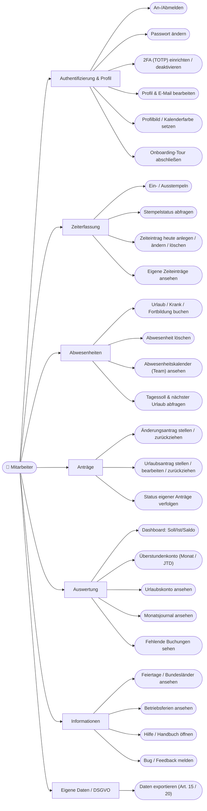
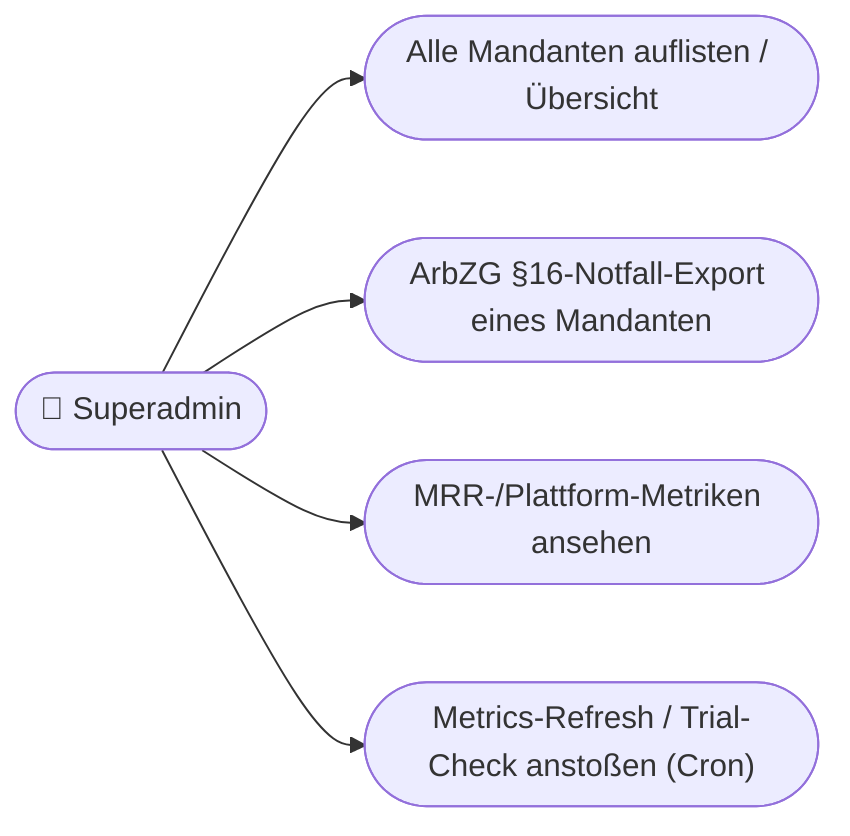
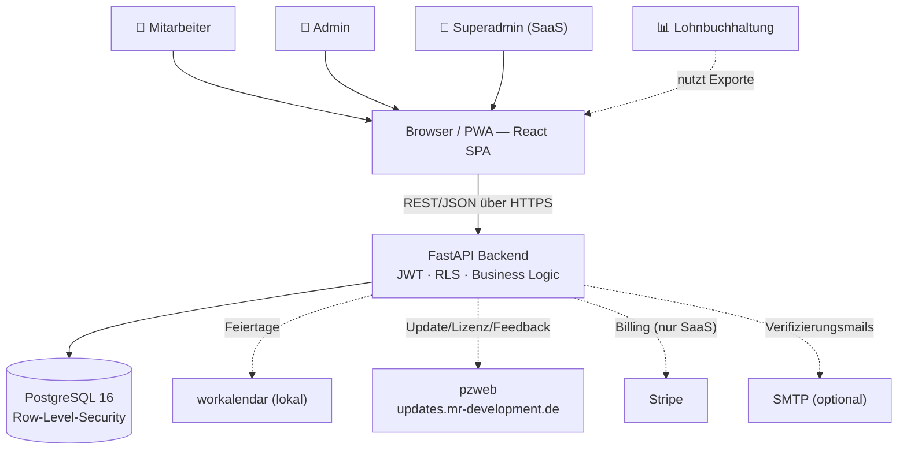

# ARC42 Architekturdokumentation – PraxisZeit

> Erstellt nach dem arc42-Template (https://arc42.org/overview)
> **Version: 2.0 | Stand: Juni 2026 | App-Version: 1.8.2**
>
> Diese Fassung wurde aus dem Code-Stand (Branch `master`, Commit-Stand 1.8.2) hergeleitet.
> Sie ersetzt die ursprüngliche Fassung (v1.0, Februar 2026), die noch single-tenant war und
> weder RLS, Lizenzierung, Native Installer noch den SaaS-Umbau kannte.

---

## 1. Einführung und Ziele

### 1.1 Aufgabenstellung

PraxisZeit ist ein webbasiertes Zeiterfassungssystem für Arztpraxen und kleine Betriebe. Es deckt ab:

- **Zeiterfassung**: Ein-/Ausstempeln (Stempeluhr) und manuelle Tageseinträge (Start, Ende, Pausen)
- **Abwesenheitsverwaltung**: Urlaub, Krankmeldung, Fortbildung, bezahlte Freistellung, Überstundenausgleich
- **Antragsworkflows**: Änderungsanträge auf Zeit-/Abwesenheitseinträge, optionaler Urlaubsgenehmigungs-Workflow (4-Augen-Prinzip)
- **Auswertungen**: Soll/Ist-Vergleich, Überstundenkonto (monatlich/JTD), Urlaubskonto (tagebasiert), Monats-/Jahresberichte
- **Export**: Excel (XLSX), OpenDocument (ODS) und PDF für die Lohnbuchhaltung
- **Compliance (ArbZG)**: Echtzeit-Ruhezeitwarnung (§5), Pausenpflicht (§4), Nachtarbeit (§6), Sonntagsarbeit (§9), Ausgleichsruhe (§11), revisionssichere Audit-Logs (§16)
- **Compliance (DSGVO)**: Auskunft/Export (Art. 15/20), Berichtigung (Art. 16), Löschung/Anonymisierung (Art. 17), Verarbeitungsverzeichnis, AVV
- **Betrieb**: Benutzerverwaltung, Betriebsferien, Feiertage je Bundesland, Jahresabschluss/Carryover, Fehler-Monitoring, In-App-Updates
- **Mehrmandantenfähigkeit**: Multi-Tenant-Betrieb (SaaS) mit echter Datenisolation per PostgreSQL Row-Level-Security; alternativ Single-Tenant-On-Premise

### 1.2 Qualitätsziele

| Priorität | Qualitätsmerkmal | Motivation |
|-----------|------------------|------------|
| 1 | **Korrektheit** | Gehalts-, Überstunden- und Urlaubsberechnungen müssen exakt und gesetzeskonform sein |
| 2 | **Datenschutz & Mandantentrennung** | Personaldaten (DSGVO Art. 9 Gesundheitsdaten) erfordern Zugriffsschutz; im SaaS dürfen Mandanten einander nie sehen (RLS) |
| 3 | **Compliance** | Nachweisbare ArbZG- und DSGVO-Konformität (Audit-Trail, §16-Aufbewahrung, Betroffenenrechte) |
| 4 | **Benutzerfreundlichkeit** | Praxispersonal ohne IT-Kenntnisse muss es bedienen können |
| 5 | **Verfügbarkeit & Robustheit** | Tägliche Nutzung; Lizenz-/Update-Fehler dürfen den Dienst nie abschießen (Read-Only statt Crash) |
| 6 | **Wartbarkeit & Portabilität** | Ein Code-Stand für Docker, SaaS und Native-Installer (Linux/Windows/macOS) |

### 1.3 Stakeholder

| Rolle | Interesse |
|-------|-----------|
| Praxisinhaber / Admin | Übersicht über Arbeitszeiten, Genehmigung von Anträgen, Compliance, Berichte |
| Mitarbeiter:innen | Einfache Zeiterfassung, Urlaubs-/Abwesenheitsverwaltung, Transparenz über das eigene Konto |
| Lohnbuchhaltung | Excel-/ODS-/PDF-Exporte für die Gehaltsabrechnung |
| IT-Betreiber | Einfaches Deployment (Docker/Native), Wartung, Updates |
| Superadmin (SaaS) | Mandantenverwaltung, ArbZG-Notfall-Export, Plattform-Metriken |
| Datenschutzbeauftragte:r | Betroffenenrechte, Verarbeitungsverzeichnis, AVV |
| MR Development (Hersteller) | Lizenzausstellung, Update-Auslieferung, Bug-Tracking über pzweb |

### 1.4 Anwendungsfälle (Use-Case-Übersicht)

Es gibt drei Akteure: **Mitarbeiter** (Rolle `EMPLOYEE`), **Admin** (Rolle `ADMIN`, sieht zusätzlich alle Mitarbeiter-UCs des eigenen Mandanten) und **Superadmin** (kein `tenant_id`, mandantenübergreifend). Die folgenden Diagramme zeigen die fachlichen Anwendungsfälle; der vollständige Katalog mit technischer Realisierung steht in [Abschnitt 1.5](#15-use-case-katalog).

#### 1.4.1 Use Cases – Mitarbeiter



#### 1.4.2 Use Cases – Admin

> Der Admin ist gleichzeitig Mitarbeiter und nutzt **alle** Mitarbeiter-Use-Cases (Generalisierung). Zusätzlich:

```mermaid
flowchart LR
    AD(["👤 Admin"])
    AD -.->|erbt alle| MA(["👤 Mitarbeiter-UCs"])

    AD --> USR[Benutzerverwaltung]
    AD --> TIM[Zeit-/Abwesenheit für MA]
    AD --> APR[Anträge prüfen]
    AD --> ORG["Stammdaten & Organisation"]
    AD --> REP["Auswertungen & Export"]
    AD --> ARB[ArbZG-Compliance-Reports]
    AD --> JAHR[Jahresabschluss]
    AD --> OPS["Betrieb & System"]
    AD --> SAAS[SaaS-Verwaltung / Billing]

    USR --> U1(["MA anlegen / bearbeiten / deaktivieren"])
    USR --> U2(["Passwort für MA setzen"])
    USR --> U3(["Arbeitszeit-Änderung (historisch) pflegen"])
    USR --> U4(["Arbeitszeit-Fenster pro Wochentag setzen"])
    USR --> U5(["Benutzerübersicht (Urlaub + Überstunden)"])
    USR --> U6(["Löschkandidaten anonymisieren (Art. 17)"])

    TIM --> T1(["Zeiteintrag für MA anlegen / ändern / löschen"])
    TIM --> T2(["Abwesenheit für MA buchen"])
    TIM --> T3(["Audit-Log eines Eintrags einsehen"])

    APR --> P1(["Änderungsanträge prüfen (einzeln / Bulk)"])
    APR --> P2(["Urlaubsanträge genehmigen / ablehnen / ändern"])
    APR --> P3(["Offene-Anträge-Zähler sehen"])

    ORG --> O1(["Betriebsferien anlegen / ändern / löschen"])
    ORG --> O2(["Eigene Feiertage pflegen, Bundesland setzen"])
    ORG --> O3(["Sondertage (24./31.12.) konfigurieren"])
    ORG --> O4(["System-Settings & Typ-Farben pflegen"])
    ORG --> O5(["Urlaubsfreigabe-Pflicht ein/aus"])

    REP --> E1(["Monatsbericht aller MA"])
    REP --> E2(["Jahres-Abwesenheiten"])
    REP --> E3(["Export XLSX / ODS / PDF (Monat & Jahr)"])
    REP --> E4(["XLS-Import (Vorschau & Bestätigung)"])

    ARB --> C1(["Ruhezeit-Verstöße §5"])
    ARB --> C2(["Sonntagsarbeit §9"])
    ARB --> C3(["Nachtarbeit §6"])
    ARB --> C4(["Ausgleichsruhe §11"])
    ARB --> C5(["24-Wochen-Durchschnitt §6"])

    JAHR --> J1(["Carryover (Überstunden/Urlaub) pflegen"])
    JAHR --> J2(["Jahresabschluss durchführen / zurücknehmen"])

    OPS --> M1(["Fehler-Monitoring verwalten"])
    OPS --> M2(["Update-Status prüfen / Update suchen"])

    SAAS --> G1(["Seat-Nutzung & Plan ansehen"])
    SAAS --> G2(["Rechnungsadresse / Billing pflegen"])
    SAAS --> G3(["Checkout / Stripe-Portal öffnen"])
    SAAS --> G4(["Mandant aussetzen / löschen / übertragen"])
    SAAS --> G5(["Mandanten-Export & AVV-PDF"])
```



#### 1.4.3 Use Cases – Superadmin (nur SaaS)



### 1.5 Use-Case-Katalog

Verdichteter Katalog (UC-Granularität, nicht jeder der 140 Endpoints einzeln). Rolle: 🟢 Mitarbeiter · 🔵 Admin · 🟣 Superadmin · ⚪ Public.

| Bereich | Use Case | Rolle | Realisierung (Router/Endpoint, Auszug) |
|---------|----------|-------|----------------------------------------|
| Auth | An-/Abmelden, Token-Refresh | ⚪/🟢 | `POST /api/auth/login`, `/refresh`, `/logout` |
| Auth | Passwort ändern | 🟢 | `POST /api/auth/change-password` |
| Auth | 2FA (TOTP) einrichten/prüfen/deaktivieren | 🟢 | `POST /api/auth/totp/setup`,`/verify`, `DELETE /totp/disable` |
| Auth | Profil/E-Mail bearbeiten (Art. 16) | 🟢 | `PUT /api/auth/profile`, `/calendar-color`, `/profile-picture` |
| Auth | Onboarding abschließen | 🟢 | `POST /api/auth/onboarding/complete` |
| Zeit | Ein-/Ausstempeln + Status | 🟢 | `POST /api/time-entries/clock-in`,`/clock-out`, `GET /clock-status` |
| Zeit | Zeiteintrag CRUD (MA: nur heute) | 🟢 | `POST/PUT/DELETE/GET /api/time-entries/...` |
| Zeit | Zeiteintrag für MA CRUD (beliebiger Tag) | 🔵 | `…/api/admin/users/{id}/time-entries/...` (+ Audit-Log) |
| Abwesenheit | Abwesenheit buchen/löschen | 🟢 | `POST/DELETE /api/absences/...` |
| Abwesenheit | Kalender / Team / Tagessoll / nächster Urlaub | 🟢 | `GET /api/absences/calendar`,`/team/upcoming`,`/daily-target`,`/next-vacation` |
| Anträge | Änderungsantrag stellen/zurückziehen/verfolgen | 🟢 | `POST/GET/DELETE /api/change-requests/...` |
| Anträge | Urlaubsantrag stellen/bearbeiten/zurückziehen | 🟢 | `POST/GET/PATCH/DELETE /api/vacation-requests/...` |
| Anträge | Änderungsanträge prüfen (einzeln/Bulk) | 🔵 | `…/api/admin/change-requests/{id}/review`, `/bulk-review`, `/pending-count` |
| Anträge | Urlaubsanträge genehmigen/ablehnen/ändern | 🔵 | `…/api/admin/vacation-requests/{id}/review`, `PATCH …`, `/pending-count` |
| Auswertung | Dashboard, Überstunden (Monat/JTD), Urlaubskonto | 🟢 | `GET /api/dashboard/`,`/overtime`,`/ytd-overtime`,`/vacation` |
| Auswertung | Monatsjournal | 🟢/🔵 | `GET /api/journal/me`, `…/api/admin/users/{id}/journal` |
| Auswertung | Fehlende Buchungen (eigen / Team) | 🟢/🔵 | `GET /api/dashboard/missing-bookings`, `…/team` |
| Benutzer | MA CRUD + Passwort + Übersicht + Löschkandidaten | 🔵 | `…/api/admin/users`, `/users-overview`, `/deletion-candidates`, `/set-password` |
| Benutzer | Arbeitszeit-Änderung (historisch) | 🔵 | `…/api/admin/users/{id}/working-hours` |
| Organisation | Betriebsferien CRUD | 🔵 | `POST/PUT/DELETE /api/company-closures/...` (Ansicht 🟢) |
| Organisation | Feiertage (custom) + Bundesländer | 🔵/🟢 | `POST/PUT/DELETE /api/holidays/...`, `GET /api/holidays/states` |
| Organisation | Settings, Typ-Farben, Sondertage | 🔵 | `…/api/admin/settings`, `/settings/special-days`, `/settings/type-colors` |
| Export | Monats-/Jahresbericht | 🔵 | `GET /api/admin/reports/monthly`, `/yearly-absences` |
| Export | Datei-Export XLSX/ODS/PDF | 🔵 | `…/reports/export`, `/export-ods`, `/export-pdf`, `/export-yearly*` |
| Export | XLS-Import | 🔵 | `POST /api/admin/import/preview`, `/confirm` |
| ArbZG | Ruhezeit §5 / Sonntag §9 / Nacht §6 / Ausgleich §11 / 24-Wochen | 🔵 | `…/reports/rest-time-violations`,`/sunday-summary`,`/night-work-summary`,`/compensatory-rest`,`/24-week-average` |
| Jahresabschluss | Carryover + Year-Closing | 🔵 | `…/api/admin/users/{id}/carryovers/{year}`, `…/api/admin/year-closing/{year}` |
| Betrieb | Fehler-Monitoring | 🔵 | `GET/PATCH/DELETE /api/admin/errors/...` |
| Betrieb | Update-Status / Update-Check | 🔵 | `GET /api/admin/updates/status`, `POST /api/admin/updates/check` |
| DSGVO | Eigener Datenexport (Art. 15/20) | 🟢 | `GET /api/auth/me/export`, `GET /api/me/data-export` |
| Feedback | Bug/Feedback an pzweb melden | 🟢 | `POST /api/feedback/report` |
| SaaS-Billing | Usage/Billing/Rechnungen/Checkout/Portal | 🔵 | `…/api/tenant/usage`,`/billing`,`/invoices`, `POST /api/billing/checkout`,`/portal` |
| SaaS-Lifecycle | Aussetzen/Löschen/Übertragen + Export + AVV | 🔵 | `…/api/tenant/suspend`,`/request-deletion`,`/transfer-ownership`,`/export`,`/avv` |
| SaaS-Signup | Selbstregistrierung + E-Mail-Verifikation | ⚪ | `POST /api/public/signup`, `GET /api/public/verify-email`, `…/resend-verification` |
| SaaS-Webhook | Stripe-Abo-Events | ⚪ | `POST /api/webhooks/stripe` (signiert) |
| Superadmin | Mandanten-Liste/Übersicht/Export | 🟣 | `GET /api/superadmin/tenants`, `/tenants-overview`, `/tenants/{id}/arbzg-export` |
| Superadmin | MRR-Metriken / Cron-Jobs | 🟣 | `GET /api/superadmin/metrics/mrr`, `POST /cron/metrics-refresh`,`/cron/trial-check` |

> Insgesamt **140 API-Endpoints** über 27 Router-Module + Public-Endpoints in `main.py` (`/api/health`, `/api/status`, `/api/system/info`, `/api/settings`, SPA-Fallback).

---

## 2. Randbedingungen

### 2.1 Technische Randbedingungen

| Randbedingung | Begründung |
|---------------|------------|
| Frontend: **React 18.3 + TypeScript + Tailwind 4 + Vite 6** | Responsive SPA, PWA-fähig |
| Backend: **FastAPI 0.115 (Python 3.12) + SQLAlchemy 2.0 + Alembic** | Async, automatische OpenAPI-Doku, Pydantic-Validierung |
| Datenbank: **PostgreSQL 16** | Row-Level-Security (Mandantentrennung), Transaktions-Locks, bewährt |
| Auth: **JWT (HS256) + HttpOnly-Refresh-Cookie + optional TOTP-2FA** | Stateless Access-Token, sichere Sitzungserneuerung |
| Zwei Deployment-Modelle: **Docker Compose** und **Native Installer** | Praxen ohne Docker (Windows-Server) bedienbar |
| Zwei Betriebsmodi: **`onprem` (Single-Tenant)** und **`saas` (Multi-Tenant)** | Ein Code-Stand für beide Welten |
| Updates/Lizenz/Feedback über **pzweb** (Ed25519-signiert) | Zentrale Auslieferung über `updates.mr-development.de` / `praxiszeit.mr-development.de` |

### 2.2 Organisatorische Randbedingungen

- Repository: https://github.com/phash/praxiszeit
- On-Premise-Deployment typischerweise lokal in der Praxis (kein Cloud-Zwang); SaaS-Variante zentral gehostet
- Datenhaltung lokal möglich; §16 ArbZG verlangt 2 Jahre Aufbewahrung (DB-Volume nicht löschen)
- **Beta-Phase (Stand 1.8.x):** Lizenzprüfung per `BETA_MODE=True` deaktiviert; vor erstem kostenpflichtigem Release auf `False` (Build-Script warnt)

---

## 3. Kontextabgrenzung

### 3.1 Fachlicher Kontext



### 3.2 Technischer Kontext

| Schnittstelle | Protokoll | Beschreibung |
|---------------|-----------|--------------|
| Browser → Backend | REST/JSON über HTTPS | API-Aufrufe, JWT-Bearer + CSRF-Double-Submit |
| Backend → DB | psycopg2 / SQLAlchemy | ORM-basiert; RLS-Kontext per Session-Variable |
| Backend → workalendar | Python-Bibliothek | Feiertagsberechnung (lokal, offline) |
| Backend → pzweb | HTTPS (Ed25519-signiert) | Update-Manifest, Lizenz-Public-Key, Bug-Reports |
| Backend → Stripe | HTTPS + Webhook | Abo-Verwaltung (nur SaaS, optional) |
| Backend → SMTP | SMTP | Verifizierungsmails (optional, Fallback: Log) |
| Admin → Datei | StreamingResponse | XLSX-/ODS-/PDF-Export |

---

## 4. Lösungsstrategie

### Kernentscheidungen

1. **Layered Architecture**: Router → Service → Model. Keine direkten DB-Zugriffe in Routern; Geschäftslogik in `services/`.
2. **Schema-Trennung**: Pydantic-Schemas (Request/Response, `float` statt `Decimal`) getrennt von SQLAlchemy-Modellen.
3. **Ein Code-Stand, zwei Welten**: `DEPLOYMENT_MODE=onprem|saas` (`app/core/deployment.py`) steuert Bootstrap, Lizenz, Signup, Billing.
4. **Echte Mandantentrennung per RLS**: Jede mandantengebundene Tabelle hat eine PostgreSQL-Policy gegen `app.tenant_id`; zusätzlich „belt-and-suspenders" Tenant-Filter in der App (F-026).
5. **Historische Berechnungen**: Stundenänderungen tagesgenau über `working_hours_changes`; Soll/Ist respektiert Eintritt/Austritt-Fenster.
6. **Tagebasierter Urlaub** (Tagesprinzip §3 BUrlG): 1 freier Arbeitstag = 1 Urlaubstag.
7. **ArbZG eingebaut**: Echtzeit-Prüfung an allen Schreibpfaden (Ruhezeit, Pause, Nachtarbeit, Sonntag, Arbeitszeit-Fenster) + dedizierte Compliance-Reports.
8. **Robuste Lizenz/Update-Kette**: Ed25519-signiert, mehrere akzeptierte Public-Keys (keine harte Rotation); Fehler → Read-Only statt Crash.
9. **Autonomer Scheduler**: APScheduler für tägliche Lifecycle-Jobs (kein externes Cron nötig).
10. **PWA**: Offline-fähige, installierbare Web-App.

---

## 5. Bausteinsicht

### 5.1 Ebene 1 – Gesamtsystem

```
praxiszeit/
├── frontend/          # React SPA (TypeScript + Tailwind + Vite)
├── backend/           # FastAPI Python-Backend (+ alembic/)
├── installer/         # Native Installer (linux/ windows/ macos/ + setup/ Avalonia-GUI)
├── e2e/               # Playwright End-to-End-Tests
├── prometheus/ grafana/  # Monitoring-Stack (Docker)
├── tools/             # build-release.sh, validate-release.sh, ...
├── docs/              # Architektur, Handbücher, Specs
├── praxiszeit-server.py  # Prozess-Orchestrator für Native-Betrieb (PG + uvicorn)
└── docker-compose.yml # Orchestrierung aller Services
```

### 5.2 Ebene 2 – Backend (`backend/app/`)

```
main.py        # App-Einstieg, Lifespan (Bootstrap, Holiday-Sync, Lizenz, Scheduler), Middleware-Stack, Router-Registrierung
config.py      # pydantic-settings (TOML + ENV), DEPLOYMENT_MODE, BETA_MODE, SERVE_FRONTEND
database.py    # Engine/SessionLocal + RLS-Kontext (Event-Listener re-applied nach commit)

core/          # deployment.py · license.py (Ed25519, Multi-Key) · updater.py (Manifest-Signatur, Host-Allowlist)
               # limiter.py (slowapi) · tenant_context.py

middleware/    # auth.py (get_current_user / require_admin / require_superadmin, RLS-Kontext)
               # csrf.py · license.py (LicenseReadOnlyMiddleware) · static_serving.py (SecurityHeaders, SPA-Fallback, RequestSizeLimit)

models/        # User · TimeEntry · Absence · ChangeRequest · VacationRequest · CompanyClosure
               # WorkingHoursChange · YearCarryover · PublicHoliday · TimeEntryAuditLog
               # Tenant (+Billing/Lifecycle) · SystemSetting · ErrorLog · SignupToken · SignupAuditLog · StripeEvent · TenantInvoice

schemas/       # Pydantic Request/Response

routers/  (27 Module, 140 Endpoints)
  auth · me · time_entries · absences · dashboard · holidays · change_requests · vacation_requests
  company_closures · journal · feedback · reports · import_xls
  admin (Koordinator) → admin_users · admin_time_entries · admin_vacations · admin_change_requests
                        · admin_carryovers · admin_settings · admin_updates
  error_logs · superadmin · billing · tenant_billing · public_signup

services/  (26 Domain-Services)
  calculation_service       # Soll/Ist/Überstunden/Urlaubskonto — zentrale Autorität (get_weekly_hours_for_date)
  work_window_service       # #201 Arbeitszeit-Fenster-Kappung mit Rohstempel-Erhalt
  rest_time_service         # §5 Ruhezeit (11h) · break_validation_service # §4 Pausen · arbzg_utils # §6 Nachtarbeit
  export_service / ods_export_service / avv_generator   # XLSX/ODS/PDF
  holiday_service · special_days_service · type_colors_service · journal_service · timezone_service
  auth_service              # bcrypt (v=2), JWT, TOTP, Token-Revocation
  error_log_service · scheduler_service · lifecycle_service
  signup_service · stripe_service · plan_enforcement · tenant_metrics · metrics_refresh · mail_service · alerting · xls_import_service
```

### 5.3 Ebene 2 – Frontend (`frontend/src/`)

```
App.tsx        # BrowserRouter, ProtectedRoute (requiredRole), RouterAwareErrorBoundary (F-057)
main.tsx       # React-Einstieg

pages/
  Login · Signup · Verify · Privacy            # public
  Dashboard · TimeTracking · AbsenceCalendarPage · Profile · Help   # employee
  admin/  AdminDashboard · Users · UserJournal · ChangeRequests · Reports · AuditLog
          AdminAbsences · ErrorMonitoring · VacationApprovals · ImportXls · Settings · Billing

components/    # Layout · StampWidget · MonthlyJournal · ChangeRequestForm · DocViewer/DocDrawer/DocModal
               # BetaBadge · TrialBanner · OnboardingModal · FeedbackDialog · QrLinkModal · ConfirmDialog · ...
stores/        # authStore · systemStore (isBeta, deployment_mode) · typeColorsStore · uiStore (notifyStampChange)
contexts/      # ToastContext (severity-basierte Default-Dauer)
api/           # client.ts (Axios, /api, Auth-Interceptor, CSRF)
utils/         # arbzgWarnings · breakValidation · errorMessage (formatHoursHM) · specialDays · ...
```

> **Doku-Drift-Warnung:** Das In-App-Handbuch ist in `components/DocViewer.tsx` hartkodiert (nicht aus `docs/handbuch/*.md` geladen). Bei nutzersichtbaren Doku-Änderungen **beides** pflegen.

---

## 6. Laufzeitsicht

### 6.1 Login + RLS-Kontext

```
Browser → POST /api/auth/login (user, pw, optional TOTP)
  Backend: hash_verify (bcrypt v=2) → JWT(access, tid-Claim) + Set-Cookie(refresh, HttpOnly)
Browser → GET /api/dashboard (Bearer access)
  get_current_user(): JWT prüfen → token_version (Revocation) → set_tenant_context(db, tid)
  → SELECT läuft unter RLS-Policy (nur eigener Mandant sichtbar)
```

### 6.2 Zeiterfassung (Clock-out mit Lock + ArbZG)

```
POST /api/time-entries/clock-out
  _get_open_entry(with_for_update)   # Lock gegen Doppelklick-Race
  work_window_service.clamp()        # Rohstempel erhalten, net_hours aus gekappter Zeit
  rest_time_service / break_validation  # §5/§4-Warnungen in response.warnings
  → 200 + Warnungen  → Frontend: showArbzgWarnings(toast, warnings)
```

### 6.3 Urlaubsantrag → Genehmigung (4-Augen, optional)

```
MA: POST /api/vacation-requests (wenn vacation_approval_required)
Admin: POST /api/admin/vacation-requests/{id}/review (approve, optional edit)
  → bucht Tagessoll je Arbeitstag (Feiertage/WE ausgeschlossen, Tagesprinzip), Audit-Log-Eintrag
```

### 6.4 Lizenz-/Read-Only-Pfad (on-prem, BETA_MODE=False)

```
Lifespan: license.key lesen → Ed25519 gegen Public-Key-Liste prüfen
  gültig → normal · abgelaufen/ungültig → READ-ONLY (kein sys.exit!)
LicenseReadOnlyMiddleware: blockt POST/PUT/PATCH/DELETE (Login + Export bleiben offen)
```

---

## 7. Verteilungssicht

### 7.1 Docker Compose (5 Services)

```
┌───────────────────────── Docker Host ──────────────────────────┐
│  frontend (nginx, :80)   backend (uvicorn, :8000)   db (PG16)   │
│  prometheus (:9090, lokal)   grafana (via nginx /grafana/, IP-restr.) │
│  Volumes: postgres_data (persistent, §16!), grafana_data        │
│  Netz: praxiszeit-network (bridge)                              │
└─────────────────────────────────────────────────────────────────┘
        │ :80/:443  (optional docker-compose.ssl.yml-Overlay)
   Internet/LAN
```
- nginx: Reverse-Proxy `/api/`, SPA-Fallback, statische Assets (immutable), `/grafana/` IP-Allowlist, `/api/metrics` geblockt.
- DB-User: App = `praxiszeit_app` (RLS enforced), Migrationen = `praxiszeit` (Superuser).

### 7.2 Native Installer (ohne Docker)

- **`praxiszeit-server.py`** orchestriert PostgreSQL + uvicorn (start/stop/status/init/backup).
- **Linux**: `installer/linux/install.sh` → systemd-Service (non-root, Hardening), gebündeltes theseus-PG, Runtime-Libs via apt/dnf/zypper/pacman, Backup per systemd-Timer.
- **Windows**: `installer/windows/setup.bat` → NSSM-Dienst + separater PG-NetworkService-Dienst (EDB-PG, VC++-Runtime).
- **macOS**: analog Linux.
- **GUI-Installer**: `installer/setup/` (Avalonia / .NET 10), Wizard-basiert.
- **`SERVE_FRONTEND=True`**: FastAPI liefert das Frontend selbst (nginx entfällt); `/metrics` und Proxy-Header-Vertrauen deaktiviert.

### 7.3 Konfiguration (Auszug)

| Variable | Beschreibung | Default |
|----------|--------------|---------|
| `DATABASE_URL` | Postgres-Connection | – |
| `SECRET_KEY` | JWT-Signing (≥32 Zeichen, Validator) | – |
| `DEPLOYMENT_MODE` | `onprem` / `saas` | `onprem` |
| `BETA_MODE` | Lizenzprüfung aus | `True` (vor Paid-Release auf `False`!) |
| `SERVE_FRONTEND` | Native: Backend liefert SPA | `False` |
| `COOKIE_SECURE` | Refresh-Cookie nur HTTPS | `True` (ohne SSL `False`) |
| `CORS_ORIGINS` | Erlaubte Origins | (gesetzt, nicht `*` in Prod) |
| `HOLIDAY_STATE` | Bundesland (workalendar) | `Bayern` |
| `LICENSE_KEY_PATH` / `LICENSE_DEMO_EXPIRES_AT` | Lizenz (on-prem) | – |
| `ADMIN_USERNAME/EMAIL/PASSWORD` | Initial-Admin-Bootstrap | – |
| `STRIPE_*` / `MAIL_*` / `SLACK_WEBHOOK_URL` | SaaS/optional | – |

---

## 8. Querschnittskonzepte

### 8.1 Authentifizierung & Autorisierung
- JWT-Bearer (HS256, kurzlebig) + HttpOnly-Refresh-Cookie; optional **TOTP-2FA** (`pyotp`).
- **bcrypt** (v=2, passlib-wire-kompatibel; passlib wegen VULN-014 entfernt).
- RBAC: `get_current_user` / `require_admin` / `require_superadmin` als FastAPI-Dependencies.
- **Token-Revocation** über `user.token_version`.

### 8.2 Mehrmandantenfähigkeit & RLS
- `set_tenant_context(db, tid)` setzt `app.tenant_id` per `SET LOCAL`; `set_superadmin_context(db)` bypassed RLS. Event-Listener re-applied den Kontext nach `commit()` (SET LOCAL ist transaktionsgebunden).
- **Pflicht bei neuen Tabellen**: `tenant_id`-FK + RLS-Policy + Migration-Eintrag. **Pflicht bei neuen Endpoints/Sessions**: Kontext setzen, sonst 0 Rows.
- F-026: zusätzlich expliziter `Model.tenant_id == current_user.tenant_id`-Filter (list/lookup/delete).
- Default-Tenant-UUID (on-prem): `00000000-0000-0000-0000-000000000001`.

### 8.3 Lizenzierung & Beta
- `core/license.py`: **Liste** akzeptierter Ed25519-Public-Keys (`_PUBLIC_KEYS_PEM`) — neue Keys vorne ergänzen, alte nie entfernen. 3 Sync-Stellen (Python, GUI-Installer C#, Manifest-Trust-Root-Alias).
- `BETA_MODE=True` (Default) gated den kompletten Lizenz-Block; Frontend zeigt BETA-Badge. Fehler → Read-Only, nie Crash.

### 8.4 Datenbankmigrationen
- **Alembic**, aktuell **48 Migrationen** (`001`…`048`, `version_num varchar(32)`-Limit beachten).
- Wichtig: `…027` RLS-Umbau · `044` Audit-Logs · `042` paid_leave/Betriebsferien · `046` Halbtage · `047` receives_closures · `048` Arbeitszeit-Fenster.
- Migrationen auf Host erstellen + committen **vor** Container-Rebuild; gegen Prod-DB-Kopie testen.

### 8.5 ArbZG-Compliance
- **§5 Ruhezeit** (11h, Echtzeit-Warnung beim Einstempeln), **§4 Pausen** (>6h → ≥30 min), **§6 Nachtarbeit**, **§9 Sonntag** (`sunday_exception_reason`), **#201 Arbeitszeit-Fenster** (Rohstempel `raw_start/end_time` erhalten).
- Dedizierte Admin-Reports: Ruhezeit-Verstöße, Sonntags-Summary, Nachtarbeit, Ausgleichsruhe, 24-Wochen-Durchschnitt.
- **§16 Aufbewahrung**: revisionssichere `time_entry_audit_logs` (`source`/`action` je `varchar(40)`).

### 8.6 DSGVO
- Betroffenenrechte: Auskunft/Export (Art. 15/20), Berichtigung (Art. 16), Löschung/Anonymisierung (Art. 17, Löschkandidaten), Verarbeitungs-/Consent-Audit (`signup_audit_logs`, überlebt Tenant-Löschung), AVV-PDF.
- **Art. 9**: Kalender-Endpoints maskieren `sick` → `absent` für Nicht-Admins.
- Strukturiertes Error-Logging mit PII-Scrubbing + 90-Tage-Purge.

### 8.7 Scheduler (autonom)
- APScheduler startet im Lifespan (deaktiviert unter pytest): Vacation-Audit-Purge, Tenant-Suspend, Tenant-Deletion (jeweils 03:00). Jobs nutzen `set_superadmin_context`.

### 8.8 Sicherheits-Querschnitt
- Middleware-Stack: CORS → CSRF (Double-Submit) → License-Read-Only → GZip → RequestSizeLimit (2 MB) → SecurityHeaders (CSP, X-Frame-Options, HSTS).
- Rate-Limiting (slowapi): Login 5/min, Refresh 10/min; Feedback 10/h; Signup 5/h.
- Update-Kette: HTTPS-only, Host-Allowlist, Manifest-Ed25519-Signatur, Anti-Rollback, SHA256-Verify.

### 8.9 Fehlerbehandlung & UI-Konventionen
- Backend: `HTTPException` mit deutschsprachigen Meldungen; 5xx werden in `error_logs` erfasst (Fingerprint-Dedup).
- Frontend: Toasts (severity-basierte Dauer), `showArbzgWarnings(...)`, `formatHoursHM()`, ConfirmDialog statt `alert()`.

### 8.10 Feiertage
- workalendar (16 Bundesländer), Sync aktuelles + Folgejahr beim Start; Custom-Holidays mandanten-scoped.

---

## 9. Architekturentscheidungen (ADR)

| ADR | Entscheidung | Begründung / Konsequenz |
|-----|--------------|--------------------------|
| 001 | **FastAPI** statt Django/Flask | Auto-OpenAPI, async, Pydantic |
| 002 | **Zustand** statt Redux | Minimaler Boilerplate, Server-State per-Page gefetcht |
| 003 | **Username-Login**, E-Mail optional | Praxisinterne Systeme ohne echte Mailadressen |
| 004 | **Ein DB-Eintrag pro Abwesenheitstag** | Feiertage/WE automatisch ausgeschlossen, tagesgenaue Stundenhistorie |
| 005 | **Mandantentrennung per PostgreSQL-RLS** (+ App-Filter F-026) | Echte Isolation; „belt-and-suspenders" gegen Kontext-Fehler |
| 006 | **Ed25519-Lizenz mit Key-Liste** (keine harte Rotation) | Bestandslizenzen + neue Shop-Lizenzen bleiben gültig; reale Produktiv-Ausfälle vermieden |
| 007 | **Lizenz-/Update-Fehler → Read-Only statt `sys.exit`** | Login-Totalausfall verhindern (1.5.x-Postmortem) |
| 008 | **`BETA_MODE` Schalter** | Beta ohne Lizenzzwang, reversibel; Build-Script erzwingt Bewusstsein |
| 009 | **`DEPLOYMENT_MODE` onprem/saas** | Ein Code-Stand, getrennter Bootstrap/Billing/Signup |
| 010 | **Native Installer mit gebündeltem PostgreSQL** (theseus/EDB) | Kundeninstallation ohne Docker/Internet-Zwang |
| 011 | **Tagebasierter Urlaub** (Tagesprinzip §3 BUrlG) | Rechtskonform; 1 Arbeitstag = 1 Urlaubstag, Halbtag = 0,5 |
| 012 | **Arbeitszeit-Fenster mit Rohstempel-Erhalt** (#201) | Salden mit gekappter Zeit, §16-konforme Rohdaten bleiben erhalten |

---

## 10. Qualitätsszenarien

### 10.1 Korrektheit
| Szenario | Stimulus | Reaktion |
|----------|----------|----------|
| Rückwirkende Stundenänderung | Admin ändert Teilzeit ab 01.03. | Soll ab März mit neuen Stunden, ältere Monate unverändert |
| Feiertag im Urlaub | Urlaub über Ostern | Karfreitag/Ostermontag nicht als Urlaubstag gezählt |
| Eintritt/Austritt | MA tritt zum 15. ein | Kein Soll vor `first_work_day`, keine Phantom-Überstunden |

### 10.2 Sicherheit
| Szenario | Stimulus | Reaktion |
|----------|----------|----------|
| Kein Token | API-Call ohne JWT | 401 |
| Rolle | Employee ruft Admin-Endpoint | 403 |
| Mandant | Tenant A fragt Daten von Tenant B | 0 Rows (RLS) + 404 (App-Filter) |
| Lizenz abgelaufen | Schreib-Request (on-prem) | 403 Read-Only; Login/Export bleiben |

### 10.3 Performance / Robustheit
| Szenario | Last/Stimulus | Ziel |
|----------|---------------|------|
| Admin-Übersicht | N Mitarbeiter | 1 Call (`users-overview`, kein N+1) |
| Doppel-Klick Stempeln | gleichzeitige Requests | Serialisiert (`with_for_update`) |
| Ungültige Lizenz | Key-Rotation defekt | Read-Only statt Crash |

---

## 11. Risiken und technische Schulden

| Punkt | Schwere | Status / Maßnahme |
|-------|---------|-------------------|
| **`BETA_MODE=True`** im Auslieferungsstand | Hoch | Vor erstem Paid-Release auf `False` (Build-Script warnt) |
| Native: Fremd-PostgreSQL auf `:5432` (#174) | Mittel | Bootstrap-Check verwechselt Fremd-PG; nur dedizierte Hosts unterstützt |
| Native: Rolling-Distros libxml2 ≥2.14 (#177) | Mittel | theseus-PG braucht `libxml2.so.2`; Fail-Fast vorhanden, Bundle-Fix offen |
| Carryover für `track_hours=False` (#191) | Niedrig | Jahresabschluss-Übertrag für leitende Angestellte offen |
| Employment-Window-Filter an 6 Stellen | Niedrig | Tech-Debt: gemeinsamer Per-Tag-Helper statt 6 Filterstellen |
| Doku-Drift `DocViewer.tsx` ↔ `docs/handbuch/*` | Niedrig | Bei Doku-Änderungen beides pflegen |
| SaaS-Roadmap (#100) | – | 8-Phasen-Umbau; Phase 0–4/6 umgesetzt, Rest offen |
| `workalendar` unmaintained (VULN-014) | Niedrig | Ablösung durch `python-holidays` erwägen |
| `SERVE_FRONTEND` + Self-Signed → SW-Registrierung (#84) | Niedrig | Chrome-PWA-Limitierung dokumentiert |

> Veraltete Einträge der v1.0-Fassung („keine E2E-Tests", „CORS auf `*`", „kein Rate-Limiting") sind erledigt: **409 Backend-Tests / 13 RLS-Integrationstests / ~125 E2E-Tests / 11 Frontend-Vitest-Module**, CORS gesetzt, slowapi aktiv. CI: `.github/workflows/` (cross-tenant + validate-macos), `scripts/local-ci.sh`.

---

## 12. Glossar

| Begriff | Definition |
|---------|------------|
| **Soll-/Ist-/Überstunden** | Vertragsstunden/Tag · erfasste Zeit · Differenz (Saldo) |
| **Urlaubskonto** | Anspruch (anteilig `30 × Arbeitstage/5`) minus genutzter Urlaub, tagebasiert |
| **Carryover** | Jahresübertrag (Überstunden + Resturlaub) |
| **Betriebsferien** | Admin-definierte Schließzeit; bucht Urlaub/bezahlte Freistellung für teilnehmende MA |
| **Arbeitszeit-Fenster** | Soll-Start/-Ende je Wochentag; kappt Stempel auf `[Soll−Puffer, Soll+Puffer]` (#201) |
| **Ruhezeit** | §5 ArbZG: 11h zwischen zwei Schichten |
| **RLS** | Row-Level-Security (PostgreSQL): mandantengebundene Zeilenfilterung |
| **Tenant / Mandant** | Isolierter Kunde; `tenant_id` an allen mandantengebundenen Tabellen |
| **Superadmin** | Benutzer ohne `tenant_id`; mandantenübergreifend (SaaS) |
| **BETA_MODE** | Schalter, der die Lizenzprüfung vollständig deaktiviert |
| **DEPLOYMENT_MODE** | `onprem` (Single-Tenant) vs. `saas` (Multi-Tenant) |
| **pzweb** | Hersteller-Plattform für Lizenz, Updates, Bug-Tracking |
| **PWA / JWT / ADR** | Progressive Web App · JSON Web Token · Architecture Decision Record |

---

*Dieses Dokument folgt dem arc42-Template v8.2 (https://arc42.org). Mermaid-Diagramme rendern direkt auf GitHub.*
