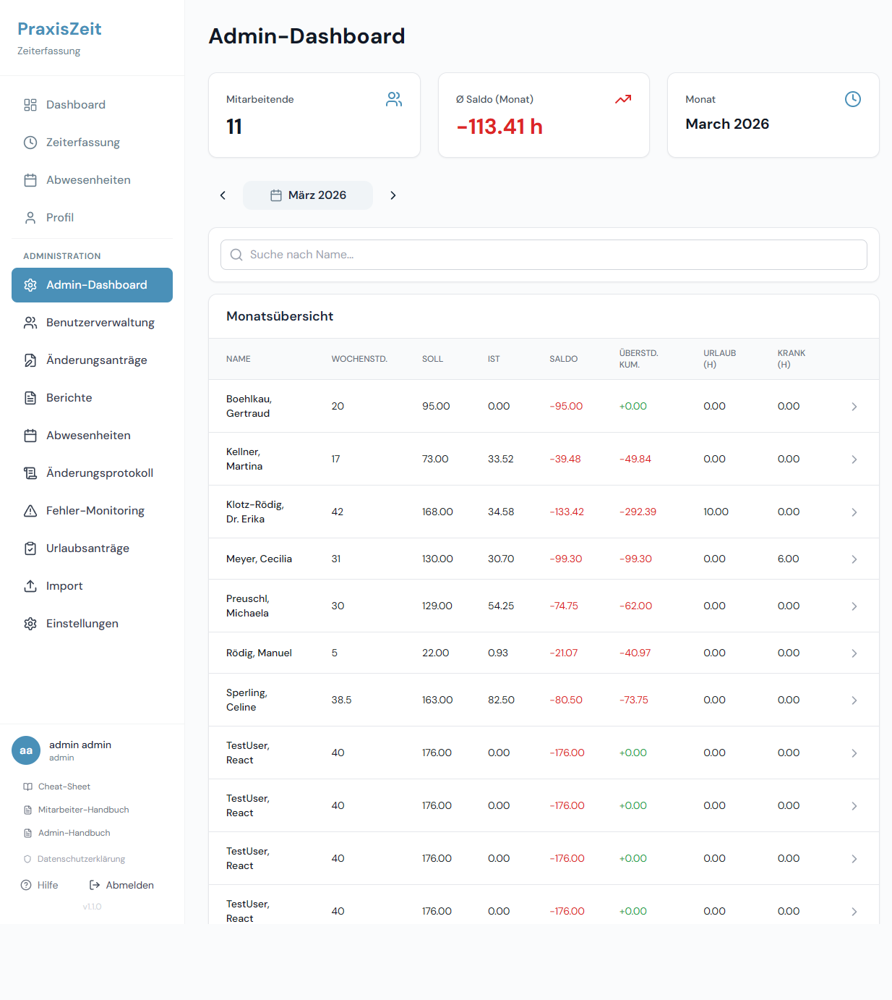
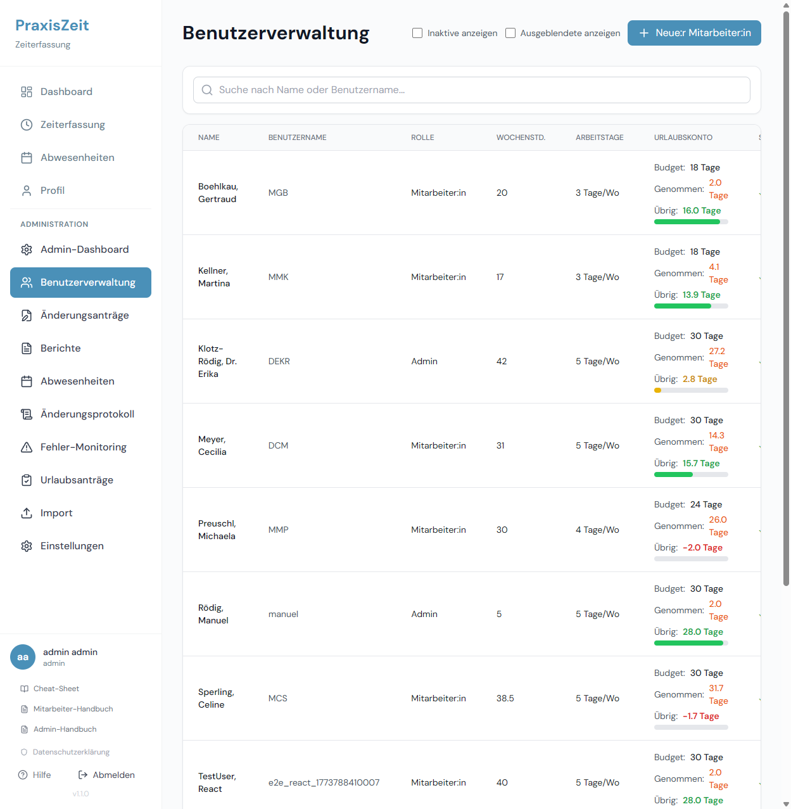
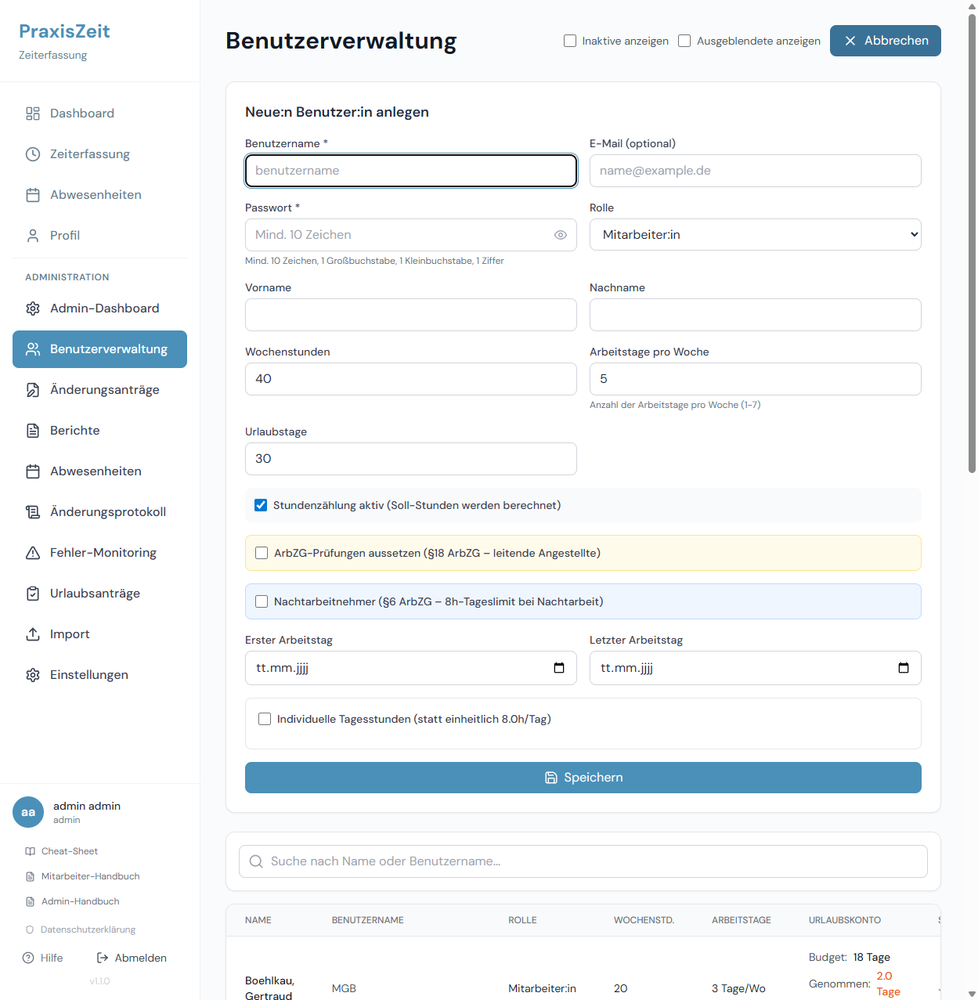
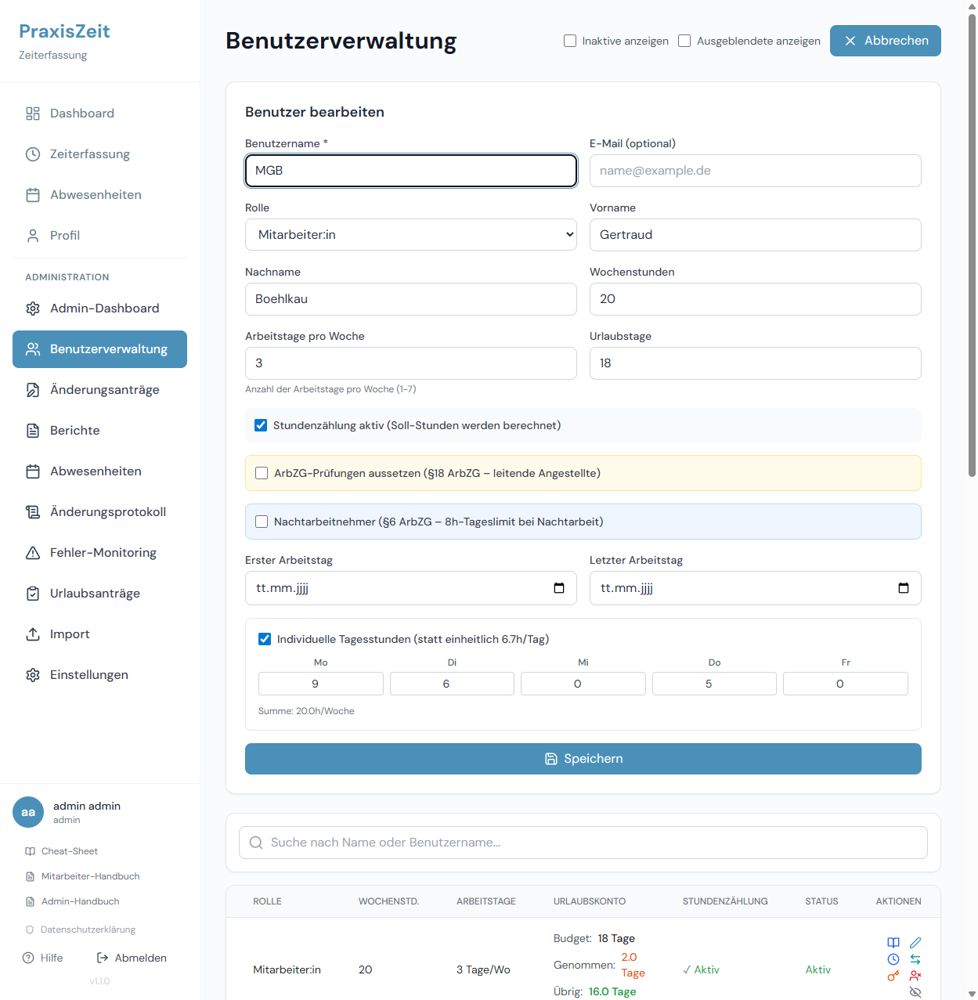
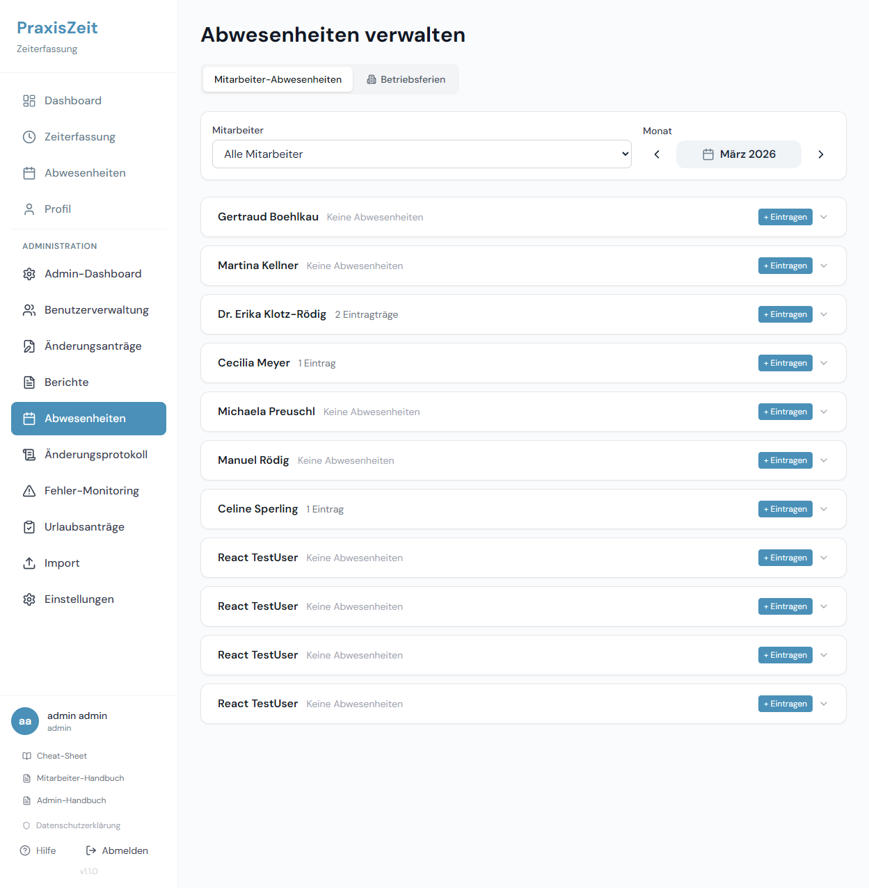
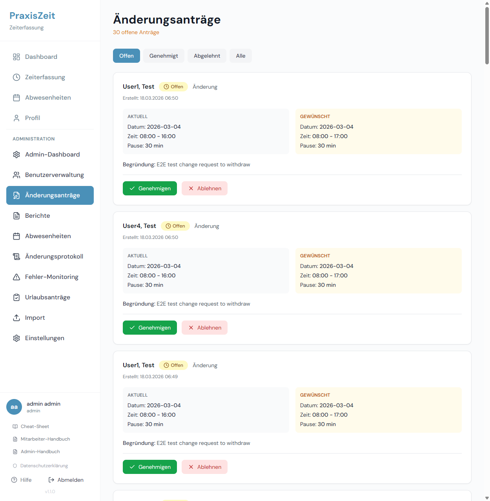
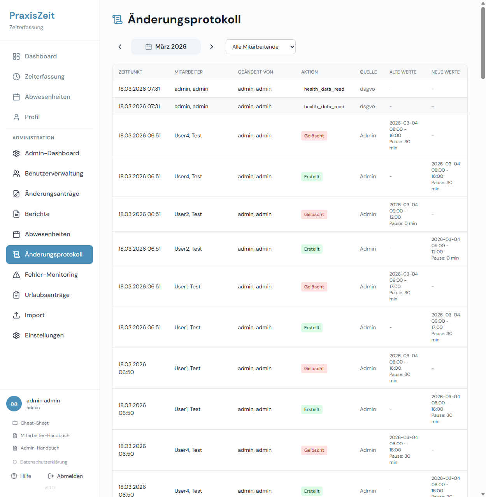
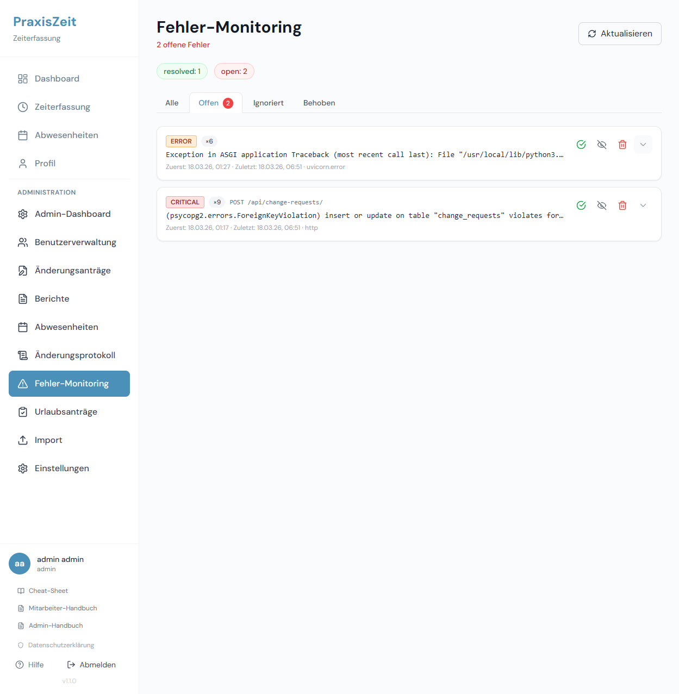
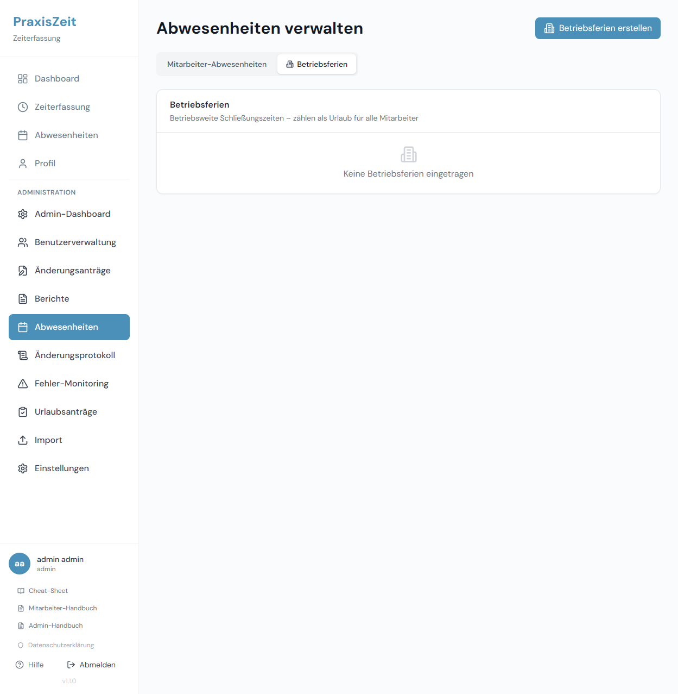
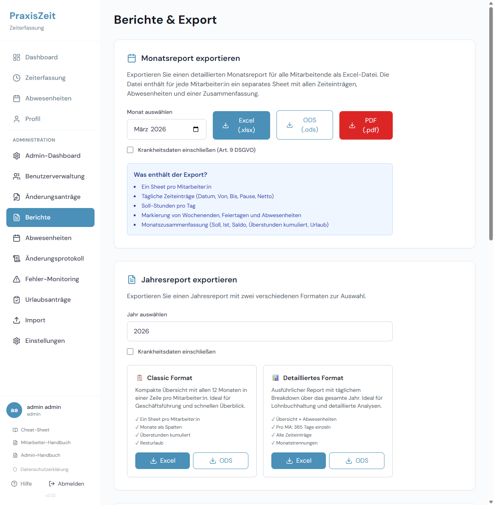

# PraxisZeit – Handbuch für Administratoren

**Version 1.0 | Stand: Februar 2026**

---

## Inhaltsverzeichnis

1. [Einleitung](#1-einleitung)
2. [Login und Zugangsdaten](#2-login-und-zugangsdaten)
3. [Admin-Dashboard](#3-admin-dashboard)
4. [Benutzerverwaltung](#4-benutzerverwaltung)
5. [Abwesenheitskalender](#5-abwesenheitskalender)
6. [Berichte und Exporte](#6-berichte-und-exporte)
7. [Urlaubsanträge genehmigen](#7-urlaubsanträge-genehmigen)
8. [Korrekturanträge prüfen](#8-korrekturanträge-prüfen)
9. [Änderungsprotokoll (Audit-Log)](#9-änderungsprotokoll-audit-log)
10. [Fehler-Monitoring](#10-fehler-monitoring)
11. [Betriebsferien verwalten](#11-betriebsferien-verwalten)
12. [ArbZG-Compliance-Berichte](#12-arbzg-compliance-berichte)
13. [Rechtliche Grundlagen](#13-rechtliche-grundlagen)

---

## 1. Einleitung

Dieses Handbuch richtet sich an **Administratoren** von PraxisZeit. Als Admin haben Sie Zugriff auf alle Bereiche der Anwendung – von der Benutzerverwaltung über Berichte bis hin zu gesetzlichen Compliance-Auswertungen.

**Wichtig:** Mit der Admin-Rolle tragen Sie die Verantwortung für die gesetzeskonforme Dokumentation der Arbeitszeiten gemäß dem **Arbeitszeitgesetz (ArbZG)**. PraxisZeit unterstützt Sie dabei mit automatischen Prüfungen und Berichten.

**Rechtsgrundlage:** Das ArbZG ([Arbeitszeitgesetz](https://www.gesetze-im-internet.de/arbzg/BJNR117100994.html)) verpflichtet Arbeitgeber zur Arbeitszeitaufzeichnung und legt verbindliche Grenzen für Arbeitszeiten fest. PraxisZeit implementiert alle relevanten §§ automatisch.

---

## 2. Login und Zugangsdaten

Der Login für Administratoren erfolgt über dieselbe Seite wie für Mitarbeiter.

**Zugang:**
- **URL:** `http://[Ihre-Server-Adresse]/login`
- **Benutzername:** Ihr Administrator-Benutzername
- **Passwort:** Ihr Passwort

> **Hinweis:** Das initiale Admin-Passwort muss beim ersten Login geändert werden. Sichere Passwörter müssen mindestens 10 Zeichen, einen Großbuchstaben, einen Kleinbuchstaben und eine Ziffer enthalten.

Nach erfolgreichem Login werden Sie automatisch zum Admin-Dashboard weitergeleitet. Das Navigationsmenü auf der linken Seite zeigt Ihnen alle Admin-Bereiche.

---

## 3. Admin-Dashboard

Das Admin-Dashboard gibt Ihnen eine sofortige **Gesamtübersicht über Ihr gesamtes Team**.

### Was Sie auf dem Dashboard sehen

**Erweiterte Navigation (linke Seite):**
- Dashboard (Admin-Ansicht)
- Benutzerverwaltung
- Abwesenheitskalender
- Berichte
- Korrekturanträge
- **Urlaubsanträge** *(neu)*
- Änderungsprotokoll
- Fehler-Monitoring
- Betriebsferien

**Teamübersicht (Hauptbereich):**
Das Admin-Dashboard zeigt alle aktiven Mitarbeiter mit ihren aktuellen Monatsdaten:

| Spalte | Bedeutung |
|--------|-----------|
| **Name** | Vor- und Nachname des Mitarbeiters |
| **Soll** | Zu leistende Stunden im aktuellen Monat |
| **Ist** | Tatsächlich geleistete Stunden |
| **Saldo** | Differenz Ist – Soll (+ = Überstunden, – = Fehlstunden) |
| **Urlaub** | Verbleibende Urlaubstage (Ampelfarbe) |

**Ampel-System Urlaub:**
- 🟢 **Grün**: Mehr als 50% Restanspruch vorhanden
- 🟡 **Gelb**: 25–50% Restanspruch
- 🔴 **Rot**: Weniger als 25% Restanspruch – Handlungsbedarf

> **Tipp:** Klicken Sie auf einen Mitarbeiter-Namen, um direkt zu dessen Detailansicht zu springen.

---

## 4. Benutzerverwaltung

Die Benutzerverwaltung ist das Herzstück der Admin-Funktion.

### Übersicht aller Mitarbeiter

Die Liste zeigt alle aktiven Mitarbeiter mit folgenden Informationen:
- **Name und Benutzername**
- **Wochenstunden** (aktuell gültige Stundenvereinbarung)
- **Arbeitstage/Woche**
- **Urlaubstage** (Jahresbudget)
- **Rolle** (Admin / Mitarbeiter)
- **Status** (Aktiv / Inaktiv)

### Neuen Mitarbeiter anlegen

Klicken Sie auf **„Neuer Benutzer"** und füllen Sie das Formular aus:

**Pflichtfelder:**
| Feld | Beschreibung |
|------|-------------|
| **Benutzername** | Eindeutiger Login-Name (z. B. `maria.hoffmann`) |
| **Vorname / Nachname** | Name des Mitarbeiters |
| **Passwort** | Initiales Passwort (mind. 10 Zeichen) |
| **Wochenstunden** | Vertraglich vereinbarte Wochenstunden |
| **Arbeitstage/Woche** | Anzahl der Arbeitstage (1–5) |
| **Urlaubstage** | Jährlicher Urlaubsanspruch |
| **Rolle** | Mitarbeiter oder Admin |

**Optionale Felder:**
| Feld | Beschreibung |
|------|-------------|
| **E-Mail** | Nur für Benachrichtigungen (optional) |
| **Kalenderfarbe** | Farbe im Teamkalender (Hex-Code, z. B. `#2563EB`) |
| **Stundenzählung deaktivieren** | Für Mitarbeiter ohne Zeiterfassungspflicht |
| **ArbZG-Ausnahme** | Für leitende Angestellte nach §18 ArbZG |
| **Tagesplan verwenden** | Individuelle Stundenverteilung Mo–Fr |

> **Rechtlicher Hinweis (§18 ArbZG):** Leitende Angestellte (Geschäftsführer, Prokuristen) können von den ArbZG-Arbeitszeitbeschränkungen ausgenommen werden. Aktivieren Sie das Flag „ArbZG-Ausnahme" nur für Personen, die tatsächlich unter §18 ArbZG fallen.

### Mitarbeiter bearbeiten

Klicken Sie in der Benutzerliste auf **„Bearbeiten"** neben dem gewünschten Mitarbeiter.

**Wichtige Hinweise beim Bearbeiten:**

**Stundenänderungen mit Wirkungsdatum:**
Wenn Sie die Wochenstunden eines Mitarbeiters ändern (z. B. bei Umstellung auf Teilzeit), wird automatisch ein Eintrag in der **Arbeitszeiten-Historie** erstellt. Damit bleiben historische Saldoberechnungen korrekt – frühere Monate werden mit den damals gültigen Stunden berechnet.

Vorgehensweise:
1. Klicken Sie auf „Bearbeiten" beim Mitarbeiter
2. Tragen Sie die neuen Wochenstunden ein
3. Geben Sie das **Wirkungsdatum** an (ab wann gelten die neuen Stunden?)
4. Optional: Notiz zur Änderung (z. B. „Wechsel auf 50% Teilzeit auf Wunsch")
5. Speichern

**Mitarbeiter deaktivieren:**
Statt Mitarbeiter zu löschen, deaktivieren Sie diese. Deaktivierte Mitarbeiter erscheinen nicht mehr in Berichten und können sich nicht mehr einloggen, aber ihre historischen Daten bleiben erhalten.

> **Rechtlicher Hinweis (§16 ArbZG):** Aufzeichnungen über Arbeitszeiten müssen **mindestens 2 Jahre** aufbewahrt werden. Löschen Sie daher keine Mitarbeiterdaten, sondern deaktivieren Sie die Konten.

---

## 5. Abwesenheitskalender

Der Abwesenheitskalender zeigt alle Abwesenheiten des Teams auf einen Blick.

### Kalenderansicht

Der Kalender zeigt farbcodierte Balken für jeden Mitarbeiter:
- **Blau**: Urlaub
- **Rot**: Krankheit
- **Orange**: Fortbildung
- **Grau**: Sonstige Abwesenheit

Jeder Mitarbeiter hat zudem eine individuelle **Kalenderfarbe** (konfigurierbar in der Benutzerverwaltung), die seine Balken kennzeichnet.

### Navigation

- **Monatspfeile** (`<` / `>`): Vorheriger / nächster Monat
- **„Heute"**: Zurück zum aktuellen Monat

### Als Admin Abwesenheiten eintragen

Als Administrator können Sie Abwesenheiten für jeden Mitarbeiter eintragen:
1. Klicken Sie auf **„Abwesenheit eintragen"**
2. Wählen Sie den Mitarbeiter aus dem Dropdown
3. Wählen Sie Datum und Typ
4. Optional: Zeitraum mit Enddatum
5. Speichern

> **Rechtlicher Hinweis (§16 ArbZG):** Lückenlose Dokumentation von Abwesenheiten ist Teil der gesetzlichen Aufzeichnungspflicht.

---

## 6. Berichte und Exporte

Der Berichtsbereich ermöglicht den Export aller relevanten Arbeitszeitdaten.

### Verfügbare Berichte

#### Monatsreport (detailliert)
- **Inhalt:** Tägliche Zeiteinträge aller Mitarbeiter im gewählten Monat
- **Format:** Excel-Datei (.xlsx)
- **Details pro Mitarbeiter:** Datum, Wochentag, Start, Ende, Pause, Ist-Stunden, Soll-Stunden, Abwesenheitstyp
- **Summenzeile:** Gesamt-Ist, Gesamt-Soll, Monatssaldo

**Verwendung:** Gehaltsabrechnung, monatliche Kontrolle, Dokumentation

#### Jahresreport Classic (kompakte 12-Monats-Übersicht)
- **Inhalt:** Pro Mitarbeiter eine Zeile pro Monat
- **Format:** Excel-Datei (.xlsx), ~17 KB
- **Details:** Soll, Ist, Saldo, Urlaubstage, Krankheitstage, Fortbildungstage

**Verwendung:** Jahresüberblick, schnelle Kontrolle

#### Jahresreport Detailliert (365 Tage)
- **Inhalt:** Jeden Tag des Jahres pro Mitarbeiter
- **Format:** Excel-Datei (.xlsx), ~108 KB
- **Generierungszeit:** 3–5 Sekunden (bitte warten)

**Verwendung:** Detaillierte Jahresauswertung, Steuerberater, Betriebsprüfung

### Bericht erstellen

1. Wählen Sie den **Berichtstyp** (Monatsreport / Jahresreport Classic / Jahresreport Detailliert)
2. Wählen Sie **Monat** oder **Jahr**
3. Klicken Sie auf **„Exportieren"**
4. Die Excel-Datei wird automatisch heruntergeladen

> **Rechtlicher Hinweis (§16 ArbZG):** Der Arbeitgeber ist verpflichtet, Arbeitszeitaufzeichnungen **2 Jahre** aufzubewahren. Exportieren Sie regelmäßig (mindestens jährlich) und sichern Sie die Dateien an einem sicheren Ort.

---

## 7. Urlaubsanträge genehmigen

Wenn die Genehmigungspflicht aktiviert ist, landen Urlaubsanträge von Mitarbeitern zur Prüfung beim Admin.

### Genehmigungspflicht konfigurieren

**Admin-Navigation → Urlaubsanträge**

Oben auf der Seite befindet sich ein Toggle **„Urlaubsanträge genehmigungspflichtig"**:

| Toggle | Verhalten |
|--------|-----------|
| **Aus** (Standard) | Mitarbeiter buchen Urlaub direkt – kein Antrag erforderlich |
| **Ein** | Urlaubsanträge landen als „Offen" beim Admin; erst nach Genehmigung wird der Urlaub eingetragen |

> **Hinweis:** Die Einstellung wirkt sofort. Bereits gestellte Anträge bleiben unberührt.

### Urlaubsanträge prüfen

Die Seite zeigt alle Urlaubsanträge. Filter-Tabs ermöglichen die Ansicht nach Status:

| Tab | Inhalt |
|-----|--------|
| **Offen** | Noch nicht entschiedene Anträge |
| **Genehmigt** | Genehmigte Anträge (Urlaub bereits eingetragen) |
| **Abgelehnt** | Abgelehnte Anträge (inkl. Ablehnungsgrund) |
| **Alle** | Gesamte Historie |

Jede Antragskarte zeigt:
- **Mitarbeitername**, Antragszeitpunkt
- **Urlaubszeitraum** (Datum oder Von–Bis) und **Stunden pro Tag**
- **Notiz** des Mitarbeiters (falls vorhanden)

### Antrag genehmigen

1. Klicken Sie auf **„Genehmigen"** (grüner Button)
2. Das System erstellt automatisch Abwesenheitseinträge für alle Werktage im Zeitraum
   - Wochenenden und Feiertage werden ausgeschlossen
   - Urlaubsbudget wird geprüft – bei Überschreitung erscheint eine Fehlermeldung
   - Bei aktivem Tagesplan (`use_daily_schedule`) werden die individuellen Tagessoll-Stunden verwendet
3. Der Antrag erhält Status **„Genehmigt"**

> **Achtung:** Eine Genehmigung ist unwiderruflich. Zum Stornieren müssen die entstandenen Abwesenheitseinträge manuell gelöscht werden.

### Antrag ablehnen

1. Klicken Sie auf **„Ablehnen"** (rot hinterlegter Button)
2. Optional: Ablehnungsgrund im Textfeld eintragen
3. Klicken Sie auf **„Ablehnen"** zur Bestätigung

Der Mitarbeiter sieht den Ablehnungsgrund im Tab „Meine Anträge" auf der Abwesenheitsseite.

---

## 8. Korrekturanträge prüfen

Mitarbeiter können Korrekturanträge stellen, wenn Zeiteinträge nachträglich geändert werden müssen. Als Admin prüfen und genehmigen oder lehnen Sie diese ab.

### Übersicht der Anträge

Die Liste zeigt alle offenen und vergangenen Korrekturanträge:

| Spalte | Bedeutung |
|--------|-----------|
| **Mitarbeiter** | Wer hat den Antrag gestellt? |
| **Datum** | Welches Datum soll korrigiert werden? |
| **Aktuell** | Bestehender Eintrag (Start/Ende/Pause) |
| **Neu gewünscht** | Vom Mitarbeiter gewünschte Werte |
| **Begründung** | Warum wird die Änderung beantragt? |
| **Status** | Ausstehend / Genehmigt / Abgelehnt |

### Antrag prüfen und entscheiden

1. Klicken Sie auf **„Prüfen"** neben dem Antrag
2. Das Formular zeigt den aktuellen und den gewünschten Eintrag im Vergleich
3. Lesen Sie die Begründung des Mitarbeiters
4. Entscheiden Sie:
   - **„Genehmigen"**: Der Zeiteintrag wird automatisch geändert
   - **„Ablehnen"**: Geben Sie optional einen Ablehnungsgrund ein

**Nach der Entscheidung:**
- Der Mitarbeiter sieht den Status seines Antrags in seiner eigenen Ansicht
- Bei Genehmigung: Zeiteintrag wird sofort aktualisiert, Saldo neu berechnet
- Bei Ablehnung: Der bisherige Eintrag bleibt unverändert

> **Empfehlung:** Prüfen Sie Korrekturanträge zeitnah. Ausstehende Anträge können die Monatsabrechnung verzögern.

---

## 9. Änderungsprotokoll (Audit-Log)

Das Audit-Log protokolliert alle wichtigen Aktionen im System vollständig und unveränderlich.

### Was wird protokolliert?

Das Audit-Log erfasst alle relevanten Aktionen:

| Aktion | Beispiel |
|--------|---------|
| **Login/Logout** | Wer hat sich wann eingeloggt? |
| **Zeiteinträge** | Erstellen, Ändern, Löschen von Zeiteinträgen |
| **Abwesenheiten** | Neue Abwesenheiten, Stornierungen |
| **Benutzerverwaltung** | Neue Benutzer, Passwortänderungen, Deaktivierungen |
| **Korrekturanträge** | Stellen, Genehmigen, Ablehnen |
| **Betriebsferien** | Anlegen und Löschen von Betriebsferien |

### Log-Einträge lesen

Jeder Log-Eintrag enthält:
- **Zeitstempel** (Datum und Uhrzeit)
- **Benutzer** (wer hat die Aktion ausgeführt?)
- **Aktion** (was wurde getan?)
- **Details** (betroffene Daten, z. B. geänderter Zeiteintrag)

### Filter und Suche

Nutzen Sie die Filteroptionen:
- **Zeitraum**: Von–Bis-Datum wählen
- **Benutzer**: Nur Aktionen eines bestimmten Mitarbeiters
- **Aktion**: Nur bestimmte Aktionstypen

> **Rechtlicher Hinweis:** Das Audit-Log erfüllt die Anforderungen an eine unveränderliche Aufzeichnung gemäß §16 ArbZG und kann bei Betriebsprüfungen als Nachweis dienen.

---

## 10. Fehler-Monitoring

Das Fehler-Monitoring zeigt technische Fehler, die in der Anwendung aufgetreten sind.

### Wann ist das relevant?

Das Fehler-Monitoring ist relevant, wenn:
- Mitarbeiter berichten, dass etwas nicht funktioniert
- Sie eine Fehlfunktion selbst bemerken
- Sie die Stabilität des Systems überprüfen möchten

### Fehler-Liste

Jeder Eintrag zeigt:
- **Zeitstempel** des Fehlers
- **Fehlertyp** (z. B. Verbindungsfehler, Datenbankfehler)
- **Häufigkeit** (wie oft ist dieser Fehler aufgetreten?)
- **Benutzerkontext** (welcher Benutzer war betroffen?)

### Was tun bei Fehlern?

1. **Lesen Sie die Fehlermeldung** – oft gibt es eine verständliche Beschreibung
2. **Prüfen Sie die Häufigkeit** – einmalige Fehler sind meist unkritisch
3. **Bei wiederkehrenden Fehlern**: Notieren Sie Zeitstempel und Fehlermeldung und kontaktieren Sie Ihren IT-Support

> **Tipp:** Klicken Sie auf einen Fehler, um Details anzuzeigen – oft enthält die Fehlermeldung bereits den Hinweis auf die Ursache.

---

## 11. Betriebsferien verwalten

Betriebsferien sind betriebsweite Schließzeiten, die für alle Mitarbeiter automatisch als Abwesenheit eingetragen werden.

### Wofür werden Betriebsferien verwendet?

- Weihnachtsschließzeiten
- Sommerferien-Schließzeiten
- Brückentage (wenn die gesamte Praxis geschlossen ist)

### Betriebsferien anlegen

1. Klicken Sie auf **„Neue Betriebsferien"**
2. Füllen Sie das Formular aus:
   - **Bezeichnung** (z. B. „Weihnachtsschließzeit 2026")
   - **Von** (Startdatum)
   - **Bis** (Enddatum)
3. Speichern

**Was passiert automatisch:**
- Alle aktiven Mitarbeiter erhalten für jeden Werktag im Zeitraum einen Abwesenheitseintrag vom Typ „Sonstiges"
- Urlaubstage werden **nicht** verbraucht (Betriebsferien sind kein regulärer Urlaub)
- Wochenenden und gesetzliche Feiertage werden übersprungen

### Betriebsferien löschen

Um Betriebsferien zu stornieren, klicken Sie auf das **Löschen-Symbol** in der Liste. Die entsprechenden Abwesenheitseinträge werden automatisch für alle Mitarbeiter entfernt.

> **Hinweis:** Das Löschen von Betriebsferien storniert auch die automatisch erstellten Abwesenheitseinträge. Bereits manuell ergänzte Einträge im gleichen Zeitraum bleiben unberührt.

---

## 12. ArbZG-Compliance-Berichte

PraxisZeit überwacht automatisch die Einhaltung des Arbeitszeitgesetzes. Dieser Abschnitt erklärt die speziellen Compliance-Berichte.

### Überblick der Compliance-Berichte

Auf der Berichte-Seite finden Sie (weiter unten auf der Seite) die ArbZG-spezifischen Auswertungen:

---

### §5 ArbZG – Ruhezeitverstöße

**Gesetzliche Anforderung:**
Nach §5 ArbZG müssen Arbeitnehmer nach Beendigung der täglichen Arbeitszeit eine ununterbrochene Ruhezeit von **mindestens 11 Stunden** haben, bevor sie wieder arbeiten dürfen.

[§5 ArbZG](https://www.gesetze-im-internet.de/arbzg/__5.html)

**Was der Bericht zeigt:**
- Alle Fälle, bei denen die 11-Stunden-Ruhezeit unterschritten wurde
- Mitarbeitername, betroffene Daten (Tag 1 Ende → Tag 2 Beginn), tatsächliche Ruhezeit

**Handlungsbedarf:**
- Ruhezeitverstöße müssen dokumentiert und Ursachen beseitigt werden
- In dringenden Ausnahmefällen (§7 ArbZG) kann die Ruhezeit auf 9 Stunden verkürzt werden, wenn innerhalb von 4 Wochen der Ausgleich erfolgt

---

### §6 ArbZG – Nachtarbeit-Auswertung

**Gesetzliche Anforderung:**
Nach §6 ArbZG haben Nachtarbeitnehmer (mehr als 48 Arbeitstage pro Jahr zwischen 23:00 und 6:00 Uhr) besondere Schutzrechte. Für sie gilt eine reduzierte tägliche Höchstarbeitszeit von **8 Stunden** (statt 10 Stunden).

[§6 ArbZG](https://www.gesetze-im-internet.de/arbzg/__6.html)

**Was der Bericht zeigt:**
- Mitarbeiter, die im gewählten Jahr 48+ Nachtarbeitstage hatten
- Anzahl der Nachtarbeitstage
- Warnungen bei Überschreitung der 8-Stunden-Grenze

**Handlungsbedarf:**
- Nachtarbeitnehmer müssen regelmäßig arbeitsmedizinisch untersucht werden (§6 Abs. 3 ArbZG)
- Bei mehr als 48 Nachtarbeitstagen gilt die 8h-Grenze statt der 10h-Grenze

---

### §11 ArbZG – Sonntagsarbeit (15-freie-Sonntage-Regel)

**Gesetzliche Anforderung:**
Nach §11 ArbZG müssen Arbeitnehmer mindestens **15 Sonntage pro Jahr** beschäftigungsfrei haben.

[§11 ArbZG](https://www.gesetze-im-internet.de/arbzg/__11.html)

**Was der Bericht zeigt:**
- Anzahl der gearbeiteten Sonntage pro Mitarbeiter im gewählten Jahr
- Warnung, wenn die 15 freien Sonntage nicht eingehalten werden
- Wert: 52 Sonntage im Jahr – 15 Pflichtfreie = **max. 37 Arbeitsonntage**

**Handlungsbedarf:**
- Bei drohender Überschreitung: Dienstplanung anpassen
- Alle Sonntagseinsätze müssen mit einem Ausnahmegrund dokumentiert werden (Feld im Zeiteintrag)

---

### §11 ArbZG – Ersatzruhetag-Tracking

**Gesetzliche Anforderung:**
Wer am Sonntag arbeitet, hat gemäß §11 ArbZG Anspruch auf einen **Ersatzruhetag**:
- Bei Sonntagsarbeit: Ersatzruhetag innerhalb der folgenden **2 Wochen**
- Bei Feiertagsarbeit: Ersatzruhetag innerhalb der folgenden **8 Wochen**

[§11 ArbZG](https://www.gesetze-im-internet.de/arbzg/__11.html)

**Was der Bericht zeigt:**
- Alle Sonntagseinsätze ohne dokumentierten Ersatzruhetag
- Frist bis zur Gewährung des Ersatzruhetags
- Status: Innerhalb Frist / Frist abgelaufen

**Handlungsbedarf:**
- Überwachen Sie offene Ersatzruhetag-Verpflichtungen regelmäßig
- Tragen Sie gewährte Ersatzruhetage als Abwesenheit (Typ: Sonstiges) ein

---

### Automatische Warnungen im Alltag

Neben den Berichten prüft PraxisZeit beim Erstellen und Bearbeiten von Zeiteinträgen automatisch:

| Warnung | Auslöser | Rechtsgrundlage |
|---------|----------|----------------|
| **Tageshöchstgrenze** | > 10h Arbeitszeit | §3 ArbZG |
| **Pausenpflicht** | < 30 min bei >6h / < 45 min bei >9h | §4 ArbZG |
| **Sonntagsarbeit** | Eintrag an einem Sonntag oder Feiertag | §9 ArbZG |
| **Wochenhöchstgrenze** | > 48h in einer Woche | §14 ArbZG |
| **8h-Warnung Nachtarbeit** | Nachtarbeitnehmer > 8h täglich | §6 ArbZG |

---

## 13. Rechtliche Grundlagen

PraxisZeit wurde so entwickelt, dass die wichtigsten Anforderungen des **Arbeitszeitgesetzes (ArbZG)** automatisch durchgesetzt und dokumentiert werden.

**Referenz:** [Arbeitszeitgesetz – Volltext](https://www.gesetze-im-internet.de/arbzg/BJNR117100994.html)

### Überblick der implementierten §§

| Paragraph | Inhalt | Umsetzung in PraxisZeit |
|-----------|--------|------------------------|
| [§3](https://www.gesetze-im-internet.de/arbzg/__3.html) | Werktägliche Arbeitszeit max. 8h (verlängerbar auf 10h) | Warnung bei >8h, Sperrung bei >10h Zeiteintrag |
| [§4](https://www.gesetze-im-internet.de/arbzg/__4.html) | Ruhepausen: 30 min ab 6h, 45 min ab 9h Arbeitszeit | Automatische Pausenvalidierung bei jedem Eintrag |
| [§5](https://www.gesetze-im-internet.de/arbzg/__5.html) | Ruhezeit zwischen zwei Arbeitstagen min. 11 Stunden | Ruhezeitbericht im Admin-Bereich |
| [§6](https://www.gesetze-im-internet.de/arbzg/__6.html) | Nachtarbeit 23–6 Uhr: besondere Schutzrechte (max. 8h/Tag für Nachtarbeitnehmer) | Nachtarbeit-Flag, 8h-Warnung, Nachtarbeit-Report |
| [§9](https://www.gesetze-im-internet.de/arbzg/__9.html) | Sonn- und Feiertagsruhe | Warnung bei Sonntags- oder Feiertagseintrag |
| [§10](https://www.gesetze-im-internet.de/arbzg/__10.html) | Ausnahmen Sonn-/Feiertagsarbeit: Dokumentationspflicht | Pflichtfeld „Ausnahmegrund" bei Sonntagseintrag |
| [§11](https://www.gesetze-im-internet.de/arbzg/__11.html) | Min. 15 freie Sonntage/Jahr; Ersatzruhetag | 15-freie-Sonntage-Report; Ersatzruhetag-Tracking |
| [§14](https://www.gesetze-im-internet.de/arbzg/__14.html) | Außergewöhnliche Fälle: max. 48h/Woche als Warnschwelle | Wochenwarnung bei >48h |
| [§16](https://www.gesetze-im-internet.de/arbzg/__16.html) | Aufzeichnungspflicht: 2 Jahre Aufbewahrung | Excel-Exporte; Audit-Log; Datenretention |
| [§18](https://www.gesetze-im-internet.de/arbzg/__18.html) | Ausnahmen für leitende Angestellte | `ArbZG-Ausnahme`-Flag auf Benutzerebene |

### Admin-Pflichten im Überblick

Als Admin sind Sie verantwortlich für:

1. **Regelmäßige Datenexporte** (mindestens monatlich) und sichere Aufbewahrung über 2 Jahre
2. **Zeitnahe Prüfung** von Korrekturanträgen
3. **Überwachung der ArbZG-Berichte** – besonders §5 (Ruhezeit) und §11 (Sonntage)
4. **Dokumentation von Ausnahmen** (Sonntagsarbeit, verlängerte Arbeitszeiten)
5. **Aktuelle Benutzerdaten** – bei Stundenänderungen immer Wirkungsdatum eintragen
6. **Regelmäßiger Abgleich** Urlaubskonten mit tatsächlichem Urlaubsanspruch

> **Haftungshinweis:** PraxisZeit unterstützt Sie bei der Einhaltung des ArbZG, ersetzt aber keine Rechtsberatung. Bei Unsicherheiten zu arbeitsrechtlichen Fragen wenden Sie sich an einen Fachanwalt für Arbeitsrecht oder Ihren Arbeitgeberverband.

---

*PraxisZeit – Zeiterfassungssystem für Arztpraxen und kleine Unternehmen*
*Stand: Februar 2026*
