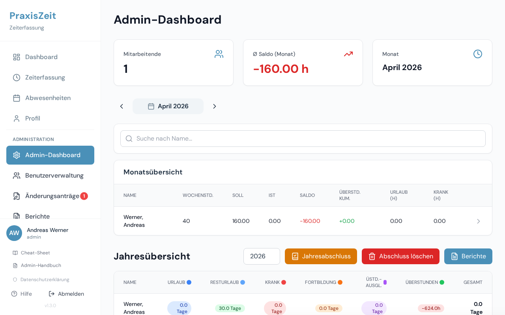
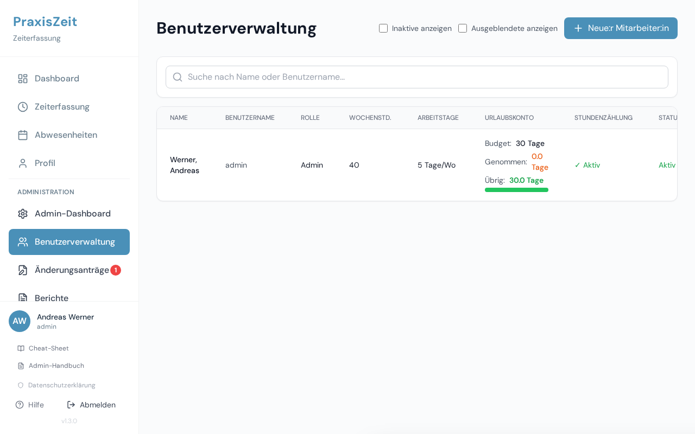
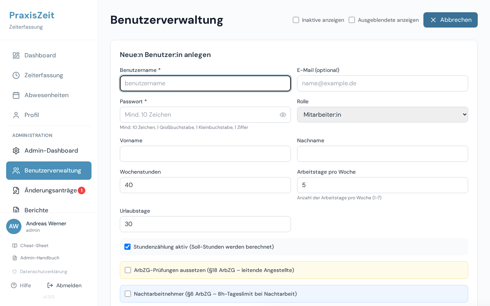
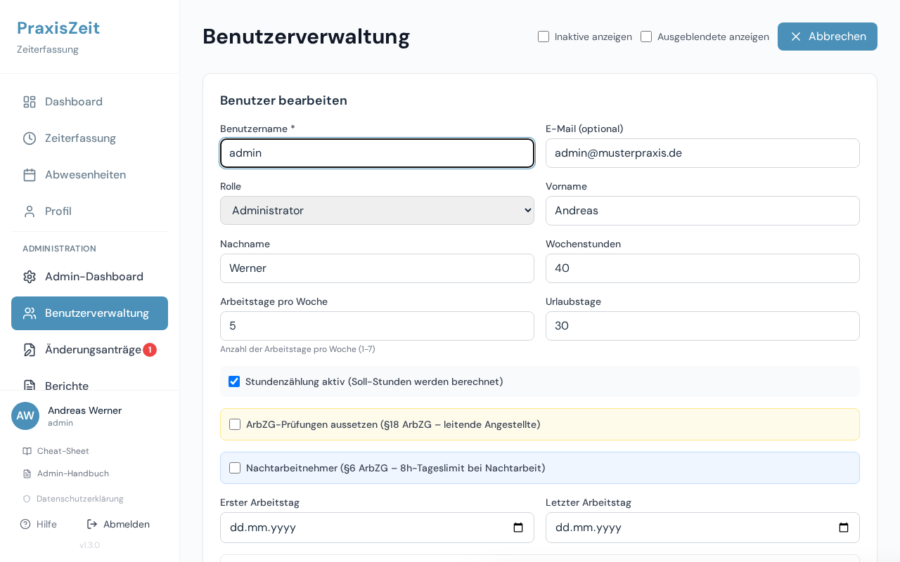
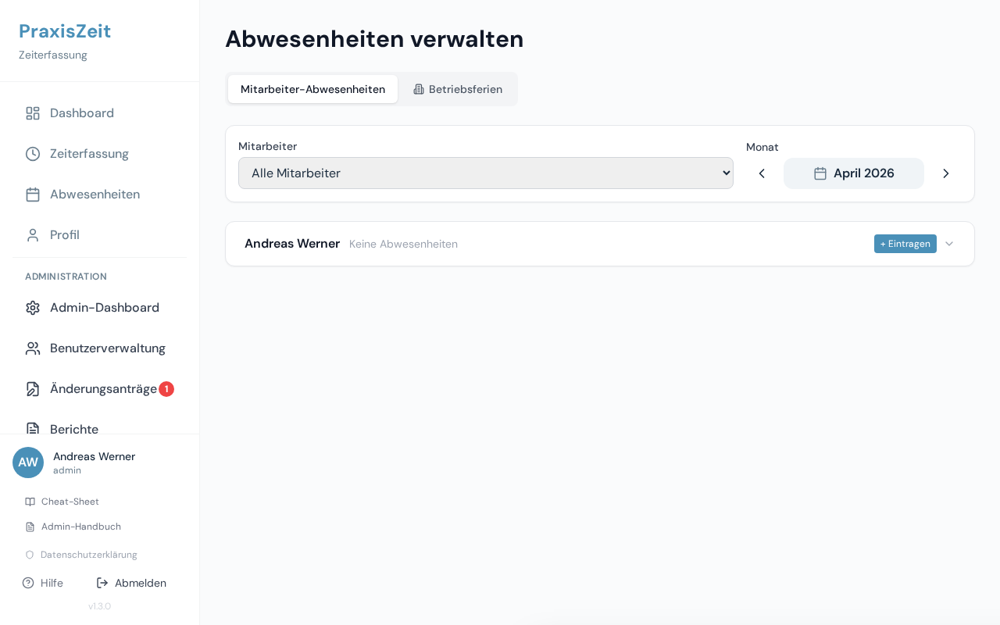
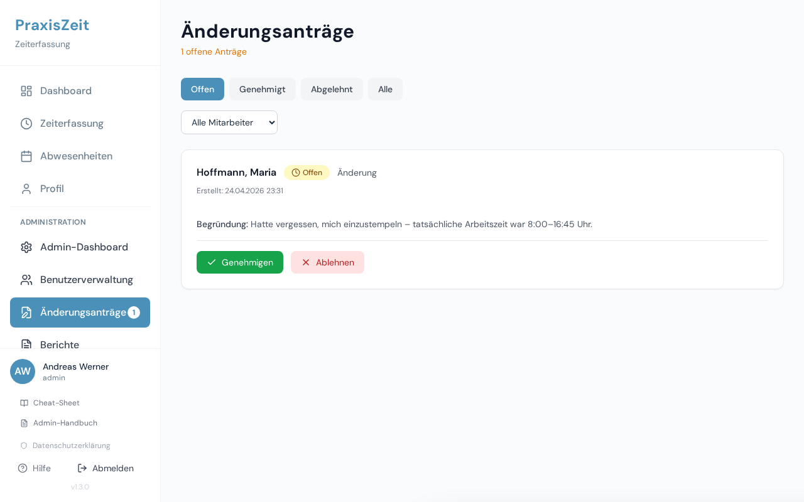
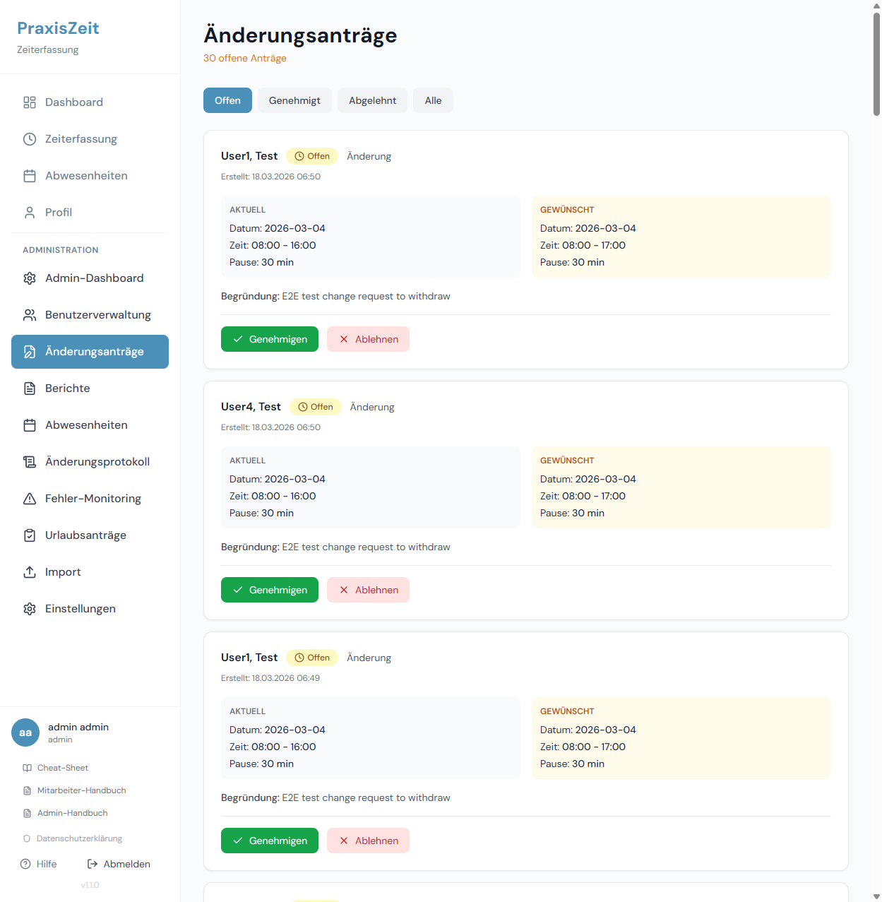
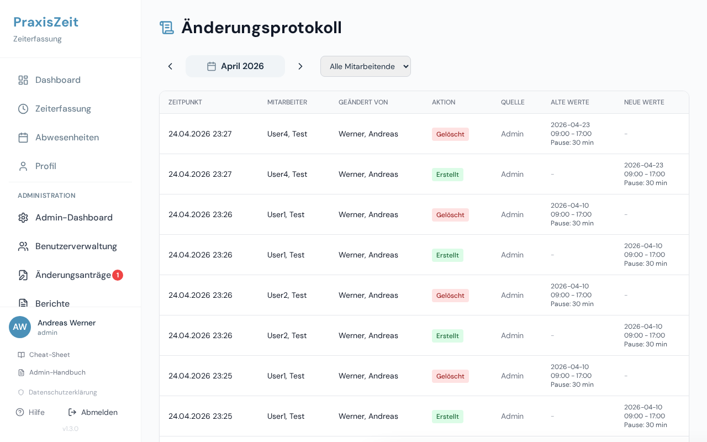
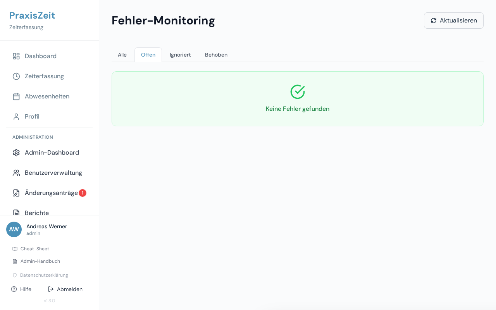
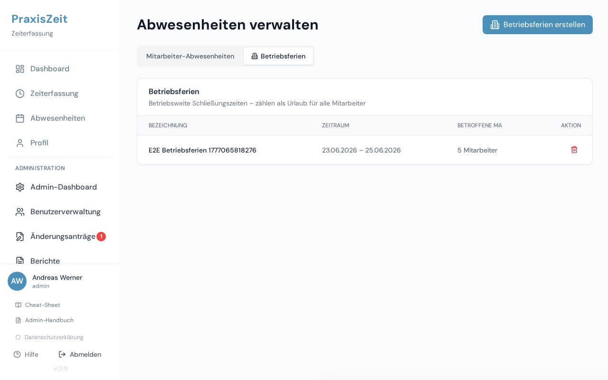

# PraxisZeit – Handbuch für Administratoren

**Version 2.7 | Stand: August 2026 (für PraxisZeit 1.18.2)**

---

## Inhaltsverzeichnis

1. [Einleitung](#1-einleitung)
2. [Login und Zugangsdaten](#2-login-und-zugangsdaten)
3. [Admin-Dashboard](#3-admin-dashboard)
4. [Benutzerverwaltung](#4-benutzerverwaltung)
5. [Abwesenheitskalender](#5-abwesenheitskalender)
6. [Berichte und Exporte](#6-berichte-und-exporte)
7. [Abwesenheitsanträge genehmigen](#7-abwesenheitsanträge-genehmigen)
8. [Korrekturanträge prüfen](#8-korrekturanträge-prüfen)
9. [Änderungsprotokoll (Audit-Log)](#9-änderungsprotokoll-audit-log)
10. [Fehler-Monitoring](#10-fehler-monitoring)
11. [Betriebsferien verwalten](#11-betriebsferien-verwalten)
12. [Import](#12-import)
13. [Einstellungen](#13-einstellungen)
    - [Feiertage / Eigene Feiertage](#feiertage)
    - [Sondertage 24./31.12.](#sondertage-2431-12)
    - [Urlaubsgenehmigung](#urlaubsgenehmigung)
    - [Pflicht-Pause-Ausnahme](#pflicht-pause-ausnahme)
    - [Soll-Arbeitszeit-Fenster (Puffer)](#soll-arbeitszeit-fenster-puffer)
    - [Farben](#farben)
14. [ArbZG-Compliance-Berichte](#14-arbzg-compliance-berichte)
15. [Überstundenausgleich](#15-überstundenausgleich)
16. [Änderungsanträge für Abwesenheiten](#16-änderungsanträge-für-abwesenheiten)
17. [Rechtliche Grundlagen](#17-rechtliche-grundlagen)
18. [Berechnungsgrundlagen (Anhang)](#18-berechnungsgrundlagen-anhang)
19. [Datensicherung (Backup & Restore)](#19-datensicherung-backup--restore)

---

## 1. Einleitung

Dieses Handbuch richtet sich an **Administratoren** von PraxisZeit. Als Admin haben Sie Zugriff auf alle Bereiche der Anwendung – von der Benutzerverwaltung über Berichte bis hin zu gesetzlichen Compliance-Auswertungen.

**Navigation:** In der linken Seitenleiste finden Sie zwei Bereiche:
- **Mitarbeiter-Bereich**: Dashboard, Zeiterfassung, Abwesenheiten, Profil (Ihre eigene Zeiterfassung)
- **Administration**: Admin-Dashboard, Benutzerverwaltung, Änderungsanträge, Berichte, Abwesenheiten, Änderungsprotokoll, Fehler-Monitoring, Anträge, Import, Einstellungen

**Rechtliche Verantwortung:** Als Admin sind Sie für die gesetzeskonforme Dokumentation der Arbeitszeiten gemäß dem **Arbeitszeitgesetz (ArbZG)** verantwortlich. PraxisZeit unterstützt Sie mit automatischen Prüfungen und Berichten.

---

## 2. Login und Zugangsdaten


**Zugang:**
- **URL:** `http://[Ihre-Server-Adresse]/login`
- **Benutzername:** Ihr Administrator-Benutzername
- **Passwort:** Ihr Passwort (mind. 10 Zeichen, Groß-/Kleinbuchstabe, Ziffer)

Nach erfolgreichem Login werden Sie automatisch zum Dashboard weitergeleitet. Die Admin-Navigation erscheint unter dem Abschnitt **„Administration"** in der linken Seitenleiste.

---

## 3. Admin-Dashboard

Das Admin-Dashboard gibt Ihnen eine sofortige **Gesamtübersicht über Ihr gesamtes Team**.



### Teamübersicht

Das Admin-Dashboard zeigt alle aktiven Mitarbeiter mit ihren aktuellen Monatsdaten:

| Spalte | Bedeutung |
|--------|-----------|
| **Name** | Vor- und Nachname des Mitarbeiters |
| **Wochenstd.** | Aktuell gültige Wochenstunden |
| **Soll** | Zu leistende Stunden im aktuellen Monat |
| **Ist** | Tatsächlich geleistete Stunden |
| **Saldo** | Differenz Ist – Soll (H:MM, + = Überstunden, – = Fehlstunden) |
| **Übersto. Kum.** | Kumulierter Jahressaldo |
| **Urlaub** | Verbleibende Urlaubstage (Ampelfarbe) |
| **Krank** | Kranktage im aktuellen Monat |

### Statistiken (oben)

- **Mitarbeitende:** Anzahl aktiver Mitarbeiter
- **Ø Saldo (Monat):** Durchschnittlicher Monatssaldo aller Mitarbeiter
- **Monat:** Aktuell angezeigter Monat

**Monat wechseln:** Mit den Pfeilen `<` und `>` wechseln Sie den angezeigten Monat.

**Monat ↔ Woche umschalten (#329):** Über den Umschalter **„Monat / Woche"** oben neben dem Zeitraum wechseln Sie zwischen der Monats- und einer **Wochenansicht**. In der Wochenansicht steht statt „Juni 2026" die Kalenderwoche, z. B. **„22.–28.06.2026 (KW 26)"**; mit den Pfeilen blättern Sie wochenweise. Die Spalten sind dieselben wie im Monat. So erhalten Sie eine schnelle Plausibilitätsübersicht, wer zu viel oder zu wenig gearbeitet hat. Ihre Auswahl (Monat oder Woche) bleibt **pro Browser/Gerät** gespeichert. In der Wochenansicht heißt die zweite Option der Soll-Basis entsprechend **„volle Woche"** statt „Monatsende".

**Soll-Basis umschalten (#313):** Über das Dropdown **„Soll: bis heute / Monatsende"** in der Monatsübersicht steuern Sie, wie das Monats-**Soll** gezählt wird:
- **bis heute** (Standard): nur bis zum **letzten abgeschlossenen Arbeitstag** des laufenden Monats — so startet der Saldo nicht mit einem Monatsanfangs-Minus.
- **Monatsende**: der **volle** Monat.
Für **abgeschlossene** Monate sind beide identisch. (Technisch: der Bericht `/admin/reports/monthly` nimmt den Parameter `soll_basis=bis_heute|monatsende`.) Der Stichtag betrifft **ausschließlich** diese Live-Übersichten (MA-Dashboard, Admin-Team-Tabelle, Benutzerübersicht, Überstundenkonto samt Diagramm, Jahres-bis-heute-Summe). Die heruntergeladenen §16-Exporte, das **Monatsjournal** und der **Jahresabschluss** (Carryover) rechnen bewusst immer den **vollen** Monat bzw. das volle Jahr – das sind Rechtsbelege, die sich nicht rückwirkend ändern sollen, je nachdem, an welchem Tag man sie sich ansieht.

**Suche:** Nutzen Sie das Suchfeld, um nach einem bestimmten Mitarbeiter zu filtern.

**Detailansicht:** Klicken Sie auf den Pfeil am Ende einer Zeile, um die Detailansicht des Mitarbeiters zu öffnen.

> **Tipp:** Der Ampelindikator beim Urlaub zeigt auf einen Blick, wer dringend Urlaub nehmen sollte.

### Jahresabschluss

Unterhalb der Monatsübersicht finden Sie die **Jahresübersicht** mit Urlaubs- und Krankheitstagen aller Mitarbeiter. Hier können Sie den Jahresabschluss durchführen.

#### Jahresabschluss erstellen

1. Wählen Sie das gewünschte **Jahr** im Zahlenfeld aus
2. Klicken Sie auf den orangefarbenen Button **Jahresabschluss**
3. Im Bestätigungsdialog werden Sie informiert, dass Überstunden-Saldo und Resturlaub aller aktiven Mitarbeiter berechnet und als Übernahme ins Folgejahr gespeichert werden
4. Bestätigen Sie mit **Jahresabschluss erstellen**

Der Jahresabschluss berechnet für jeden aktiven Mitarbeiter:
- **Überstunden-Saldo** zum 31.12. des gewählten Jahres
- **Resturlaub** (nicht genommene Urlaubstage)

Diese Werte werden als Vorjahresübernahme für das Folgejahr gespeichert und fließen dort in die Stunden- und Urlaubsberechnung ein.

#### Jahresabschluss löschen

Falls ein Jahresabschluss versehentlich erstellt wurde, können Sie ihn wieder löschen:

1. Wählen Sie das Jahr, dessen Abschluss Sie löschen möchten
2. Klicken Sie auf den roten Button **Abschluss löschen**
3. Lesen Sie den Bestätigungsdialog sorgfältig — die Löschung ist **unwiderruflich**
4. Bestätigen Sie mit **Jahresabschluss löschen**

> **Wichtig:** Das Löschen entfernt **alle** Übernahmen für das Folgejahr — auch manuell eingetragene Vorjahresübernahmen einzelner Mitarbeiter. Prüfen Sie daher vor dem Löschen, ob manuelle Übernahmen existieren, die Sie anschließend neu eintragen müssen.

---

## 4. Benutzerverwaltung

Die Benutzerverwaltung ist das Herzstück der Admin-Funktion.



### Übersicht aller Mitarbeiter

Die Liste zeigt alle aktiven Mitarbeiter mit:
- **Name** und **Benutzername** (Kürzel)
- **Rolle** (Mitarbeiter:in / Admin)
- **Wochenstd.** und **Arbeitstage**
- **Urlaubskonto** (Budget, Genommen, Übrig – mit Ampelfarbe)

**Filter:** Aktivieren Sie **„Inaktive anzeigen"** oder **„Ausgeblendete anzeigen"** um deaktivierte Mitarbeiter einzublenden.

**Monatsjournal (#311):** Über das Buch-Symbol in der Aktionsspalte öffnen Sie das **Monatsjournal** des Mitarbeiters. Die Überschrift trägt jetzt den Namen der Person – **„Monatsjournal: Vorname Nachname"** –, damit beim Wechsel zwischen Mitarbeitern sofort klar ist, wessen Journal angezeigt wird.

**„Login als …" – Ansicht als Mitarbeiter:in (#370):** Über das Anmelde-Symbol in der Aktionsspalte (nur bei **aktiven Mitarbeitenden**, nicht bei Admins) öffnen Sie die Anwendung aus der Perspektive dieser Person – praktisch, um das individuelle Dashboard zu beurteilen oder ein gemeldetes Problem nachzustellen. Die Ansicht ist **ausschließlich lesend**: Stempeln, Anträge stellen und jegliche Änderungen sind gesperrt (der Server weist Schreibversuche ab). Ein dauerhaftes Hinweisbanner am oberen Rand zeigt **„Sie sehen PraxisZeit als … – nur Lesen"**; über **„Zurück zu Admin"** kehren Sie jederzeit zu Ihrem eigenen Konto zurück.

> **Datenschutz:** Jede „Login als"-Sitzung wird protokolliert (welcher Admin, welche Person, Beginn und Ende) – Rechenschaftspflicht nach Art. 5 Abs. 2 DSGVO. Da keine Änderungen möglich sind, kann keine Aktion fälschlich der/dem Mitarbeitenden zugerechnet werden (§ 16 ArbZG).

### Neuen Mitarbeiter anlegen



Klicken Sie auf **„Neuer Mitarbeiter:in"** und füllen Sie das Formular aus:

**Pflichtfelder:**
| Feld | Beschreibung |
|------|-------------|
| **Benutzername** | Eindeutiger Login-Name (z. B. `m.hoffmann`) |
| **Passwort** | Initiales Passwort (mind. 10 Zeichen, Groß-/Kleinbuchstabe, Ziffer) |
| **Rolle** | Mitarbeiter:in oder Admin |
| **Wochenstunden** | Vertraglich vereinbarte Wochenstunden (Standard: 40), direkt eingegeben in Viertelstunden-Schritten (z. B. 20,25). Bei individuellen Tagesstunden (ebenfalls Viertelstunden je Wochentag) übernimmt das System die Wochenstunden automatisch als Summe der Tageswerte – der Eingabewert im Feld selbst spielt dann keine Rolle. |
| **Arbeitstage pro Woche** | Anzahl der Arbeitstage 1–7 (Standard: 5). Bestimmt den anteiligen Urlaubsvorschlag. |
| **Urlaubstage** | Jährlicher Urlaubsanspruch in **Tagen**. Vorschlag anteilig nach Arbeitstagen: `30 × Arbeitstage ÷ 5` (5 Tage → 30, 3 Tage → 18). Überschreibbar. |

**Optionale Felder:**
| Feld | Beschreibung |
|------|-------------|
| **E-Mail** | Für Kontaktzwecke (optional) |
| **Vorname / Nachname** | Anzeigename |
| **Stundenzählung aktiv (Soll-Stunden werden berechnet)** | Standardmäßig aktiv. Deaktivieren Sie diese Option für **Mitarbeiter ohne Stundenzählung** – siehe eigener Abschnitt unten. |
| **ArbZG-Prüfungen aussetzen (§18 ArbZG – leitende Angestellte)** | Setzt die ArbZG-Prüfungen für diese Person aus. **Eigenständige, von der Stundenzählung unabhängige Einstellung** – siehe Hinweis unten. |
| **Nachtarbeitnehmer** | § 6 ArbZG – 8h-Tageslimit bei Nachtarbeit |
| **Nimmt an Betriebsferien teil** | Standardmäßig aktiv. Bestimmt, ob der/die Mitarbeitende bei angelegten Betriebsferien automatisch Abwesenheitseinträge erhält – **unabhängig von der Rolle**. Für reine Verwaltungs-Accounts (Admin ohne eigene Zeiterfassung) abwählbar. Siehe eigener Abschnitt unten. |
| **Erster / Letzter Arbeitstag** | Eintrittsdatum und ggf. geplantes Austrittsdatum. Das **Soll wird nur innerhalb dieses Zeitraums** berechnet – vor dem Eintritt bzw. nach dem Austritt entsteht kein Stundensoll, und auch tatsächlich erfasste Zeiten außerhalb des Beschäftigungszeitraums erzeugen keine Überstunden. Der **Urlaubsanspruch wird anteilig** berechnet (für ein unterjähriges Eintritts-/Austrittsjahr). In den Monats- und Jahresexporten (Excel, ODS, PDF) tragen Tage außerhalb dieses Zeitraums Soll und Ist 0 und sind mit dem Hinweis **„Außerhalb des Beschäftigungszeitraums"** gekennzeichnet; erfasste Stempelzeiten bleiben dort sichtbar. |
| **Individuelle Tagesstunden** | Abweichende Stundenverteilung Mo–Fr statt einheitlich (nur bei aktiver Stundenzählung) |
| **Abteilung/Bereich** | Optionale Zuordnung (Freitext); ermöglicht Filterung im Abwesenheitskalender |
| **Anfangssaldo Überstunden** | Übernommener Überstundensaldo zum Startjahr (kann +/- sein; nur bei aktiver Stundenzählung) |
| **Übertrag Urlaubstage** | Alt-/Vorjahres-Resturlaub, der dem **Urlaubsbudget des Startjahres** zugerechnet wird (z. B. beim Systemwechsel bei unterjährigem Eintritt der Resturlaub aus den Monaten vor dem Eintritt). Minus und Kommastellen möglich; gilt für **alle** MA (auch ohne Stundenzählung). |
| **Soll-Arbeitszeiten je Wochentag** | Optionaler Soll-Beginn / Soll-Ende pro Wochentag (Mo–Fr) – siehe eigener Abschnitt „Soll-Arbeitszeiten" unten. |

> **Wichtig – zwei getrennte Einstellungen, bitte nicht verwechseln:**
> - **„Stundenzählung aktiv"** steuert nur, **ob** für diese Person Soll-/Ist-Stunden und Überstunden geführt werden. Sie hat **nichts** mit dem § 18 ArbZG zu tun.
> - **„ArbZG-Prüfungen aussetzen (§ 18 ArbZG)"** ist eine eigene Checkbox und setzt die arbeitszeitrechtlichen Prüfungen aus. Diese betrifft ausschließlich leitende Angestellte im Sinne des § 18 ArbZG.
>
> Beide Optionen lassen sich frei und unabhängig kombinieren. Aktivieren Sie das § 18-Flag nur für Personen, die tatsächlich unter § 18 ArbZG fallen.

> **Überstunden-Übersicht:** Die Benutzerübersicht zeigt pro Mitarbeiter:in zusätzlich zum Urlaubskonto den **aktuellen Überstundensaldo (Jahr bis heute)** in der Spalte **„Überstunden (JTD)"**. Bei Mitarbeitern ohne Stundenzählung erscheint hier „—" (→ [Abschnitt „Mitarbeiter ohne Stundenzählung"](#mitarbeiter-ohne-stundenzählung)).

> ⚠️ **Wichtig bei unterjährigem Eintritt:** Tragen Sie für Mitarbeitende, die **nicht seit dem 1. Januar** im System sind, unbedingt den **„Ersten Arbeitstag"** ein. Ohne dieses Datum zählt das System das Stundensoll für den Eintrittsmonat (bzw. die JTD-Überstunden ab dem 1. Januar) auch für Tage **vor** dem tatsächlichen Eintritt mit – es entstehen **Phantom-Minusstunden**. Mit gesetztem Eintrittsdatum bleibt das Überstundenkonto korrekt.

> **So wird Urlaub berechnet (Tagesprinzip, § 3 BUrlG / BAG):** Der Urlaub wird **nach Arbeitstagen** geführt, nicht nach Stunden. Ein freier Arbeitstag verbraucht **genau 1 Urlaubstag**, unabhängig von der Tagesstundenzahl – ein langer Tag (z. B. 9 h) kostet so viel wie ein kurzer (z. B. 4 h): einen Tag. Ein **halber freier Tag** (Halbtags-Abwesenheit) kostet **0,5 Urlaubstage**. Auch bei **individuellen Tagesstunden** kostet jeder Arbeitstag gleich viel (Montag = Dienstag). Der Jahresanspruch wird anteilig nach Arbeitstagen vorgeschlagen (`30 × Arbeitstage ÷ 5`) und bei unterjährigem Eintritt/Austritt zeitanteilig berechnet. Intern speichert das System Stunden (für die Soll-/Ist-Berechnung); der **Verbrauch wird tagebasiert** gezählt und im Urlaubskonto in Tagen angezeigt.

### Mitarbeiter ohne Stundenzählung

Über die Checkbox **„Stundenzählung aktiv (Soll-Stunden werden berechnet)"** (standardmäßig aktiv) legen Sie fest, ob für eine Person die Arbeitszeit ausgewertet wird. Deaktivieren Sie die Checkbox, wird der/die Mitarbeitende zu einem **Mitarbeiter ohne Stundenzählung**.

**Was sich ändert, wenn die Stundenzählung deaktiviert ist:**
- **Keine Soll-/Ist-Stundenberechnung** und **keine Überstundenberechnung.** In der Benutzerübersicht erscheint in der Spalte „Überstunden (JTD)" ein „—".
- Die Felder „Anfangssaldo Überstunden", „Individuelle Tagesstunden" und das Soll-/Ist-Dashboard entfallen für diese Person.
- **Urlaub und Krankheit werden trotzdem geführt** – und zwar **tagebasiert**: 1 genommener freier Arbeitstag = 1 Urlaubstag. Ein „Frei + zählt als Urlaub"-Sondertag (z. B. Heiligabend) zählt 1 Tag; ein als **„halber Feiertag"** konfigurierter Sondertag (24./31.12.) zählt **0,5 Tage** (seit #394). Der Urlaubsanspruch bleibt anteilig nach Arbeitstagen und behält die Vorjahresübernahme.

**Wofür gedacht:** z. B. Personen, deren Arbeitszeit nicht erfasst, deren Urlaub aber dennoch verwaltet werden soll.

> **Abgrenzung (bitte nicht verwechseln):** „Mitarbeiter ohne Stundenzählung" hat **nichts** mit § 18 ArbZG zu tun. Die § 18-Ausnahme („ArbZG-Prüfungen aussetzen") ist eine **separate, unabhängige Checkbox** und betrifft ausschließlich leitende Angestellte. Eine Person kann z. B. Stundenzählung haben **und** § 18-befreit sein – oder umgekehrt.
>
> **Hinweis zu Halbtagen:** Bei Mitarbeitern ohne Stundenzählung zählt ein halber Tag derzeit als voller Tag (es findet keine Stunden-/Halbtagsverrechnung statt).

### Soll-Arbeitszeiten (Soll-Arbeitszeit-Fenster, #201)

Im Benutzerformular finden Sie den Bereich **„Soll-Arbeitszeiten je Wochentag"**. Dort können Sie pro Wochentag (Mo–Fr) einen **Soll-Beginn** (oberes Feld) und ein **Soll-Ende** (unteres Feld) hinterlegen. Beide Felder sind **optional** – leer lassen bedeutet „kein Fenster". Das System rechnet dann erfasste Zeiten außerhalb dieses Fensters **nicht** auf die Arbeitszeit an, sondern kürzt sie auf den jeweils erlaubten Rand (zuzüglich eines konfigurierbaren Puffers).

**Funktionsweise:**
- Zeiten außerhalb des Fensters werden **nicht angerechnet**: Die angerechnete Zeit beginnt frühestens beim Soll-Beginn (minus Puffer) und endet spätestens beim Soll-Ende (plus Puffer).
- Der **tatsächlich gestempelte Zeitpunkt** bleibt als Rohstempel erhalten und ist im Eintrag nachvollziehbar (§ 16 ArbZG – Dokumentationspflicht). Salden und Überstundenkonto rechnen ausschließlich mit der angerechneten (gekürzten) Zeit.
- **Puffer:** Der systemweite Toleranzbereich (Standard: **15 Minuten**) ist unter **Einstellungen → „Soll-Arbeitszeit-Fenster"** im Feld **„Puffer für Soll-Arbeitszeit-Fenster (Min.)"** konfigurierbar (→ [Abschnitt 13](#soll-arbeitszeit-fenster-puffer)). Innerhalb des Puffers wird die Differenz angerechnet; außerhalb wird auf den Fensterrand gekürzt.

**Opt-in:** Sind für einen Mitarbeiter **keine** Soll-Zeiten hinterlegt, ändert sich nichts am bisherigen Verhalten. Die Kappung wird außerdem **übersprungen** bei Mitarbeitern ohne Stundenzählung. Bei **§ 18-befreiten** Mitarbeitern (ArbZG-Prüfungen ausgesetzt) wird **trotzdem gekappt** – es handelt sich um eine reine Anwesenheits-Policy, nicht um eine ArbZG-Prüfung.

Eingehängt ist die Kappung an **allen** Schreibpfaden: Ein-/Ausstempeln, manuelles Anlegen/Bearbeiten von Zeiteinträgen, Admin-Korrekturen, XLS-Import und genehmigte Korrekturanträge.

> **Rechtlicher Hinweis:** Die Nicht-Anrechnung von Zeiten außerhalb des Soll-Fensters ist eine **Arbeitgeber-seitige Policy-Entscheidung** (keine gesetzliche Vorgabe). Die arbeitsrechtliche Zulässigkeit (z. B. Umgang mit angeordneter Mehrarbeit) verantwortet der Betrieb. Der erhaltene Rohstempel dokumentiert gemäß § 16 ArbZG die tatsächliche Anwesenheit.

### Mitarbeiter bearbeiten



Klicken Sie in der Benutzerliste auf den Namen des Mitarbeiters.

**Stundenänderungen:**
Die Wochenstunden, die Tagesstunden, der Haken **„Individuelle Tagesstunden"** und **„Arbeitstage pro Woche"** werden im Bearbeiten-Formular nur noch **angezeigt** – ein direktes Überschreiben ist hier für **alle** Mitarbeitenden nicht mehr möglich, auch nicht bei individuellem Tagesplan. Daneben steht der Button **„Wochenstunden anpassen…"**. Er öffnet denselben Dialog **„Wochenstunden & Tagesplan"** wie das Uhr-Symbol in der Benutzerliste.

So ändern Sie die Arbeitszeit (z. B. bei einer Teilzeitumstellung oder einem Wechsel auf individuelle Tagesstunden):

1. Name/Kürzel des Mitarbeiters öffnen
2. Button **„Wochenstunden anpassen…"** klicken (alternativ: Uhr-Symbol in der Benutzerliste)
3. Im Dialog zwischen **„Gleichmäßig"** (Wochenstunden + Arbeitstage pro Woche) und **„Nach Tagen"** (Stunden je Wochentag Mo–Fr) wählen – auch ein Wechsel zwischen den beiden Modi läuft über diesen Dialog. Im Modus „Nach Tagen" tragen Sie die Stunden pro Wochentag ein; die Wochensumme und die Zahl der Arbeitstage errechnet der Dialog daraus automatisch (Arbeitstage = Anzahl der Wochentage mit eingetragenen Stunden, nicht frei wählbar).
4. **„Gültig ab"**-Datum angeben (ab wann gilt die neue Regelung)
5. Speichern

Der Verlauf im Dialog zeigt jeden Eintrag als **„ab … bis …"**: Die vorherige Regelung endet automatisch am Vortag des neuen Gültigkeitsdatums, der aktuellste Eintrag läuft „bis heute". Bei individuellem Tagesplan zeigt die Zeile die Tagesstunden aus, z. B. „ab 01.03.2026 bis heute: Mo 8,0 / Di 5,0 / Mi 4,0 = 17,0 Std/Woche · 3 Tage/Woche". So ist auf einen Blick erkennbar, in welchem Zeitraum welche Regelung galt.

**Liegt das gewählte Datum in der Vergangenheit** – oder sind im Wirkungszeitraum bereits Abwesenheiten gebucht –, zeigt der Dialog vor dem Speichern einen Hinweis mit dem betroffenen Zeitraum, dem **Tagessoll je Wochentag** (alter Wert → neuer Wert, Mo–Fr) sowie der Anzahl betroffener Abwesenheiten. Zusätzlich vergleicht eine Tabelle **Überstundensaldo** und **Urlaub** (mit Jahreszahl) jeweils **vorher/nachher**. Gespeichert wird erst nach ausdrücklicher Bestätigung dieses Hinweises. Berührt der Zeitraum ein bereits **abgeschlossenes Jahr**, weist der Dialog zusätzlich darauf hin – der eingefrorene Jahresabschluss wird dadurch **nicht** automatisch neu berechnet, sondern nur gemeldet; eine eventuelle Anpassung des Übertrags muss manuell geprüft werden.

Beim Speichern werden die **Stunden bereits gebuchter Abwesenheiten** im Wirkungszeitraum auf das neue Tagessoll umgestellt (ein Halbtag entsprechend zur Hälfte) – das gilt gleichermaßen bei gleichmäßiger Verteilung **und** bei individuellem Tagesplan. Das gilt für rückwirkende **und** für zukunftsdatierte Änderungen: Genehmigter Urlaub, Betriebsferien und geplante Fortbildungen sind typischerweise im Voraus gebucht und tragen die Stunden des alten Vertrags – ausschlaggebend ist also nicht das Datum, sondern ob im Zeitraum überhaupt etwas gebucht ist. Der Wirkungszeitraum reicht vom Gültig-ab-Datum bis zum Tag vor der nächsten Stundenänderung; gibt es keine spätere Änderung, bis zur letzten gebuchten Abwesenheit (mindestens bis heute). Ausgenommen sind **Überstundenausgleich** (dort zählen die beantragten Stunden weiter) und **Mitarbeitende ohne Stundenzählung**. Die **Urlaubstage selbst ändern sich dabei nie** – Urlaub wird nach dem Tagesprinzip geführt (1 freier Arbeitstag = 1 Urlaubstag), nicht nach Stunden. Bei individuellem Tagesplan gilt: ändert die Änderung nur einen einzelnen Wochentag (z. B. nur Mittwoch), werden auch nur die an diesem Wochentag gebuchten Abwesenheiten umgerechnet – Abwesenheiten an unveränderten Wochentagen bleiben unangetastet.

> ⚠️ **Fallstrick – die Wochenstundenzahl allein verrät eine reine Arbeitstage-Änderung nicht.** Ändern Sie im Modus „Gleichmäßig" nur die Arbeitstage pro Woche bei gleichbleibenden Wochenstunden (z. B. 40 h auf 5 Tage → 40 h auf 4 Tage), nennt der Verlauf bzw. Bericht die neue Arbeitstage-Zahl zwar zusätzlich (z. B. „ab 16.03.2026: 40,0 Std/Woche auf 4 Arbeitstage") – aber die **Wochenstundenzahl selbst bleibt unverändert** (weiterhin „40,0"). Wer nur auf diese Zahl schaut und den angehängten Zusatz „auf 4 Arbeitstage" überliest, übersieht, dass sich das **Tagessoll** dabei trotzdem still verschiebt (8 h/Tag → 10 h/Tag). Verschieben Sie im Modus „Nach Tagen" Stunden von einem Wochentag auf einen anderen, ohne die Wochensumme zu ändern, bleibt das Tagessoll der übrigen Tage gleich – hier ändert sich stattdessen der **Urlaubsverbrauch**: War am wegfallenden Wochentag bereits ein Urlaubstag gebucht, zählt er rückwirkend nicht mehr als Urlaubstag, weil dort kein Tagessoll mehr anfällt. Prüfen Sie vor dem Speichern deshalb immer die Vorschau (Tagessoll je Wochentag sowie Saldo/Urlaub vorher-nachher), nicht nur die angezeigte Wochenstundenzahl.

Wird eine Stundenänderung wieder **gelöscht**, rechnet das System die Abwesenheits-Stunden im betroffenen Zeitraum ebenso zurück – auch das gilt für individuellen Tagesplan genauso wie für gleichmäßige Verteilung. Die **früheste** erfasste Änderung eines Mitarbeiters lässt sich dabei nicht löschen, solange spätere Änderungen bestehen – sie hält die davor gültige Regelung fest. Soll die Historie komplett zurückgesetzt werden, zuerst die späteren Einträge löschen.

Die Änderung ist auch in den Berichten sichtbar: Monats- und Jahresbericht zeigen als Wochenstunden den **zu Zeitraumsbeginn** gültigen Wert und daneben den Hinweis „ab 15.03.2026: 20,0 Std/Woche" (bei individuellem Tagesplan entsprechend „ab 01.03.2026: Mo 8,0 / Di 5,0 / Mi 4,0 = 17,0 h/Woche"). Das gilt für die Tabelle im Admin-Dashboard ebenso wie für die Excel-, ODS- und PDF-Exporte (in der Jahresübersicht als eigene Spalte **Stundenänderungen**). So passt die ausgewiesene Wochenstundenzahl immer zu den darunter historisch gerechneten Tageszeilen.

Werden dabei Abwesenheits-Stunden zurückgerechnet, erscheint im **Änderungsprotokoll** neben der zusammenfassenden Zeile zusätzlich **je betroffener Abwesenheit eine eigene Protokollzeile** mit dem alten und dem neuen Stundenwert (z. B. „Krank 8,0 h" → „Krank 4,0 h — Wochenstunden-Änderung ab 15.03.2026") – so lässt sich jede einzelne Umrechnung im Nachhinein nachvollziehen. Der ursprünglich beim Buchen erfasste Stundenwert bleibt daneben intern unverändert gespeichert und wird von der Rückrechnung nie überschrieben – eine Rückversicherung, falls sich eine Berechnung nachträglich als falsch herausstellt.

**Mitarbeiter deaktivieren:**
Setzen Sie den Status auf **„Inaktiv"**. Deaktivierte Mitarbeiter können sich nicht mehr einloggen, historische Daten bleiben erhalten.

> **Rechtlicher Hinweis (§16 ArbZG):** Arbeitszeitaufzeichnungen müssen **mindestens 2 Jahre** aufbewahrt werden. Löschen Sie daher niemals Mitarbeiterdaten – deaktivieren Sie die Konten.

### DSGVO: Anonymisierung & endgültige Löschung (Art. 17)

Für das **Recht auf Löschung** (Art. 17 DSGVO) gibt es zwei Stufen, die das gesetzliche Spannungsfeld zwischen Löschpflicht und der **Aufbewahrungspflicht** für Arbeitszeitaufzeichnungen (§16 ArbZG) auflösen. Beide setzen voraus, dass das Konto **zuvor deaktiviert** wurde.

**Ablauf in Kürze:**

1. **Deaktivieren** Sie den/die Mitarbeiter:in (Status „Inaktiv"). Damit startet eine **14-tägige Sperrfrist**.
2. Nach Ablauf der Sperrfrist kann **anonymisiert** werden.
3. **Endgültig löschen** lässt sich ein Datensatz erst, wenn die **730-tägige (2-Jahre-)Aufbewahrungsfrist** abgelaufen ist.

| Aktion | Was passiert | Voraussetzung |
|--------|--------------|---------------|
| **Anonymisieren** | Personenbezogene Daten werden entfernt (Name → „Gelöschter Benutzer", Benutzername/E-Mail, Lichtbild, Abteilung, 2FA-Geheimnis). Die **Zeiteinträge bleiben** erhalten (Pflicht nach §16 ArbZG), Abwesenheiten werden gelöscht. Der Datensatz selbst und die Aufzeichnungen bleiben bestehen. | Konto deaktiviert **und** 14-tägige Sperrfrist abgelaufen |
| **Endgültig löschen (Purge)** | **Vollständige, unwiderrufliche Löschung** des Benutzers samt aller zugehörigen Daten (Zeiteinträge, Abwesenheiten, Anträge). | Konto deaktiviert **und** die jüngste aufbewahrungspflichtige Aufzeichnung (Zeiteintrag oder Abwesenheit) ist **mindestens 730 Tage** alt |

- Die **Anonymisierung** ist der Regelweg, wenn die Aufbewahrungsfrist noch läuft: Die Person wird anonymisiert, die gesetzlich aufzubewahrenden Aufzeichnungen bleiben aber erhalten.
- Die **endgültige Löschung** wird vom System blockiert, solange noch aufbewahrungspflichtige Aufzeichnungen jünger als 730 Tage existieren. Ein anonymisierter Benutzer kann also **erst nach Ablauf der 730 Tage** endgültig gelöscht werden.
- Beide Vorgänge werden im **Änderungsprotokoll** dokumentiert (DSGVO-Rechenschaftspflicht, Art. 5 Abs. 2).

> **Wo?** Blenden Sie über **„Inaktive anzeigen"** die deaktivierten Konten ein. Das System zeigt je Konto die verbleibende Sperrfrist sowie an, ob eine Anonymisierung bzw. endgültige Löschung bereits möglich ist.

---

## 5. Abwesenheitskalender



### Kalenderansicht

Abwesenheiten werden farbcodiert nach Typ dargestellt (z. B. Urlaub, Krankheit, Fortbildung, Überstundenausgleich, Sonstiges). Die genauen Farben sind unter **Einstellungen → „Farben"** je Typ frei konfigurierbar (→ [Abschnitt 13](#farben)). Jeder Mitarbeitende hat zusätzlich eine **eigene Kalenderfarbe** im Teamkalender. Diese kann der Mitarbeiter selbst unter **Profil → Kalenderfarbe** wählen oder der Administrator im **Benutzerformular** (Feld **Kalenderfarbe**) für ihn vorgeben.

**Sondertage und Feiertage im Kalender:**
- **Gesetzliche Feiertage** und arbeitsfreie **Sondertage** (24./31.12. im Modus „Frei") werden **grau** hinterlegt und sind nicht buchbar.
- **Halbe Sondertage** (24./31.12. im Modus „Halbtag") werden **amber/gelb** hinterlegt.

Die Anzeige folgt der Konfiguration unter **Einstellungen → „Sondertage (24./31.12.)"** (→ [Abschnitt 13](#sondertage-2431-12)).

### Als Admin Abwesenheit eintragen

1. Klicken Sie auf **„Abwesenheit eintragen"**
2. Wählen Sie den **Mitarbeiter** aus dem Dropdown
3. Wählen Sie Datum, Typ und ggf. Zeitraum
4. Speichern

### Betriebsferien im Kalender

Betriebsferien werden als gesonderte Einträge angezeigt und betreffen alle aktiven Mitarbeiter gleichzeitig (→ [Abschnitt 11](#11-betriebsferien-verwalten)).

---

## 6. Berichte und Exporte


### Monatsreport

- **Inhalt:** Tägliche Zeiteinträge aller Mitarbeiter im gewählten Monat
- **Format:** Excel (.xlsx), ODS (.ods) oder PDF (.pdf)
- **Details pro Mitarbeiter:** Datum, Wochentag, Start, Ende, Pause, Ist-Stunden, Soll-Stunden, Abwesenheitstyp, Monatssaldo

**Verwendung:** Gehaltsabrechnung, monatliche Kontrolle, Dokumentation

### Jahresreport Classic

- **Format:** Excel (.xlsx) oder ODS (.ods)
- **Inhalt:** Pro Mitarbeiter eine Zeile pro Monat
- **Details:** Soll, Ist, Saldo, Urlaubstage, Krankheitstage, Fortbildungstage

**Verwendung:** Jahresüberblick, schnelle Kontrolle

### Jahresreport Detailliert

- **Format:** Excel (.xlsx) oder ODS (.ods)
- **Inhalt:** Jeden Tag des Jahres pro Mitarbeiter
- **Hinweis:** Generierungszeit 3–5 Sekunden

**Verwendung:** Detaillierte Jahresauswertung, Steuerberater, Betriebsprüfung

> **Hinweis:** Das **PDF**-Format gibt es nur für den **Monatsreport**. Die Jahresreports stehen als **Excel** und **ODS** zur Verfügung.

### Bericht erstellen

1. Wählen Sie den **Berichtstyp**
2. Wählen Sie **Monat** oder **Jahr**
3. Optional: **„Krankheitsdaten einschließen" (Art. 9 DSGVO)** – nimmt Krankheitsstunden bzw. -tage in den Export auf. Krankheitsdaten sind besondere Kategorien personenbezogener Daten (Art. 9 DSGVO); jeder Export mit dieser Option wird im **Änderungsprotokoll** vermerkt.
4. Klicken Sie auf das gewünschte Format – **Excel (.xlsx)**, **ODS (.ods)** oder (beim Monatsreport) **PDF (.pdf)**
5. Die Datei wird automatisch heruntergeladen

> **Rechtlicher Hinweis (§16 ArbZG):** Exportieren Sie regelmäßig (mindestens jährlich) und sichern Sie die Dateien sicher für **2 Jahre**.

---

## 7. Abwesenheitsanträge genehmigen

Wenn die Genehmigungspflicht aktiviert ist, landen Urlaubsanträge von Mitarbeitern zur Prüfung beim Admin.

### Genehmigungspflicht konfigurieren

**Admin-Navigation → Anträge** (Seitentitel: „Abwesenheitsanträge")

Oben auf der Seite befindet sich ein Toggle **„Urlaubsanträge genehmigungspflichtig"**:

| Toggle | Verhalten |
|--------|-----------|
| **Aus** (Standard) | Mitarbeiter buchen Urlaub direkt |
| **Ein** | Urlaubsanträge landen als „Offen" beim Admin |

### Antrag genehmigen

1. Antragskarte aufrufen – zeigt Mitarbeitername, Zeitraum, Notiz
2. Klicken Sie auf **„Genehmigen"** (grüner Button)
3. Das System trägt automatisch Abwesenheiten für alle Werktage ein (Wochenenden und Feiertage ausgeschlossen)

### Genehmigten Antrag stornieren

Eine Genehmigung lässt sich rückgängig machen, solange der Urlaubszeitraum **noch nicht begonnen hat** (Beginn in der Zukunft). Wechseln Sie dazu in den Filter **„Genehmigt"**, öffnen Sie den Antrag und klicken Sie auf **„Urlaub stornieren"**.

- Die durch die Genehmigung erzeugten **Abwesenheitseinträge werden automatisch entfernt** – ein manuelles Löschen ist nicht nötig.
- Der Antrag wird auf **„Zurückgezogen"** gesetzt und bleibt für die Nachvollziehbarkeit im Änderungsprotokoll erhalten.

> **Hinweis:** Bereits begonnene oder vergangene Urlaube können nicht storniert werden. Offene Anträge können vor der Entscheidung jederzeit storniert werden.

### Antrag ablehnen

1. Klicken Sie auf **„Ablehnen"** (roter Button)
2. Optional: Ablehnungsgrund eingeben
3. Bestätigen

Der Mitarbeiter sieht den Ablehnungsgrund im Tab „Meine Anträge".

---

## 8. Korrekturanträge prüfen

Mitarbeiter können Korrekturanträge stellen, wenn Zeiteinträge nachträglich geändert werden müssen.



### Antrag prüfen und entscheiden



1. Klicken Sie auf den Antrag oder **„Prüfen"**
2. Das Formular zeigt den aktuellen und den gewünschten Eintrag im Vergleich
3. Lesen Sie die Begründung des Mitarbeiters
4. Entscheiden Sie:
   - **„Genehmigen"**: Zeiteintrag wird automatisch geändert
   - **„Ablehnen"**: Optionalen Ablehnungsgrund eingeben

**Filter-Tabs:** Alle / Offen / Genehmigt / Abgelehnt

> **Empfehlung:** Prüfen Sie Korrekturanträge zeitnah, damit der Monatssaldo der Mitarbeiter aktuell bleibt.

---

## 9. Änderungsprotokoll (Audit-Log)

Das Audit-Log protokolliert alle Aktionen im System vollständig und unveränderlich.



### Was wird protokolliert?

| Aktion | Beispiel |
|--------|---------|
| **Login/Logout** | Wer hat sich wann eingeloggt? |
| **Zeiteinträge** | Erstellen, Ändern, Löschen |
| **Abwesenheiten** | Neue Abwesenheiten, Stornierungen |
| **Benutzerverwaltung** | Neue Benutzer, Passwortänderungen, Deaktivierungen |
| **Korrekturanträge** | Stellen, Genehmigen, Ablehnen |
| **Betriebsferien** | Anlegen und Löschen |
| **Stundenänderungen** | Sammelzeile je Änderung/Löschung, plus je nachgezogener Abwesenheit eine Einzelzeile mit altem/neuem Stundenwert (Quelle „wh_change", Anzeige „Stundenänderung") |
| **Pflicht-Pause-Ausnahmen** | Erfasste § 4-Ausnahmen samt Begründung (Quelle „break_waiver") |

### Filter und Suche

- **Zeitraum**: Von–Bis-Datum wählen
- **Benutzer**: Nur Aktionen eines bestimmten Mitarbeiters
- **Aktion**: Nur bestimmte Aktionstypen

> **Rechtlicher Hinweis:** Das Audit-Log erfüllt die Anforderungen einer unveränderlichen Aufzeichnung gem. § 16 ArbZG und kann bei Betriebsprüfungen als Nachweis dienen.

---

## 10. Fehler-Monitoring

Das Fehler-Monitoring zeigt technische Fehler, die im Betrieb aufgetreten sind.



### Fehler-Liste

Jeder Eintrag zeigt:
- **Zeitstempel** des Fehlers
- **Fehlertyp** und Beschreibung
- **Häufigkeit** (wie oft ist dieser Fehler aufgetreten?)
- **Benutzerkontext** (welcher Benutzer war betroffen?)

### Was tun bei Fehlern?

1. **Lesen Sie die Fehlermeldung** – oft gibt es eine verständliche Beschreibung
2. **Prüfen Sie die Häufigkeit** – einmalige Fehler sind meist unkritisch
3. **Bei wiederkehrenden Fehlern**: Zeitstempel und Fehlermeldung notieren, IT-Support kontaktieren oder direkt als GitHub Issue melden (Button in der Detailansicht)

---

## 11. Betriebsferien verwalten

Betriebsferien sind betriebsweite Schließzeiten, die für alle Mitarbeiter automatisch als Abwesenheit eingetragen werden.



### Wofür werden Betriebsferien verwendet?

- Weihnachtsschließzeiten
- Sommerferien-Schließzeiten
- Brückentage (wenn die gesamte Praxis geschlossen ist)

### Betriebsferien anlegen

Navigieren Sie zu **Abwesenheiten → Tab „Betriebsferien"** und klicken Sie auf **„Neue Betriebsferien"**:

1. **Bezeichnung** (z. B. „Weihnachtsschließzeit 2026")
2. **Von** (Startdatum) und **Bis** (Enddatum)
3. **Verrechnung** wählen (siehe nächster Abschnitt)
4. Speichern

**Was passiert automatisch:**
- Alle aktiven Mitarbeiter **mit der Option „Nimmt an Betriebsferien teil"** (Standard) erhalten für jeden ihrer **tatsächlichen Arbeitstage** im Zeitraum einen Abwesenheitseintrag – unabhängig von der Rolle, also auch Admins, die zugleich als Mitarbeiter geführt werden. Reine Verwaltungs-Accounts können die Option in der Benutzerverwaltung abwählen.
- Vorhandene Arbeitszeit-Einträge an diesen Tagen werden ersetzt (im Änderungsprotokoll dokumentiert).

**Es wird _kein_ Eintrag gebucht an:**
- Wochenenden und gesetzlichen **Feiertagen**
- **freien Wochentagen** von Teilzeitkräften mit individuellem Tagesplan (Tagessoll an diesem Wochentag = 0)
- als **„Frei" konfigurierten Sondertagen** (24./31.12.)
- Tagen **außerhalb des Beschäftigungszeitraums**: noch nicht eingetretene (Eintrittsdatum in der Zukunft) oder bereits ausgetretene Mitarbeiter bekommen für die betreffenden Tage **keine** Betriebsferien-Einträge
- Tagen, an denen die Mitarbeiterin bereits eine andere Abwesenheit hat (diese wird nicht überschrieben)

### Verrechnung: Urlaub oder bezahlte Freistellung

Beim Anlegen legen Sie unter **„Verrechnung"** fest, wie die Schließtage verbucht werden:

| Auswahl | Wirkung |
|---|---|
| **Als Urlaub werten** (Standard) | Jeder gebuchte Schließtag wird vom **Urlaubskonto** der Mitarbeiter abgezogen (1 Tag pro Arbeitstag, Tagesprinzip). |
| **Bezahlte Freistellung** | Wie ein Feiertag: das Tagessoll entfällt, es wird **kein** Urlaubstag abgezogen und das **Überstundenkonto** bleibt unberührt (saldoneutral). |

> **Tipp – nachträglich Berechtigte ergänzen:** Aktivieren Sie die Option „Nimmt an Betriebsferien teil" bei einem Mitarbeiter und speichern Sie die Benutzer-Änderung. Die Abwesenheiten werden **automatisch** für alle laufenden und künftigen Betriebsferien nachgetragen – ein erneutes Speichern der Betriebsferien ist nicht mehr nötig, und bereits erfasste Arbeitszeiten bleiben erhalten. (Bereits abgelaufene Betriebsferien werden bewusst nicht rückwirkend ergänzt.)

### Betriebsferien länger als der Jahresurlaub (#314)

Sind die **als Urlaub** zählenden Betriebsferien länger als das **Resturlaub-Budget** einer Mitarbeiterin, hängt das Verhalten vom globalen Schalter **„Überzählige Betriebsferien als Überstundenabbau"** ab (unter **Einstellungen → „Betriebsferien & Urlaub"**, standardmäßig **aus**):

- **Schalter AUS (Standard):** Alle Schließtage zählen als Urlaub. Übersteigen die Betriebsferien den Resturlaub, entstehen **Minus-Urlaubstage** (Pflichturlaub – die Schließung wird zwingend gebucht).
- **Schalter AN:** Pro Mitarbeiter wird **erst der Urlaub aufgezehrt, dann auf Überstundenabbau** umgestellt. Die überzähligen Tage werden als **Überstundenausgleich** gebucht (das Soll bleibt, der Tag zählt als 0 Stunden → das Überstundenkonto sinkt um das Tagessoll und **darf ins Minus gehen**). So entsteht **nie Minus-Urlaub**.

Wenn der Schalter aktiv ist, gilt zusätzlich:

- **Kalenderreihenfolge:** Der Jahresurlaub wird den Betriebsferien **chronologisch nach Datum** zugeteilt (frühere Schließung zuerst) – **unabhängig davon, in welcher Reihenfolge Sie die Betriebsferien eingegeben haben**. Die Überstunden-Tage landen damit immer auf der **letzten** Schließung des Jahres.
- **Privater Urlaub** im selben Jahr reduziert den für die Betriebsferien verfügbaren Urlaub mit – auch wenn er erst später im Jahr (z. B. im Sommer) gebucht ist. Urlaub wird also immer **zuerst** verbraucht, die Betriebsferien greifen nur auf den verbleibenden Rest zu.

> **Wichtig – nachträglich aktivierter Schalter:** Der Schalter wirkt **beim Anlegen bzw. erneuten Speichern** von Betriebsferien. Für **bereits eingetragene** Betriebsferien öffnen Sie diese einmal unter „Betriebsferien" und **speichern erneut** – dann werden die Tage nach derselben Regel neu berechnet (Urlaub zuerst, danach Überstundenabbau).

### Betriebsferien löschen

Klicken Sie auf das Löschen-Symbol. Die Abwesenheitseinträge werden bei allen Mitarbeitern automatisch entfernt.

---

## 12. Import

Unter **Import** übernehmen Sie historische **Zeiteinträge** aus einer **TimeRec-Datei im `.xls`-Format**. Der Bereich ist für die einmalige Datenübernahme bei der Einführung von PraxisZeit gedacht (z. B. Altdaten aus der bisherigen Zeiterfassung).

> **Wichtig:** Importiert werden **ausschließlich Zeiteinträge** (Arbeitszeiten). **Abwesenheiten** (Urlaub, Krank usw.) werden **nicht** importiert. Es gibt **keine** Vorlagendatei zum Herunterladen und es werden **keine** CSV- oder `.xlsx`-Dateien unterstützt – nur das echte `.xls`-Format (BIFF) mit einem Tabellenblatt namens **„Zeiterfassung"**.

**Anforderungen an die Datei:**

- Format **`.xls`** (TimeRec-Export), maximal **5 MB**
- Tabellenblatt **„Zeiterfassung"** mit den Spalten Datum, Tag, Total, Ein, Aus, Tagesnotiz

**Vorgehensweise (Assistent in drei Schritten):**

1. **Hochladen:** Wählen Sie den/die **Mitarbeiter:in** aus, dem/der die Einträge zugeordnet werden, und laden Sie die `.xls`-Datei hoch (Drag & Drop oder Klick). Klicken Sie auf **„Datei analysieren"**.
2. **Vorschau:** Das System zeigt alle gefundenen Einträge in einer Tabelle mit Datum, Von/Bis, Pause und Netto-Stunden. **Konflikte** (bereits vorhandene Einträge am selben Tag) werden rot, **ArbZG-Warnungen** (z. B. Ruhezeit, Höchstarbeitszeit) gelb markiert. Über die Option **„Konflikte überschreiben"** entscheiden Sie, ob vorhandene Einträge ersetzt werden – andernfalls werden sie übersprungen. Klicken Sie auf **„Import bestätigen"**.
3. **Ergebnis:** Sie sehen, wie viele Einträge importiert, überschrieben oder übersprungen wurden sowie die ArbZG-Warnungen. Der Import wird im **Änderungsprotokoll** dokumentiert.

---

## 13. Einstellungen

Unter **Einstellungen** konfigurieren Sie alle systemweiten Parameter. Jeder Bereich hat einen eigenen **Speichern**-Button – Änderungen werden erst durch Klick darauf wirksam.

<a id="onboarding"></a>
### Onboarding / Willkommens-Tour

Beim **ersten Login** sehen neue Mitarbeitende und Admins eine kurze, rollenspezifische **Willkommens-Tour** mit den wichtigsten Bereichen. Im Bereich **„Onboarding / Willkommens-Tour"** schalten Sie diese mit dem Schalter **„Willkommens-Tour anzeigen"** praxisweit ein oder aus (Standard: **an**). Bereits gesehene Touren erscheinen ohnehin nicht erneut. Eine eigene **Schnellstart**-Anleitung für die Ersteinrichtung erreichen Sie jederzeit über den Button **„Schnellstart"** unten links in der Seitenleiste.

<a id="feiertage"></a>
### Feiertage / Eigene Feiertage

**Feiertage:** Wählen Sie das **Bundesland**, dessen gesetzliche Feiertage gelten sollen. Nach dem Speichern werden alle gesetzlichen Feiertage automatisch neu berechnet. Feiertage reduzieren das Stundensoll und werden im Kalender grau dargestellt.

**Eigene Feiertage:** Legen Sie zusätzlich lokale/regionale Feiertage an (z. B. Schützenfest, Karneval) – mit **Name** und **Datum**. Eigene Feiertage reduzieren die Soll-Zeit wie gesetzliche Feiertage und können bearbeitet oder gelöscht werden. Gesetzliche Feiertage werden nur zur Information angezeigt und lassen sich nicht ändern. Über das Jahr-Auswahlfeld blättern Sie zwischen den Jahren. Eigene Feiertage bleiben erhalten, wenn Sie das Bundesland wechseln.

<a id="sondertage-2431-12"></a>
### Sondertage 24./31.12.

Heiligabend (24.12.) und Silvester (31.12.) sind keine gesetzlichen Feiertage. Im Bereich **„Sondertage (24./31.12.)"** legen Sie für **jeden** der beiden Tage getrennt fest, wie er behandelt wird.

**Modus** (Auswahlfeld pro Tag):
| Modus | Bedeutung |
|-------|-----------|
| **Arbeitstag** (Standard) | Voller Arbeitstag, normales Tagessoll |
| **Halbtag** | Halbes Tagessoll; im Kalender amber/gelb hinterlegt |
| **Frei** | Arbeitsfrei (wie ein Feiertag), Tagessoll 0; im Kalender grau hinterlegt |

**Anrechnung** (zusätzliches Auswahlfeld, erscheint nur bei Modus „Frei"):
| Auswahl | Bedeutung |
|---------|-----------|
| **Urlaub** | Der freie Tag wird vom Urlaubskonto abgezogen |
| **Bezahlte Freistellung** | Kein Abzug vom Urlaubskonto (wie ein Feiertag) |

Die Einstellung wirkt sich automatisch auf **Stundensoll**, **Urlaubskonto** und die **Kalenderdarstellung** aus. Klicken Sie nach Änderungen auf **Speichern**.

<a id="urlaubsgenehmigung"></a>
### Urlaubsgenehmigung

Der Schalter **„Genehmigung erforderlich"** steuert, ob Urlaubsanträge von einem Admin genehmigt werden müssen, bevor sie wirksam werden:
- **Aus** (Standard): Mitarbeiter buchen Urlaub direkt.
- **Ein**: Urlaubsanträge landen als „Offen" im Bereich **Anträge** beim Admin (→ [Abschnitt 7](#7-abwesenheitsanträge-genehmigen)).

Diese Einstellung lässt sich alternativ auch direkt im Bereich „Abwesenheitsanträge" umschalten.

<a id="betriebsferien-urlaub"></a>
### Betriebsferien & Urlaub

Der Schalter **„Überzählige Betriebsferien als Überstundenabbau"** steuert, was passiert, wenn als Urlaub zählende Betriebsferien länger sind als der Resturlaub einer Mitarbeiterin (Standard: **aus**):

- **Aus:** Alle Schließtage zählen als Urlaub. Reicht der Resturlaub nicht, entstehen **Minus-Urlaubstage**.
- **Ein:** Zuerst wird der Urlaub aufgezehrt, die überzähligen Tage werden als **Überstundenausgleich** gebucht (das Überstundenkonto darf ins Minus gehen) – statt Minus-Urlaub.

Die Option ist **global** und gilt nur für Betriebsferien, die als Urlaub gewertet werden. Sie wirkt **beim Anlegen bzw. erneuten Speichern** von Betriebsferien; bereits eingetragene Betriebsferien aktualisieren Sie durch erneutes Speichern (→ [Abschnitt 11](#11-betriebsferien-verwalten)).

<a id="pflicht-pause-ausnahme"></a>
### Pflicht-Pause-Ausnahme

> **Hinweis:** Hintergrund zur Pausenpflicht selbst (§ 4 ArbZG) siehe [Abschnitt 14 → „Pflicht-Pause-Ausnahme"](#pflicht-pause-ausnahme-§4-arbzg).

Konnte eine gesetzlich vorgeschriebene Pause (§ 4 ArbZG) nicht eingelegt werden, kann ein Eintrag mit einer **Pflicht-Begründung** trotzdem erfasst werden, statt ihn zu blockieren. Der Schalter **„Genehmigung erforderlich"** steuert das Verhalten:
- **Aus** (Standard): Der Eintrag wird sofort gespeichert; die Abweichung wird als Warnung gemeldet und im Änderungsprotokoll dokumentiert.
- **Ein**: Der Eintrag wird erst nach **Admin-Genehmigung** wirksam (**4-Augen-Prinzip**).

> **4-Augen-Prinzip:** Ein Admin darf seine **eigene** Pflicht-Pause-Ausnahme **nicht selbst genehmigen** – sie muss von einem anderen Admin geprüft werden.

<a id="soll-arbeitszeit-fenster-puffer"></a>
### Soll-Arbeitszeit-Fenster (Puffer)

Im Bereich **„Soll-Arbeitszeit-Fenster"** legen Sie im Feld **„Puffer für Soll-Arbeitszeit-Fenster (Min.)"** den systemweiten Toleranzbereich für die in der Benutzerverwaltung hinterlegten Soll-Arbeitszeiten fest (Standard: **15** Minuten). Anwesenheit vor oder nach dem Soll-Fenster zählt nur bis zu diesem Puffer zur Arbeitszeit; Stempel außerhalb des Puffers werden auf die Fenstergrenze gekürzt. Details und rechtlicher Hinweis: [Abschnitt 4 → „Soll-Arbeitszeiten"](#soll-arbeitszeiten-soll-arbeitszeit-fenster-201).

<a id="farben"></a>
### Farben

Im Bereich **„Farben"** legen Sie für jeden Anwesenheits- und Abwesenheitstyp eine eigene Farbe fest (Arbeit/Anwesenheit, Fortbildung, Urlaub, Krank, Überstundenausgleich, Sonstiges, Bezahlte Freistellung). Die Farben werden im Kalender, in den Übersichten und bei der Zeiterfassung verwendet. Eine kleine „Aa"-Vorschau zeigt, ob die Schrift auf der gewählten Farbe lesbar bleibt.

### Eigene Abwesenheitsgründe (#312)

Im Bereich **„Eigene Abwesenheitsgründe"** legen Sie zusätzliche, frei benannte Gründe an (z. B. **„Schule"** für Auszubildende mit Berufsschultagen) – mit eigener Farbe. Jeder Grund hat ein **Basis-Verhalten**, das die Berechnung bestimmt:

| Basis-Verhalten | Wirkung |
|---|---|
| **Zählt als gearbeitet** | Die geplanten Stunden werden als Arbeitszeit gutgeschrieben (wie Fortbildung) – passend für **Berufsschule** (Arbeitszeit nach § 15 JArbSchG), es entstehen keine Stundenverluste. |
| **Bezahlt frei** | Das Tagessoll wird auf 0 gesetzt (saldoneutral), **kein** Urlaubsabzug – der Arbeitgeber zahlt weiter. |
| **Unbezahlt frei** | Das Tagessoll wird auf 0 gesetzt (saldoneutral), **kein** Urlaubsabzug, aber **unbezahlt** (Lohn gekürzt) – für **Kind krank** (§45 SGB V) oder unbezahlten Sonderurlaub. |
| **Überstundenabbau** | Das Überstundenkonto sinkt um das Tagessoll. |

Das Basis-Verhalten ist **nach dem Anlegen fix**. Gründe lassen sich umbenennen, umfärben und deaktivieren (deaktivierte stehen beim Buchen nicht mehr zur Auswahl, bleiben aber an bestehenden Abwesenheiten erhalten). Beim Eintragen einer Abwesenheit erscheinen die eigenen Gründe unter **„Eigene Gründe"** in der Typ-Auswahl.

> **Datenschutz:** Da ein eigener Grund sensibel sein kann (z. B. „Reha"), werden Abwesenheiten mit eigenem Grund im Team-Kalender für andere Mitarbeitende nur als **„abwesend"** angezeigt – nur Admins sehen die Bezeichnung.

#### Kind krank & Sonderurlaub-Vorlagen (#376)

Über die Schaltflächen unter **„Vorlagen (1-Klick aktivieren)"** legen Sie gängige Gründe direkt an – **Kind krank** (unbezahlt frei), **Todesfall naher Angehöriger**, **Eigene Hochzeit**, **Geburt eines Kindes**, **Umzug (betrieblich)**, **Arztbesuch**, **Pflege naher Angehöriger**. Das voreingestellte Verhalten (bezahlt/unbezahlt) können Sie je Betrieb frei anpassen – die rechtliche Einordnung (z. B. ob § 616 BGB im Arbeitsvertrag ausgeschlossen ist) liegt bei Ihnen.

**Kind-krank-Jahreslimit (§45 SGB V):** Für den Grund **„Kind krank"** zählt PraxisZeit die genommenen Tage pro Kalenderjahr. Den Standard-Jahresanspruch stellen Sie unter **Einstellungen → „Kind-krank-Standardanspruch"** ein (Voreinstellung 15 Tage); pro Mitarbeiter:in lässt sich im Benutzerformular ein **individueller Wert** hinterlegen (Feld „Kind-krank-Tage/Jahr", leer = Standard). Wird der Anspruch beim Buchen überschritten, erscheint ein **Hinweis** – die Abwesenheit wird **trotzdem erfasst** (nicht blockiert), da der Fehltag dokumentiert werden muss (die Krankenkasse zahlt Kinderkrankengeld ggf. nicht mehr). Den Verbrauch je Mitarbeiter:in sehen Sie in der **Benutzerübersicht**.

> **Hinweis:** PraxisZeit bildet die reine Zeiterfassung ab. Die Meldung an Krankenkasse und Lohnbuchhaltung erfolgt außerhalb der Software.

### Minijob / Arbeitszeitkonto (§ 2 Abs. 2 MiLoG) (#377)

Für Minijobber:innen, die **auf Arbeitszeitkonto** geführt werden („sonstige flexible Arbeitszeitregelung"), aktivieren Sie im Benutzerformular die Checkbox **„Arbeitszeitkonto (§ 2 Abs. 2 MiLoG)"**. PraxisZeit prüft dann zwei gesetzliche Grenzen als **weiche Hinweise** (nichts wird blockiert):

- **50-%-Regel:** Die auf das Konto eingestellten Plusstunden dürfen pro Monat **50 % der vertraglich vereinbarten Arbeitszeit** nicht übersteigen. Bei aktivem Arbeitszeitkonto erscheint das Feld **„Vereinbarte Monatsarbeitszeit (h)"** — tragen Sie dort die vereinbarte Monatszahl direkt ein (z. B. **33** → max. 16,5 h Konto/Monat). Bleibt das Feld leer, wird die Monatszeit wie bisher aus den Wochenstunden abgeleitet (× 13/3, z. B. 7,62 h/Woche ≈ 33 h/Monat). Die eingegebene Monatszahl ist die vertragliche Bezugsgröße für die **50-%-Prüfung**. Das **12-Monats-Aging** bleibt bewusst Soll-basiert (rechnet gegen das tatsächliche Monats-Soll, damit Urlaub/Feiertage das Konto nicht belasten). Der Hinweis erscheint beim Buchen/Ausstempeln, im **eigenen Überstundenkonto** der/des MA und in der **Benutzerübersicht**.
- **12-Monats-Ausgleichsfrist:** Konto-Stunden müssen binnen 12 Kalendermonaten ausgeglichen werden — bei Überfälligkeit ein Hinweis.

Der **aktuelle gesetzliche Mindestlohn** (§ 1 MiLoG) wird unter **Einstellungen → „Gesetzlicher Mindestlohn"** angezeigt.

> **Wichtig:** Die 50-%-Grenze bindet nur die **mindestlohnwirksamen** Stunden. Wird über dem Mindestlohn vergütet, sind mehr Stunden möglich — der Hinweis ist dann ggf. unkritisch, bitte prüfen. PraxisZeit speichert **keine Lohndaten** und prüft daher **nicht** die 603-€-Verdienstgrenze; das bleibt der Lohnbuchhaltung vorbehalten. Die vereinbarte **Monatsarbeitszeit** kann im Feld „Vereinbarte Monatsarbeitszeit (h)" direkt eingegeben werden (siehe oben); sie ist die vertragliche Bezugsgröße für die **50-%-Prüfung**. Das **12-Monats-Aging** bleibt bewusst Soll-basiert (siehe oben) und ändert sich dadurch nicht.

#### Feste Monatsarbeitszeit (Minijob-Modus, #377 Baustein 2b)

Für Minijobber:innen mit einer **fest vereinbarten Monatsarbeitszeit**, die jeden Monat **gleich** sein soll (statt aus Wochenstunden/Arbeitstagen zu schwanken), aktivieren Sie zusätzlich zum Arbeitszeitkonto die Checkbox **„Feste Monatsarbeitszeit (Monats-Soll = vereinbarte Monatsarbeitszeit)"**. Sie erscheint nur, wenn „Arbeitszeitkonto (§ 2 Abs. 2 MiLoG)" bereits aktiv ist, und macht das Feld „Vereinbarte Monatsarbeitszeit (h)" zur **Pflichtangabe**.

Mit aktivem Modus gilt:

- **Monats-Soll ist fix:** Statt der Tagessoll-Summe über die Arbeitstage des Monats zählt jeden Monat exakt die vereinbarte Monatsarbeitszeit als Soll — egal ob der Monat 4 oder 5 Montage hat. Bei unterjährigem Ein-/Austritt wird das Soll **anteilig nach Kalendertagen** des Beschäftigungsfensters im Monat berechnet.
- **Individuelle Tagesstunden werden zur geplanten Anwesenheit:** Die Tagesstunden je Wochentag (Mo–Fr, Modus „Nach Tagen") heißen in diesem Modus „Geplante Anwesenheit" und steuern **nicht mehr das Soll**, sondern nur noch, wie viele Stunden an Feiertags-/Fehltagen gutgeschrieben werden. Sie dürfen frei bzw. lückenhaft gesetzt sein (z. B. nur Montag und Mittwoch). Beim **Anlegen** tragen Sie die Werte direkt im Formular ein; bei einer **bestehenden** Mitarbeiterin/einem bestehenden Mitarbeiter ändern Sie sie ausschließlich über den Dialog „Wochenstunden anpassen…" (Modus „Nach Tagen") mit Wirkungsdatum – eine Tagesstunden-Matrix im Bearbeiten-Formular selbst gibt es seit der Stundenhistorie für individuellen Tagesplan nicht mehr.
- **Feiertag, Urlaub oder bezahlte Freistellung auf einem geplanten Tag** schreiben die geplanten Stunden dieses Wochentags dem **Ist** gut, als wäre gearbeitet worden (Konto-Wirkung: neutral statt Minus). Krankheit und Fortbildung waren bereits vorher als Ist gutgeschrieben und ändern sich nicht.
- **Unbezahlt entschuldigte Tage** (Typ „Sonstiges", z. B. ein „unbezahlt frei"-Grund wie Kind krank) **mindern stattdessen das feste Monats-Soll** um die geplanten Stunden — es gibt keine Vergütungspflicht, also auch keine Ist-Gutschrift.
- **Monatsjournal in diesem Modus (#463):** Die Tagestabelle heißt hier nicht mehr „Soll", sondern **„Geplant"** — sie zeigt die geplante Anwesenheit des Wochentags, nicht ein Tages-Soll (ein solches gibt es im festen Monats-Soll nicht). Der **Tages-Saldo entfällt** ganz, weil er ohne Tages-Soll keine definierte Bedeutung hätte. Ein Urlaubs- oder Feiertag auf einem geplanten Tag zeigt die geplanten Stunden sowohl unter „Geplant" als auch unter „Ist" — genau die Gutschrift aus dem Punkt darüber. **Verbindlich ist die Monatsübersicht unter der Tabelle**; ein entsprechender Hinweis steht über dem Journal.
- Übersteigt das erfasste Monats-Ist (inkl. Gutschriften) die vereinbarte Monatsarbeitszeit, erscheint eine **weiche Warnung** (nicht blockierend) — beim Buchen, im eigenen Überstundenkonto und in der Benutzerübersicht, wie die übrigen MiLoG-Hinweise.

> **⚠️ Bekannte Grenze — volle Fehlmonate:** Liegen die geplanten Tagesstunden deutlich **unter** der vereinbarten Monatszeit (weil ein Teil der Zeit flexibel, ohne festen Plan, gearbeitet wird), deckt die automatische Gutschrift bei einem **einzelnen** Fehltag (Feiertag, ein Urlaubstag) korrekt den geplanten Anteil ab. Fällt jedoch ein **kompletter Monat** durch Urlaub oder Krankheit ganz aus, wird nur der geplante Anteil gutgeschrieben — der **flexible Rest** bleibt als Konto-Defizit stehen. In diesem seltenen Fall ist eine **manuelle Korrektur** durch den Betrieb nötig (z. B. über das Überstundenkonto oder den Jahresübertrag). Für den Regelfall einzelner Fehltage ist die Berechnung vollautomatisch korrekt.

Ist der Modus **nicht** aktiviert, bleibt das Verhalten für alle Mitarbeitenden unverändert (das bestehende Tages-Soll-Modell).

---

## 14. ArbZG-Compliance-Berichte

PraxisZeit überwacht automatisch die Einhaltung des Arbeitszeitgesetzes.


Die ArbZG-spezifischen Auswertungen finden Sie auf der **Berichte-Seite** weiter unten.

---

### §5 ArbZG – Ruhezeitverstöße

**Gesetzliche Anforderung:**
Nach § 5 ArbZG müssen Arbeitnehmer nach Beendigung der täglichen Arbeitszeit eine ununterbrochene Ruhezeit von **mindestens 11 Stunden** haben.

[§5 ArbZG](https://www.gesetze-im-internet.de/arbzg/__5.html)

**Was der Bericht zeigt:**
- Alle Fälle, bei denen die 11-Stunden-Ruhezeit unterschritten wurde
- Mitarbeitername, betroffene Daten, tatsächliche Ruhezeit

**Handlungsbedarf:**
- Ruhezeitverstöße dokumentieren und Ursachen beseitigen
- In Ausnahmefällen (§ 7 ArbZG) kann die Ruhezeit auf 9 Stunden verkürzt werden (Ausgleich innerhalb von 4 Wochen)

---

### §6 ArbZG – Nachtarbeit-Auswertung

**Gesetzliche Anforderung:**
Nachtarbeitnehmer (> 48 Nachtarbeitstage/Jahr, 23–6 Uhr) haben eine reduzierte Tageshöchstarbeitszeit von **8 Stunden**.

[§6 ArbZG](https://www.gesetze-im-internet.de/arbzg/__6.html)

**Was der Bericht zeigt:**
- Mitarbeiter mit 48+ Nachtarbeitstagen im gewählten Jahr
- Anzahl der Nachtarbeitstage und 8h-Warnungen

**Handlungsbedarf:**
- Regelmäßige arbeitsmedizinische Untersuchung anbieten (§ 6 Abs. 3 ArbZG)

---

### §11 ArbZG – Sonntagsarbeit (15-freie-Sonntage-Regel)

**Gesetzliche Anforderung:**
Arbeitnehmer müssen mindestens **15 Sonntage pro Jahr** beschäftigungsfrei haben.

[§11 ArbZG](https://www.gesetze-im-internet.de/arbzg/__11.html)

**Was der Bericht zeigt:**
- Anzahl der gearbeiteten Sonntage pro Mitarbeiter im gewählten Jahr
- Warnung bei Annäherung an oder Überschreitung der 37 Arbeitsonntage (52 − 15)

---

### §11 ArbZG – Ersatzruhetag-Tracking

**Gesetzliche Anforderung:**
Bei Sonntagsarbeit: Ersatzruhetag innerhalb von **2 Wochen**.
Bei Feiertagsarbeit: Ersatzruhetag innerhalb von **8 Wochen**.

**Was der Bericht zeigt:**
- Alle Sonntagseinsätze ohne dokumentierten Ersatzruhetag
- Frist und Status (innerhalb Frist / Frist abgelaufen)

**Handlungsbedarf:**
- Gewährte Ersatzruhetage als Abwesenheit (Typ: Sonstiges) eintragen

---

### §3 ArbZG – Tageshöchstgrenze (10 Stunden)

Nach § 3 ArbZG darf die werktägliche Arbeitszeit 8 Stunden nicht überschreiten; sie darf auf bis zu **10 Stunden** verlängert werden, wenn innerhalb von 6 Kalendermonaten / 24 Wochen im Schnitt 8 Stunden eingehalten werden. PraxisZeit behandelt die 10-Stunden-Grenze je nach Erfassungsweg unterschiedlich:

- **Beim Live-Ausstempeln** wird ein Tag über 10 Stunden **nicht mehr blockiert** – die Arbeitszeit ist bereits tatsächlich geleistet und muss gemäß § 16 ArbZG dokumentiert werden. Der Eintrag wird gespeichert, und der § 3-Verstoß wird als **deutliche Warnung** gemeldet (und steht für die Compliance-Berichte zur Verfügung).
- **Bei manueller Eingabe oder einem Antrag** (frei wählbare Start-/Endzeit) bleibt die 10-Stunden-Grenze eine **harte Sperre**: Ein solcher Eintrag kann nicht über 10 Stunden hinaus gespeichert werden.

Eine **8-Stunden-Warnung** weist bereits ab Überschreiten der Regelgrenze auf den nötigen Ausgleich hin. § 18-befreite Mitarbeitende sind von diesen Prüfungen ausgenommen.

---

<a id="pflicht-pause-ausnahme-§4-arbzg"></a>
### §4 ArbZG – Pausenpflicht und Pflicht-Pause-Ausnahme

Nach § 4 ArbZG ist die Arbeit durch im Voraus feststehende Ruhepausen zu unterbrechen: **mindestens 30 Minuten** bei mehr als 6 Stunden, **mindestens 45 Minuten** bei mehr als 9 Stunden Arbeitszeit.

Wird beim Erfassen, Korrigieren oder Genehmigen eines Eintrags die Pausenpflicht verletzt, blockiert PraxisZeit den Vorgang nicht zwingend. Stattdessen kann eine **dokumentierte Ausnahme mit Pflicht-Begründung** erfasst werden, falls die Pause im konkreten Fall nicht eingelegt werden konnte. Die Begründung wird im Änderungsprotokoll festgehalten.

Ob solche Ausnahmen sofort wirksam werden oder zuerst genehmigt werden müssen, steuern Sie unter **Einstellungen → „Pflicht-Pause-Ausnahme"** (→ [Abschnitt 13](#pflicht-pause-ausnahme)).

> **4-Augen-Prinzip:** Ist die Genehmigungspflicht aktiv, darf ein Admin seine **eigene** Pflicht-Pause-Ausnahme **nicht selbst genehmigen**. Sie muss von einer zweiten Person geprüft werden.

---

### Automatische Warnungen im Alltag

| Warnung | Auslöser | Verhalten | Rechtsgrundlage |
|---------|----------|-----------|----------------|
| **Tageshöchstgrenze** | > 10h Arbeitszeit | Warnung beim Live-Ausstempeln; harte Sperre bei manueller Eingabe/Antrag | § 3 ArbZG |
| **8h-Warnung** | > 8h Arbeitszeit | Warnung | § 3 ArbZG |
| **Pausenpflicht** | < 30 Min. bei > 6h / < 45 Min. bei > 9h | Warnung; dokumentierte Ausnahme mit Begründung möglich | § 4 ArbZG |
| **Sonntagsarbeit** | Eintrag an Sonntag oder Feiertag | Warnung | § 9 ArbZG |
| **Wochenhöchstgrenze** | > 48h/Woche | Warnung | § 14 ArbZG |
| **8h-Warnung Nachtarbeit** | Nachtarbeitnehmer > 8h täglich | Warnung | § 6 ArbZG |
| **Ruhezeitwarnung** | < 11h seit letztem Arbeitsende beim Einstempeln | Warnung | § 5 ArbZG |

---

## 15. Überstundenausgleich

Mitarbeiter können angesammelte Überstunden durch **Überstundenausgleich-Tage** abbauen.

### Funktionsweise

Wenn ein Überstundenausgleich-Tag eingetragen wird:
- **Soll-Stunden** bleiben für den Tag erhalten (z. B. 8h)
- **Ist-Stunden** werden auf 0h gesetzt
- Das Überstundenkonto **sinkt** um die Tagessollzeit

**Beispiel:** Ein Mitarbeiter mit 40h/Woche (8h/Tag) nimmt einen Überstundenausgleich-Tag.
→ Konto: -8h an diesem Tag → Überstunden werden effektiv abgebaut.

### Eintragen

1. **Abwesenheiten** → **Abwesenheit eintragen**
2. **Typ:** „Überstundenausgleich" auswählen
3. Datum(e) auswählen → Speichern

> **Hinweis:** Es gibt keine automatische Prüfung, ob das Überstundenkonto ausreichend gedeckt ist. Prüfen Sie den Kontostand im Admin-Dashboard.

---

## 16. Änderungsanträge für Abwesenheiten

Mitarbeiter können nicht nur Zeiteinträge korrigieren, sondern auch **Abwesenheiten per Änderungsantrag beantragen** (z. B. Fortbildung, Urlaub).

### Ablauf

1. Mitarbeiter erstellt einen Änderungsantrag mit **Typ „Abwesenheit"**
2. Der Antrag enthält: Datum, Abwesenheitstyp, optionale Start-/Endzeit, Begründung
3. Admin prüft und genehmigt/lehnt ab
4. Bei Genehmigung wird die Abwesenheit automatisch erstellt

### Besonderheiten

- **Krankmeldung per Antrag ist gesperrt** — Krankschreibungen müssen vom Admin eingetragen werden
- **Halbe Tage:** Abwesenheiten können optionale Start-/Endzeiten haben (z. B. „Fortbildung nachmittags 13:00–17:00")
- **DSGVO:** Im Kalender sehen Nicht-Admins fremde Kranktage nur als „abwesend" (nicht als „krank")

---

## 17. Rechtliche Grundlagen

| Paragraph | Inhalt | Umsetzung in PraxisZeit |
|-----------|--------|------------------------|
| [§3](https://www.gesetze-im-internet.de/arbzg/__3.html) | Max. 8h/Tag (bis 10h mit Ausgleich) | Warnung > 8h; > 10h: Warnung beim Live-Ausstempeln, harte Sperre bei manueller Eingabe/Antrag |
| [§4](https://www.gesetze-im-internet.de/arbzg/__4.html) | Ruhepausen: 30 Min. ab 6h, 45 Min. ab 9h | Automatische Pausenvalidierung; dokumentierte Ausnahme mit Begründung möglich (optional genehmigungspflichtig, 4-Augen-Prinzip) |
| [§5](https://www.gesetze-im-internet.de/arbzg/__5.html) | Ruhezeit mind. 11h | Ruhezeitbericht im Admin-Bereich |
| [§6](https://www.gesetze-im-internet.de/arbzg/__6.html) | Nachtarbeit 23–6 Uhr: max. 8h für Nachtarbeitnehmer | Nachtarbeit-Flag, 8h-Warnung, Nachtarbeit-Report |
| [§9](https://www.gesetze-im-internet.de/arbzg/__9.html) | Sonn- und Feiertagsruhe | Warnung bei Eintrag an Sonntag/Feiertag |
| [§10](https://www.gesetze-im-internet.de/arbzg/__10.html) | Ausnahmen Sonn-/Feiertagsarbeit | Pflichtfeld „Ausnahmegrund" |
| [§11](https://www.gesetze-im-internet.de/arbzg/__11.html) | Min. 15 freie Sonntage/Jahr; Ersatzruhetag | 15-freie-Sonntage-Report; Ersatzruhetag-Tracking |
| [§14](https://www.gesetze-im-internet.de/arbzg/__14.html) | Außergewöhnliche Fälle: 48h/Woche Warnschwelle | Wochenwarnung > 48h |
| [§16](https://www.gesetze-im-internet.de/arbzg/__16.html) | Aufzeichnungspflicht: 2 Jahre Aufbewahrung | Excel-Exporte; Audit-Log |
| [§18](https://www.gesetze-im-internet.de/arbzg/__18.html) | Ausnahmen für leitende Angestellte | `ArbZG-Prüfungen aussetzen`-Flag |

### Admin-Pflichten im Überblick

1. **Regelmäßige Datenexporte** (mindestens monatlich) und sichere Aufbewahrung für 2 Jahre
2. **Zeitnahe Prüfung** von Korrekturanträgen
3. **Überwachung der ArbZG-Berichte** – besonders §5 (Ruhezeit) und §11 (Sonntage)
4. **Dokumentation von Ausnahmen** (Sonntagsarbeit, verlängerte Arbeitszeiten, Pflicht-Pause-Ausnahmen)
5. **Aktuelle Benutzerdaten** – bei Stundenänderungen immer Wirkungsdatum eintragen
6. **Abgleich Urlaubskonten** mit tatsächlichem Urlaubsanspruch

> **Haftungshinweis:** PraxisZeit unterstützt Sie bei der Einhaltung des ArbZG, ersetzt aber keine Rechtsberatung. Bei arbeitsrechtlichen Fragen wenden Sie sich an einen Fachanwalt für Arbeitsrecht.

---

## 18. Berechnungsgrundlagen (Anhang)

> Dieser Anhang erklärt **vollständig und exakt**, wie PraxisZeit Soll-, Ist-, Überstunden- und Urlaubswerte ermittelt – auf dem tatsächlichen Rechenstand der Software (Version 1.18.2). Die ausführliche, code-nahe Referenz mit allen durchgerechneten Beispielen (Teilzeit, individueller Tagesplan, Pro-rata, Historie) steht in [`docs/BERECHNUNGEN.md`](../BERECHNUNGEN.md).

### 18.1 Grundbegriffe

| Begriff | Bedeutung |
|---------|-----------|
| **Soll** | Stunden, die ein Mitarbeiter an einem Tag/Monat vertraglich arbeiten müsste |
| **Ist** | Tatsächlich erfasste Arbeitszeit + gutgeschriebene Abwesenheiten (Krank/Fortbildung) |
| **Saldo / Überstunden** | Ist − Soll (positiv = Mehrarbeit, negativ = Minusstunden) |
| **Tagessoll** | Soll-Stunden für einen einzelnen Arbeitstag |
| **Tagesprinzip** | Urlaub wird in **Tagen** gezählt (§ 3 BUrlG): 1 freier Arbeitstag = 1 Urlaubstag |
| **Carryover** | Jahresübertrag von Überstunden und Resturlaub ins Folgejahr |

### 18.2 Tagessoll

Bei gleichmäßiger Verteilung gilt:

> **Tagessoll = Wochenstunden ÷ Arbeitstage pro Woche**

⚠️ Der Divisor ist die **Arbeitstage pro Woche**, **nicht** fix 5. Ein Mitarbeiter mit 24 h auf 3 Tage hat **8 h/Tag**, nicht 4,8 h.

| Wochenstunden | Arbeitstage/Woche | Tagessoll |
|---|---|---|
| 40 | 5 | 8,00 h |
| 20 | 5 | 4,00 h |
| 24 | 3 | 8,00 h |
| 20 | 2 | 10,00 h |

Bei **individuellen Tagesstunden** (z. B. Mo 10 h / Di 10 h / Mi 4 h) zählt der konkrete Wert des jeweiligen Wochentags. Wochenenden, Tage vor Eintritt / nach Austritt sowie Mitarbeiter ohne Stundenzählung haben Tagessoll 0.

### 18.3 Ist-Stunden

Pro Zeiteintrag: **Ist = (Ende − Beginn) − Pause**, auf 2 Nachkommastellen gerundet und **nie negativ**.

Ist ein **Soll-Arbeitszeit-Fenster** hinterlegt (→ [Abschnitt 4, Soll-Arbeitszeiten](#4-benutzerverwaltung)), wird die angerechnete Zeit auf das Fenster (± Puffer) gekürzt; der Rohstempel bleibt erhalten (§ 16 ArbZG). Zusätzlich zählen **Krankheit** und **Fortbildung** mit ihren gebuchten Stunden als Ist (siehe Matrix).

> **Die Gutschrift folgt dem Soll des Tages.** Krankheit und Fortbildung sollen den Saldo **nicht bewegen**: das Soll des Tages bleibt stehen, die Gutschrift gleicht es aus. Deshalb wird nur gutgeschrieben, soweit an diesem Tag überhaupt ein Soll steht:
>
> | Tag | Gutschrift |
> |-----|-----------|
> | Regulärer Arbeitstag | volle gebuchte Stunden |
> | Samstag / Sonntag | **keine** |
> | Gesetzlicher Feiertag | **keine** |
> | Sondertag 24./31.12. als „halber Feiertag" | **die Hälfte** |
> | Sondertag 24./31.12. als „frei" | **keine** |
>
> An einem Tag ohne Arbeitspflicht kann keine Arbeitspflicht ausfallen — für den Feiertag gilt die Feiertagsvergütung (§ 2 EntgFG), nicht zusätzlich die Entgeltfortzahlung wegen Krankheit (§ 3 EntgFG). **Beispiel:** Wer vom 24.12. bis 28.12. krankgeschrieben ist (24.12. halber Feiertag, 25./26.12. Feiertage, 27.12. Sonntag, 28.12. Arbeitstag), erhält 4 h + 0 h + 0 h + 0 h + 8 h = **12 h** gutgeschrieben — genau das Soll dieser Tage. Der Saldo bleibt bei 0.
>
> **Wo der Fehler im Alltag auftrat.** PraxisZeit legt beim Buchen an Wochenenden und an den bereits eingetragenen Feiertagen gar keine Abwesenheit an — im Beispiel oben entstehen nur zwei Zeilen (24.12. und 28.12.). Der Regelfall war deshalb der **Halbtags-Sondertag**: eine ganz normale Krankmeldung am 24.12. brachte bis einschließlich Version 1.17.0 4 h Soll gegen 8 h Gutschrift, also **+4 Überstunden aus dem Nichts**. Auf einem **Feiertag** kann eine Abwesenheit nachträglich landen — wenn Sie das Bundesland umstellen, einen eigenen Feiertag auf ein bereits gebuchtes Datum legen oder in ein Jahr gebucht wurde, für das die Feiertage noch nicht synchronisiert waren; dann kam je solchem Tag ein volles Tagessoll dazu.
>
> **Was das Update repariert — und was nicht.** Laufende und noch **nicht abgeschlossene** Jahre rechnen sich von selbst richtig, weil PraxisZeit die Salden bei jedem Aufruf neu berechnet. Für ein bereits per **Jahresabschluss** abgeschlossenes Jahr gilt das **nicht**: der Abschluss ist ein eingefrorener Übertrag, und PraxisZeit rechnet ihn bewusst nie automatisch neu (sonst würden manuelle Korrekturen still überschrieben). Da der Fehler naturgemäß im Dezember auftrat, betrifft das den wahrscheinlichsten Fall. **Prüfen Sie deshalb nach dem Update den Übertrag** betroffener Mitarbeiter:innen unter *Jahresabschluss* und korrigieren Sie ihn dort von Hand (→ [Abschnitt 3, Jahresabschluss](#jahresabschluss)).
>
> Eine Fortbildung, die **länger** dauerte als der Arbeitstag, bleibt dagegen unangetastet echte Mehrarbeit — gedeckelt wird nicht.

### 18.4 Monats-Soll

PraxisZeit geht jeden Kalendertag des Monats durch und addiert das Tagessoll – **außer** an: Wochenenden, Feiertagen, Tagen außerhalb des Beschäftigungszeitraums und Abwesenheitstagen, die das Soll reduzieren (siehe Matrix). Sondertage 24./31.12. wirken mit Faktor 0,5 (Halbtag) bzw. 0 (frei).

### 18.5 Abwesenheits-Typen-Matrix

| Typ | reduziert Soll? | zählt als Ist? | belastet Urlaub? | Effekt aufs Konto |
|-----|:---:|:---:|:---:|---|
| **Urlaub** | ✅ | ❌ | ✅ | saldo-neutral; zieht 1 Urlaubstag |
| **Krank** | ❌ | ✅ | ❌ | saldo-neutral (Soll bleibt, Ist gutgeschrieben, § 3 EntgFG) |
| **Fortbildung** | ❌ | ✅ | ❌ | saldo-neutral (zählt als gearbeitet) |
| **Bezahlte Freistellung** | ✅ | ❌ | ❌ | saldo-neutral, aber **kein** Urlaubsverbrauch |
| **Sonstige** | ✅ | ❌ | ❌ | saldo-neutral |
| **Überstundenausgleich** | ❌ | ❌ (Ist = 0) | ❌ | Soll bleibt, Ist = 0 h → **Überstundenkonto sinkt** |

> **Merksatz:** Krankheit & Fortbildung **füllen das Ist auf** (kein Saldo-Effekt). Urlaub, bezahlte Freistellung & Sonstige **senken das Soll**. Nur der Überstundenausgleich lässt das Soll stehen und baut so Überstunden ab.

### 18.6 Saldo & Überstundenkonto

**Monatssaldo = Monats-Ist − Monats-Soll.** Das kumulierte Überstundenkonto summiert die Monatssalden fortlaufend und startet beim **Jahresübertrag** (Carryover) des Jahres. Die Spalte „Überstunden (JTD)" in der Benutzerübersicht zeigt den Saldo vom 1. Januar bis heute zzgl. Carryover.

**Voraussichtlicher Saldo zum Jahresende:** Daneben steht, wie das Konto zum 31.12. voraussichtlich aussieht – der Saldo bis heute abzüglich der Stunden aller bereits gebuchten künftigen **Überstundenausgleich**-Tage. Nur Ausgleichstage senken das Konto; Urlaub, Krankheit und Fortbildung sind saldo-neutral und fließen deshalb nicht in die Vorschau ein. Dieselbe Kennzahl sehen Mitarbeitende auf ihrem Dashboard.

Beide Anzeigen lassen sich unter **Einstellungen → Überstunden-Projektion zum Jahresende** getrennt abschalten (#430, Standard jeweils **an** – bisheriges Verhalten bleibt erhalten):
- **„Im Mitarbeiter-Dashboard anzeigen"** – aus: Mitarbeitende sehen die Vorschau-Zeile auf ihrem eigenen Dashboard nicht mehr; die Berechnung entfällt dann ganz.
- **„Im Admin-Dashboard anzeigen"** – aus: Die Spalte „Überstd. Jahresende" im Monats- und Wochenbericht des Admin-Dashboards entfällt (dort ohnehin nur im laufenden Monat sichtbar, und nur, wenn mindestens ein/e Mitarbeiter:in bereits künftigen Ausgleich gebucht hat).

Beide Schalter wirken nur auf die Anzeige – das Überstundenkonto selbst wird unverändert weitergerechnet.

### 18.7 Urlaubskonto (Tagesprinzip)

Urlaub wird grundsätzlich **in Tagen** geführt, nicht in Stunden (Tagesprinzip § 3 BUrlG). **Resturlaub = Anspruch − Verbrauch.**

**Anspruch (Budget):**
- **Jahresanspruch in Tagen** + Resturlaub-Vortrag (Carryover) aus dem Jahresabschluss.
- **Anteilig (pro rata)** bei unterjährigem Eintritt/Austritt – nach den tatsächlichen Beschäftigungsmonaten.
- **Teilzeit nach Arbeitstagen/Woche:** Anspruch = `30 × Arbeitstage pro Woche ÷ 5`. Wer weniger Tage pro Woche arbeitet, hat anteilig weniger Urlaubstage; wer 5 (kürzere) Tage arbeitet, behält den vollen Tagesanspruch von 30. Beispielwerte: 5 Tage → 30; 4 Tage → 24; 3 Tage → 18. Der Wert ist beim Anlegen **überschreibbar**.

**Verbrauch:**
- Nur **Urlaub** belastet das Budget (bezahlte Freistellung, Krank, Fortbildung **nicht**). Jeder freie Arbeitstag kostet **1 Tag** (Halbtag 0,5) – unabhängig von der Stundenzahl des Tages.
- Als **„Frei" + „zählt als Urlaub"** konfigurierte **Sondertage 24./31.12.** kosten je **1 Urlaubstag** – auch ohne eigenen Abwesenheitseintrag.
- **Budget-Check** beim Antrag zählt **buchbare Arbeitstage** (Tagessoll > 0). Eine ganze Urlaubswoche kostet einen 3-Tage-Mitarbeiter nur 3 Tage.

**Beschäftigungsfenster:** Vor dem ersten / nach dem letzten Arbeitstag entstehen **weder Anspruch noch Verbrauch**.

**Live-Anzeige:** Die Konto-Anzeigen rechnen „bis heute" (Stichtag, siehe Abschnitt 18.6); rechtsverbindliche Datei-Exporte rechnen den vollen Zeitraum.

### 18.8 Sonderfälle

- **Mitarbeiter ohne Stundenzählung (leitende Angestellte):** kein Soll/Ist/Überstunden; Urlaub trotzdem tagebasiert (voller Urlaubstag / „Frei"-Sondertag = 1 Tag, „halber Feiertag" 24./31.12. = 0,5 Tag seit #394).
- **Sondertage 24./31.12.:** je Tag Arbeitstag / Halbtag (Faktor 0,5) / Frei (Faktor 0). „Frei + zählt als Urlaub" zieht 1 Urlaubstag.
- **Eintritt/Austritt:** vor dem ersten / nach dem letzten Arbeitstag entstehen weder Soll noch Ist; der Urlaubsanspruch wird anteilig berechnet.
- **Stundenänderung (rückwirkend oder zukunftsdatiert):** alte Monate rechnen mit dem damals gültigen Wochensoll (Stundenhistorie / Gültig-ab-Datum). Zusätzlich werden die Stunden bereits gebuchter Abwesenheiten im Wirkungszeitraum auf das neue Tagessoll umgestellt – auch bei einem Datum in der Zukunft (Ausnahme: Überstundenausgleich, MA ohne Stundenzählung); Urlaubs**tage** bleiben unberührt. Details in [Abschnitt 6 → „Stundenänderungen"](#6-benutzer-verwalten).
- **Betriebsferien:** je nach Verrechnung Urlaubsabzug oder bezahlte Freistellung; bei aktivem Schalter „Überzählige Betriebsferien als Überstundenabbau" zuerst Urlaub, dann Überstundenausgleich (kein Minus-Urlaub) – Details in [Abschnitt 11](#11-betriebsferien-verwalten).
- **Feste Monatsarbeitszeit (Minijob-Modus, #377 Baustein 2b):** für MA mit aktiviertem Modus gilt statt 18.4/18.5 ein **festes** Monats-Soll (= vereinbarte Monatsarbeitszeit, kalendertag-pro-rata bei Ein-/Austritt); Feiertag/Urlaub/bezahlte Freistellung auf einem geplanten Tag schreiben die geplanten Stunden dem Ist gut, unbezahlte Fehltage mindern stattdessen das feste Soll. Details, Voraussetzungen und die bekannte Fehlmonat-Grenze in [Abschnitt 13 → „Feste Monatsarbeitszeit"](#13-einstellungen).

### 18.9 Durchgerechnetes Beispiel (Vollzeit)

Profil: 40 h / 5 Tage → Tagessoll 8,00 h, 30 Urlaubstage. Beispielmonat mit 22 Werktagen, davon 1 Feiertag.

```
Werktage 22 − 1 Feiertag − 4 Urlaubstage = 17 Soll-Tage
Monats-Soll  = 17 × 8,00 h               = 136,00 h
Ist (14 Tage à 8,0 h + 3 Tage à 8,5 h)   = 137,50 h
Monatssaldo  = 137,50 − 136,00           = +1,50 h
Urlaubskonto = 30 − 4                     = 26 Tage übrig
```

> Vollständige Beispiele für Teilzeit, individuellen Tagesplan, Pro-rata-Eintritt und rückwirkende Stundenänderung stehen in [`docs/BERECHNUNGEN.md`](../BERECHNUNGEN.md).

---

## 19. Datensicherung (Backup & Restore)

Unter **Admin → Datensicherung** (ab Version 1.9.0) verwalten Sie Backups ohne Kommandozeile — in der Docker- **und** der nativen Installation:

- **Jetzt sichern** — erstellt umgehend ein vollständiges, komprimiertes Backup (`praxiszeit_<Zeitstempel>.sql.gz`, Plain-SQL mit `--clean --if-exists`).
- **Geplante Sicherung** — tägliche automatische Sicherung zur eingestellten Stunde aktivieren, mit Aufbewahrungsdauer (Tage) und optionalem Speicherort.
- **Liste** — vorhandene Sicherungen **herunterladen** (für eine externe Kopie) oder löschen.

**Wo:** Docker im Volume `praxiszeit_backups`, native im `data/backups/`-Verzeichnis.

**§16 ArbZG:** Zeitaufzeichnungen mindestens **2 Jahre** aufbewahren — Aufbewahrungsdauer entsprechend setzen, eine Kopie **außerhalb** des Servers vorhalten und vor jedem Update zusätzlich sichern.

> **Native:** Die *geplante* Sicherung läuft weiterhin über den OS-Timer (systemd/launchd/Task); der *manuelle* Trigger und die Liste funktionieren überall.

**Wiederherstellung** (idempotent dank `--clean --if-exists`, kein manuelles Leeren der DB nötig) und alle Kommandozeilen-Varianten: siehe [`docs/BACKUP.md`](../BACKUP.md).

---

## 20. Admin-Passwort verloren (nur native Installation)

Kommt niemand mehr mit einem Administrator-Konto in die Anwendung, hilft ein Kommando **auf dem Server selbst** — es setzt das Passwort direkt in der Datenbank neu und braucht dafür keine Anmeldung:

```
sudo praxiszeit-server.py reset-admin-password
```

Das Kommando fragt das neue Passwort zweimal ab (es wird nicht mit eingetippt, damit es nicht in der Befehls-Historie landet) und prüft dieselben Regeln wie die Anwendung: mindestens 10 Zeichen, Groß- und Kleinbuchstabe, Ziffer. Danach sind **alle laufenden Sitzungen dieses Kontos ungültig** — wer damit angemeldet war, muss sich neu anmelden.

**Ist auch das Handy mit der Zwei-Faktor-Anmeldung weg**, reicht das neue Passwort nicht: der Login fragt weiterhin nach einem Code. Dann zusätzlich:

```
sudo praxiszeit-server.py reset-admin-password --disable-2fa
```

Danach im Profil eine neue Zwei-Faktor-Anmeldung einrichten.

Betrifft es ein anderes Konto als `admin`, geben Sie den Benutzernamen mit an: `--username <name>`.

**Was dabei protokolliert wird:** Jeder solche Vorgang wird mit Zeitpunkt, betroffenem Konto und dem Betriebssystem-Konto, das ihn ausgelöst hat, dauerhaft festgehalten (Nachweispflicht nach Art. 5 Abs. 2 DSGVO). Ein Passwort-Reset ist also kein stiller Vorgang.

> **Docker-Installation:** Dort gibt es dieses Kommando nicht — die Zugangsdaten stehen in der `.env`, der Weg führt über `docker compose exec db psql`. Siehe [`docs/DEPLOYMENT.md`](../DEPLOYMENT.md).

> **Der Eintrag `[admin] password` in `config/praxiszeit.conf` ist keine Antwort auf die Frage:** er ist nur der Startwert der Erstinstallation und wird bei einer späteren Passwortänderung nicht nachgeführt. Nach einem Reset überschreibt ihn das Kommando mit einem Zufallswert — er steht dann nur noch da, weil die Anwendung das Feld beim Start voraussetzt.

---

## Schichtplanung (optional, standardmäßig deaktiviert)

Mit der **Schichtplanung** erstellen Sie wöchentliche Einsatzpläne (wer steht
wann an welchem Arbeitsplatz). Sie ist ein **reines Planungswerkzeug** und
verändert **nicht** Zeiterfassung, Soll/Ist-Stunden, ArbZG-Prüfungen, Urlaub
oder Überstunden.

**Aktivieren:** **Einstellungen → Schichtplanung → „Schichtplanung aktivieren"
→ Speichern.** Das Modul ist nach der Installation **aus**; nur Admins können es
einschalten. Erst danach erscheinen die Menüpunkte und das Dashboard-Widget.

**Geplante Wochentage (#371):** Direkt darunter (nur bei aktiver Schichtplanung)
legen Sie fest, **welche Wochentage** der Planer anzeigt und plant – Standard
**Mo–Fr**. Samstag/Sonntag oder ein Schließtag (z. B. Donnerstag) lassen sich
einzeln zu-/abschalten (mindestens ein Tag muss aktiv bleiben). Ein abgeschalteter
Tag verschwindet aus der Wochenansicht, nimmt keine neuen Slots auf und wird von
der Auto-Generierung übersprungen; bereits angelegte Slots bleiben erhalten und
kehren beim Reaktivieren des Tages zurück.

**Stammdaten:** **Standorte** (optional) und **Arbeitsplätze** (Tresen, Labor,
Springer … mit Farbe) anlegen. **Schichtpläne:** beliebig viele benannte
Wochenpläne („Normalzustand", „Azubis Schulferien" …). Im **Wochen-Editor**
Zeitslots per **Drag & Drop** oder Klick-Dialog über die Woche verteilen,
**Mitarbeitende** per Drag auf einen Slot ziehen, optional eine
**Mindestbesetzung** setzen (unterbesetzte Slots werden markiert – weiche
Warnung, blockiert nicht).

**Aktiv schalten** macht einen Plan für alle sichtbar; **mehrere Pläne können
gleichzeitig aktiv** sein. Mitarbeitende sehen ihre heutige Einteilung im
Dashboard.

**Freigabe für Mitarbeitende:** Über den Knopf „Bearbeiten" (Stift-Symbol) in
der Werkzeugleiste des Plan-Editors öffnen Sie die Plan-Einstellungen; dort
gibt es zusätzlich den Schalter **„Für Mitarbeitende sichtbar"**. Er macht den
Plan in der Mitarbeiteransicht sichtbar – **unabhängig vom Aktiv-Datums-Fenster**,
in beide Richtungen: schon **vor** dessen Beginn (praktisch, um z. B. einen ab
dem 1. September geltenden Plan schon vorher bekannt zu machen) genauso wie
**nach** dessen Ende. **Achtung, Falle:** Ein befristeter Plan (z. B. ein
Sommerplan Juli–August) bleibt für Mitarbeitende sichtbar, solange der Schalter
gesetzt ist – auch Wochen nach Ablauf des Zeitfensters. Das Zurückschalten
müssen Sie selbst erledigen, sonst sammeln sich in der Mitarbeiteransicht
abgelaufene Pläne (dort dann als „Nicht mehr gültig" gekennzeichnet, siehe
PDF-Ausdruck unten). Ein heute aktiver bzw. im Datums-Fenster liegender Plan
ist ohnehin sichtbar, unabhängig vom Schalter. Eine **Kopie** („Duplizieren")
übernimmt diese Freigabe **nicht** – sie startet wie jeder neue Entwurf
unsichtbar, damit nicht versehentlich eine unfertige Variante bei den
Mitarbeitenden auftaucht. Welche Pläne freigegeben sind, sehen Sie auf einen
Blick am **Augen-Symbol** in der Planliste sowie am Abzeichen **„Sichtbar"**
(ebenfalls mit Augen-Symbol) im Kopf des geöffneten Plans.

**Hinweis je Einteilung:** Im Slot-Dialog gibt es das Feld **„Hinweis
(optional)"** (bis zu 500 Zeichen), z. B. „Einarbeitung Azubi" oder „Vertretung
für Frau Schmidt". Der Text erscheint mit vorangestelltem **»** im Wochenraster,
im PDF-Ausdruck und auf der Dashboard-Karte „Deine Einteilung heute" der
betroffenen Mitarbeitenden – rein informativ, ohne Auswirkung auf Soll/Ist, Urlaub
oder Überstunden. **Achtung:** Der Hinweis ist für alle Mitarbeitenden sichtbar,
die den Plan sehen dürfen, und wird beim PDF-Aushang mitgedruckt – tragen Sie
dort keine Gesundheitsangaben oder anderen sensiblen Daten ein.

**PDF-Ausdruck:** Der Knopf **„PDF"** in der Werkzeugleiste erzeugt einen
Aushang im Querformat mit einer Tabelle Arbeitsplatz × Wochentag – zum
Aushängen am Schwarzen Brett. Auch Mitarbeitende können darüber den Plan
drucken, den sie in ihrer Ansicht sehen. Der Hinweistext je Einteilung wird
dabei mitgedruckt – ein Aushang hängt oft an einem auch für Patientinnen und
Patienten einsehbaren Ort, das gehört bei der Wahl des Hinweistexts bedacht.
Gilt der gedruckte Plan gerade nicht (freigegebener Vorschau- oder bereits
abgelaufener Plan), trägt der Ausdruck fett und an erster Stelle in der
Kopfzeile einen Vermerk: **„Vorschau — gilt derzeit nicht"** bzw. **„Nicht mehr
gültig"** – damit am Schwarzen Brett kein veralteter oder erst künftig
geltender Plan mit dem aktuell gültigen verwechselt wird. Haben **alle**
Arbeitsplätze des Plans denselben Standort, steht er einmal in der Kopfzeile
(„Standort: Hauptstelle"); nutzt der Plan **unterschiedliche** Standorte (oder
ist er bei einem Teil gar nicht gesetzt), steht er stattdessen hinter jedem
betroffenen Arbeitsplatznamen, z. B. „Tresen (Hauptstelle)" – so ist bei zwei
Aushängen für zwei Standorte am Schwarzen Brett klar, welcher gemeint ist.

Im Reiter **Einweisungen** legen Sie per Matrix (Mitarbeiter × Arbeitsplätze)
fest, wer für welchen Arbeitsplatz eingewiesen ist. Beim Zuweisen einer nicht
eingewiesenen Person erscheint die weiche Warnung „nicht eingewiesen" (blockiert
nicht); Mitarbeitende sehen ihre Einweisungen im Profil.

Über **Bearbeiten** setzen Sie pro Plan optional ein **Aktiv-Datums-Fenster**
(„von/bis"), in dem der Plan automatisch aktiv wird (Jahresübersicht als
Zeitstrahl). **Automatisch füllen** verteilt eingewiesene, verfügbare
Mitarbeitende greedy auf die Slots (Zielwoche wählbar, ausgewogen nach
Auslastung/Überstunden) — als Entwurf zum Review, ohne den Plan zu aktivieren.

Mit dem **Woche/Tag**-Umschalter im Editor zeigen Sie wahlweise die ganze Woche
oder einen einzelnen Wochentag in voller Breite an (#321). Beim **Bearbeiten**
eines Slots kopiert **„Auf Wochentage kopieren"** die Schicht (Arbeitsplatz,
Zeit, Mindestbesetzung, Zuweisungen **und Hinweis**) auf weitere Wochentage –
praktisch für wiederkehrende Schichten (#322); ein für den Ursprungstag
formulierter Hinweistext wandert also wortgleich mit, auf den Zieltagen ggf.
anpassen. In der
Mitarbeiterliste des Editors steht unter jedem Namen die **Auslastung** der
zugewiesenen Schichtstunden zur Wochenarbeitszeit (z. B. **„15,25 / 17 h"**):
grün bei ±30 Minuten zur Vertragszeit, gelb bei ±1 Stunde, sonst rot – das
erleichtert eine ausgewogene Einteilung (#330).
Details: [`docs/SCHICHTPLANUNG.md`](../SCHICHTPLANUNG.md).

---

*PraxisZeit – Zeiterfassungssystem für Arztpraxen und kleine Unternehmen*
*Stand: August 2026 (für PraxisZeit 1.18.2)*
