# PraxisZeit – Mitarbeiter-Handbuch

**Version:** 2.0 · **Stand:** März 2026
**System:** PraxisZeit Zeiterfassungssystem
**Zugangsdaten:** Benutzername und Passwort vom Administrator

---

## Inhaltsverzeichnis

1. [Anmelden](#1-anmelden)
2. [Dashboard – Die Übersicht](#2-dashboard--die-übersicht)
3. [Zeiterfassung](#3-zeiterfassung)
   - 3.1 [Arbeitszeit eintragen](#31-arbeitszeit-eintragen)
   - 3.2 [Eintrag bearbeiten oder löschen](#32-eintrag-bearbeiten-oder-löschen)
   - 3.3 [Korrekturantrag stellen](#33-korrekturantrag-stellen)
   - 3.4 [Anträge verwalten (Anträge-Tab)](#34-anträge-verwalten-anträge-tab)
4. [Abwesenheiten](#4-abwesenheiten)
   - 4.1 [Abwesenheit eintragen](#41-abwesenheit-eintragen)
   - 4.2 [Urlaubsantrag stellen (bei Genehmigungspflicht)](#42-urlaubsantrag-stellen-bei-genehmigungspflicht)
   - 4.3 [Abwesenheit löschen](#43-abwesenheit-löschen)
5. [Profil & Passwort](#5-profil--passwort)
6. [Mobil-Nutzung](#6-mobil-nutzung)
7. [Häufige Fragen (FAQ)](#7-häufige-fragen-faq)

---

## 1. Anmelden

Öffnen Sie PraxisZeit im Browser unter der Adresse, die Ihnen Ihr Administrator mitgeteilt hat (z. B. `http://praxiszeit.meinepraxis.de`).

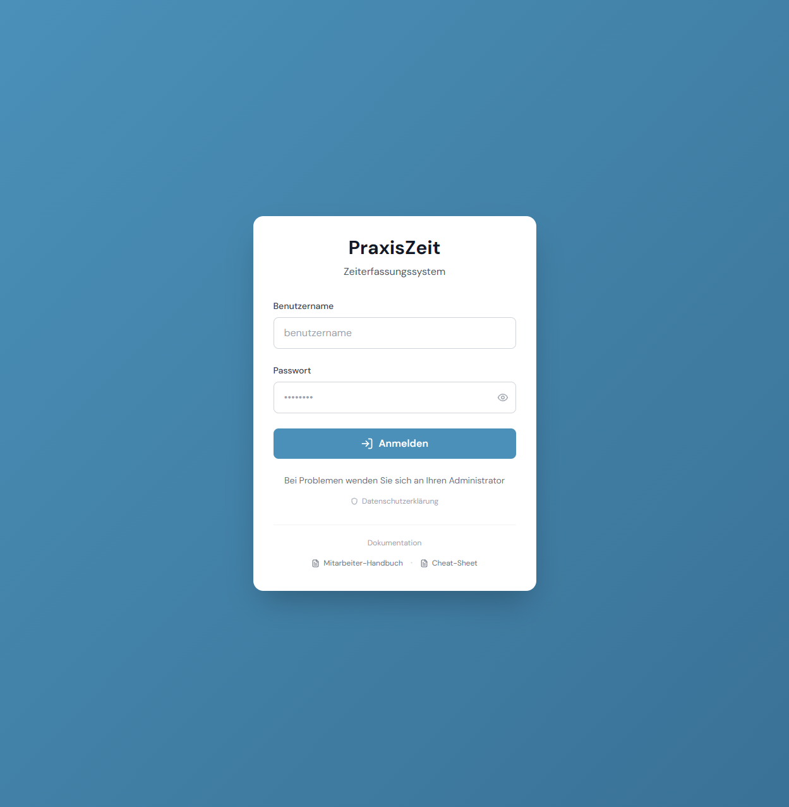

**So melden Sie sich an:**

1. Geben Sie Ihren **Benutzernamen** ein (z. B. `maria.hoffmann`)
2. Geben Sie Ihr **Passwort** ein
3. Klicken Sie auf **Anmelden**

> **Passwort vergessen?** Wenden Sie sich an Ihren Administrator.
> Am unteren Rand der Seite finden Sie unter „Dokumentation" direkte Download-Links zum Handbuch und Cheat-Sheet.

---

## 2. Dashboard – Die Übersicht

Nach der Anmeldung gelangen Sie automatisch zum Dashboard.

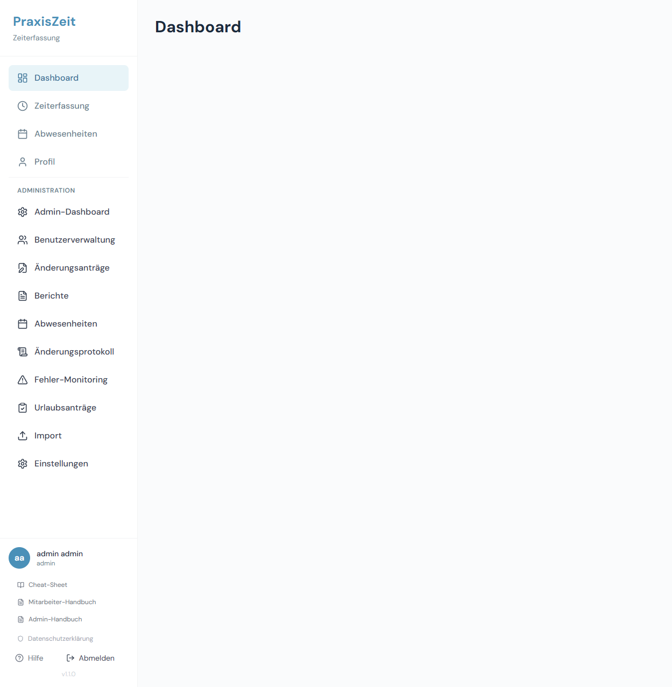

Das Dashboard zeigt Ihnen auf einen Blick:

### Kacheln (oben)

| Kachel | Was wird angezeigt |
|--------|-------------------|
| **Tagessaldo** | Heutige Ist-Zeit vs. Tagessoll (grün = eingestempelt, rot = noch nicht eingestempelt an einem Arbeitstag) |
| **Monatssaldo** | Soll- vs. Ist-Stunden des aktuellen Monats (H:MM) |
| **Überstundenkonto** | Kumulierter Jahressaldo aller Monate |
| **Urlaubskonto** | Budget, verbrauchte und verbleibende Urlaubstage |

> **Zeitanzeige:** Stunden werden im Format H:MM angezeigt (z. B. „8:30" für 8 Stunden 30 Minuten). Negative Salden werden mit einem Minus-Zeichen dargestellt (z. B. „-2:15").

### Monatsübersicht (Tabelle)

Zeigt die vergangenen Monate mit Soll, Ist, Saldo und kumuliertem Überstundenkonto.

- **Grün** = Plusstunden
- **Rot** = Minusstunden

### Jahresübersicht

Zeigt die Abwesenheitstage des laufenden Jahres nach Typ (Urlaub, Krank, Fortbildung, Sonstiges).

### Geplante Abwesenheiten im Team

Übersicht der in den nächsten 3 Monaten geplanten Abwesenheiten Ihrer Kolleginnen und Kollegen.

---

## 3. Zeiterfassung

Klicken Sie in der linken Navigation auf **Zeiterfassung**.

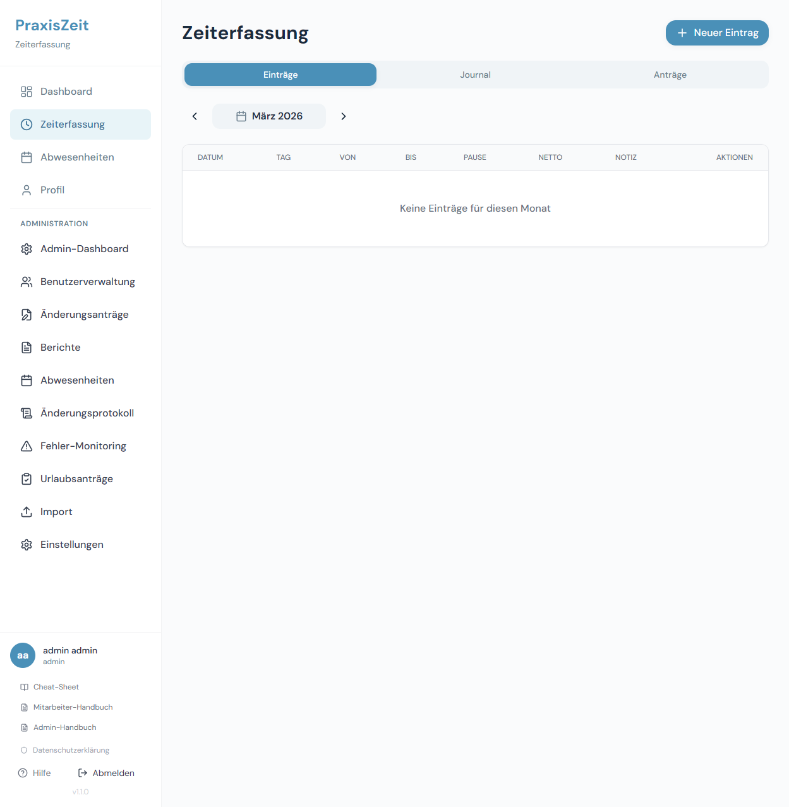

Die Seite gliedert sich in **drei Tabs**:

| Tab | Inhalt |
|-----|--------|
| **Einträge** | Monatsübersicht aller Zeiteinträge + Eingabeformular |
| **Journal** | Tagesjournal-Ansicht der Einträge |
| **Anträge** | Ihre gestellten Änderungsanträge |

**Spalten der Einträge-Tabelle:**

| Spalte | Bedeutung |
|--------|-----------|
| **Datum** | Arbeitstag |
| **Tag** | Wochentag (Mo, Di, ...) |
| **Von** | Arbeitsbeginn |
| **Bis** | Arbeitsende |
| **Pause** | Pausenzeit in Minuten |
| **Netto** | Tatsächliche Nettoarbeitszeit (ohne Pause) |
| **Notiz** | Optionaler Kommentar |
| **Aktionen** | Bearbeiten, Löschen, Korrekturantrag |

**Monat wechseln:** Mit den Pfeilen `<` und `>` neben dem Monatsnamen blättern Sie zwischen den Monaten.

> **Rechtlicher Hintergrund:** Die Aufzeichnungspflicht ergibt sich aus
> [§ 16 Abs. 2 ArbZG](https://www.gesetze-im-internet.de/arbzg/__16.html).
> PraxisZeit dokumentiert alle täglichen Zeiten und hält sie für 2 Jahre vor.

---

### 3.1 Arbeitszeit eintragen

Klicken Sie oben rechts auf **+ Neuer Eintrag**.

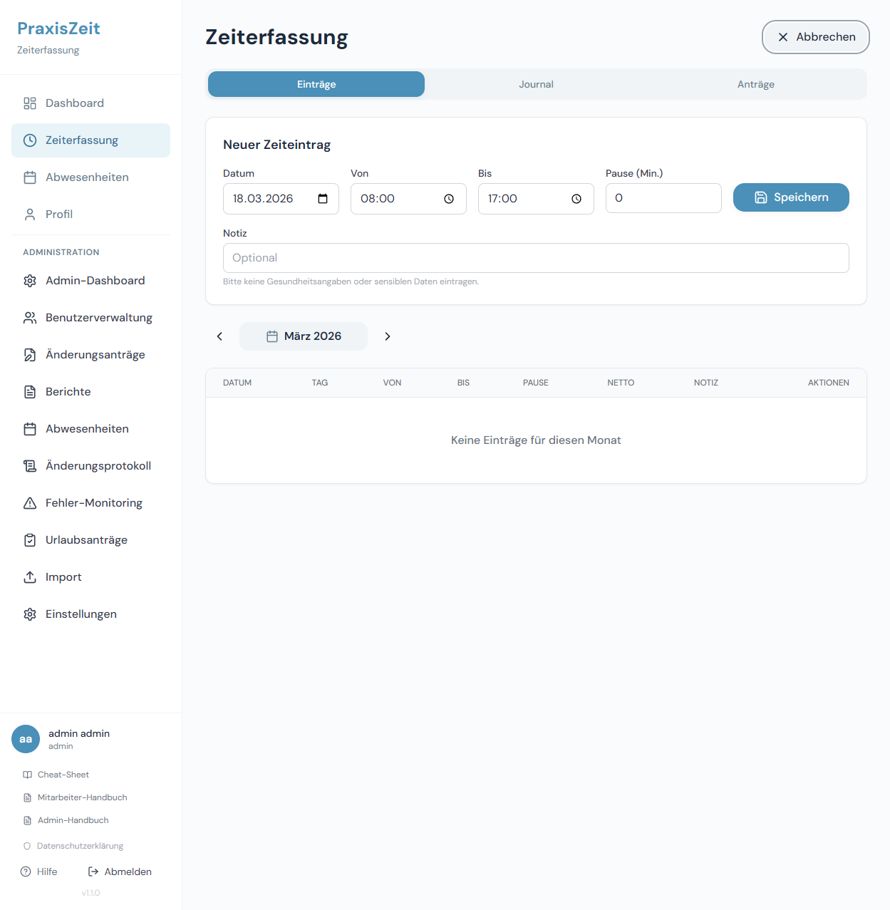

Das Eingabeformular erscheint direkt oberhalb der Eintrags-Tabelle.

**Felder ausfüllen:**

1. **Datum** – Wählen Sie den Arbeitstag aus (Vorbelegt: heute)
2. **Von** – Arbeitsbeginn (Format: `08:00`)
3. **Bis** – Arbeitsende (Format: `17:00`)
4. **Pause (Min.)** – Pausenzeit in Minuten (z. B. `30`)
5. **Notiz** – Optional: Anmerkung zum Tag (keine Gesundheitsdaten eintragen)

Klicken Sie auf **Speichern**. Mit **Abbrechen** (oben rechts) verwerfen Sie das Formular.

> **Warnung bei langen Arbeitszeiten:**
> PraxisZeit prüft Eingaben automatisch auf ArbZG-Einhaltung:
>
> - **> 8 Stunden Netto:** Hinweis gem. [§ 3 ArbZG](https://www.gesetze-im-internet.de/arbzg/__3.html)
> - **> 10 Stunden Netto:** Eintrag wird blockiert (Tageshöchstgrenze)
> - **Zu kurze Pause:** Warnung gem. [§ 4 ArbZG](https://www.gesetze-im-internet.de/arbzg/__4.html):
>   bei > 6h → mind. 30 Min.; bei > 9h → mind. 45 Min.

---

### 3.2 Eintrag bearbeiten oder löschen

In der Spalte **Aktionen** finden Sie Buttons je nach Zustand des Eintrags:

| Button | Funktion |
|--------|----------|
| **Bearbeiten** | Öffnet das Formular mit den bestehenden Werten (nur für entsperrte, aktuelle Einträge) |
| **Löschen** | Entfernt den Eintrag dauerhaft (nur wenn nicht gesperrt) |
| **Änderungsantrag** | Korrekturantrag stellen (für gesperrte oder ältere Einträge) |
| **Löschantrag** | Antrag auf Löschung eines gesperrten Eintrags stellen |

> **Warum können ältere Einträge nicht direkt geändert werden?**
> Nach einer Sperrfrist gelten Einträge als bestätigt. Korrekturen erfordern dann einen formellen Antrag (→ [Abschnitt 3.3](#33-korrekturantrag-stellen)).
> Dies dient der Nachvollziehbarkeit gem. [§ 16 ArbZG](https://www.gesetze-im-internet.de/arbzg/__16.html).

---

### 3.3 Korrekturantrag stellen

Wenn ein Eintrag gesperrt ist oder Sie nachträglich eine Korrektur beantragen möchten, klicken Sie in der Zeile des betroffenen Eintrags auf den Button **Änderungsantrag**.

Ein Dialog öffnet sich mit dem Vergleich von aktuellem und gewünschtem Eintrag:

1. Passen Sie die **Von**, **Bis** und **Pause**-Felder auf die korrekten Werte an
2. Tragen Sie eine **Begründung** ein (Pflichtfeld)
3. Klicken Sie auf **Antrag stellen**

Für eine vollständige Löschung eines gesperrten Eintrags klicken Sie stattdessen auf **Löschantrag**, geben eine Begründung ein und bestätigen.

**Was danach passiert:**
- Der Antrag erscheint beim Administrator zur Prüfung
- Sie sehen den Status unter **Zeiterfassung → Tab „Anträge"**
- Bei Ablehnung erhalten Sie eine Begründung

---

### 3.4 Anträge verwalten (Anträge-Tab)

Wechseln Sie im Tab-Menü der Zeiterfassung auf **Anträge**.

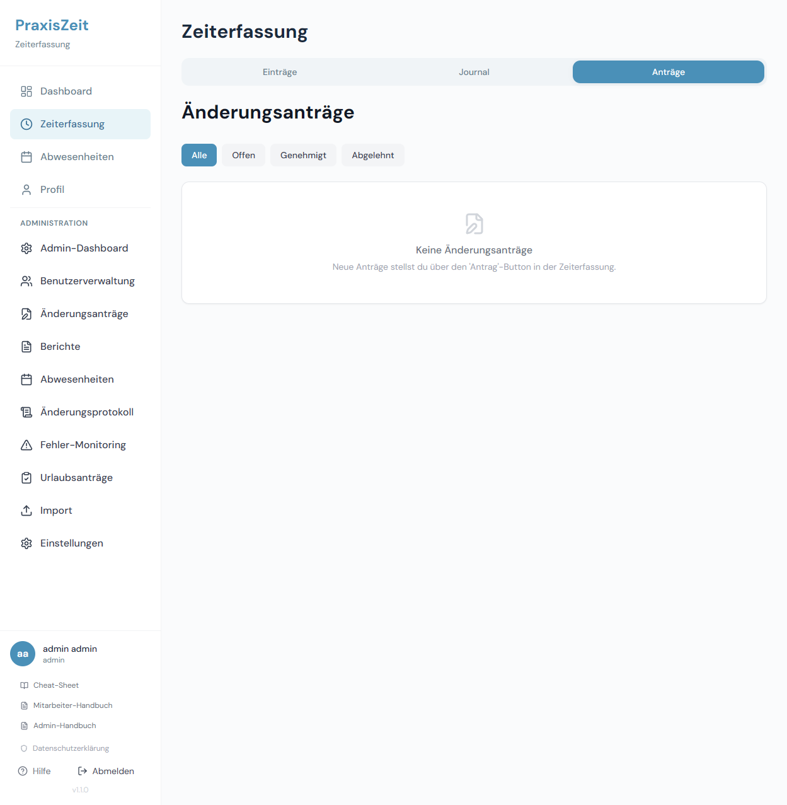

Hier sehen Sie alle Ihre gestellten Korrekturanträge mit ihrem aktuellen Status:

| Status | Bedeutung |
|--------|-----------|
| **Offen** | Antrag wartet auf Prüfung durch den Administrator |
| **Genehmigt** | Antrag wurde genehmigt, Zeiteintrag wurde korrigiert |
| **Abgelehnt** | Antrag wurde abgelehnt – Begründung wird angezeigt |

**Filter:** Verwenden Sie die Tabs **Alle / Offen / Genehmigt / Abgelehnt**.

**Antrag zurückziehen:** Solange ein Antrag noch **Offen** ist, können Sie ihn über den Button **Zurückziehen** stornieren.

---

## 4. Abwesenheiten

Klicken Sie in der Navigation auf **Abwesenheiten**.

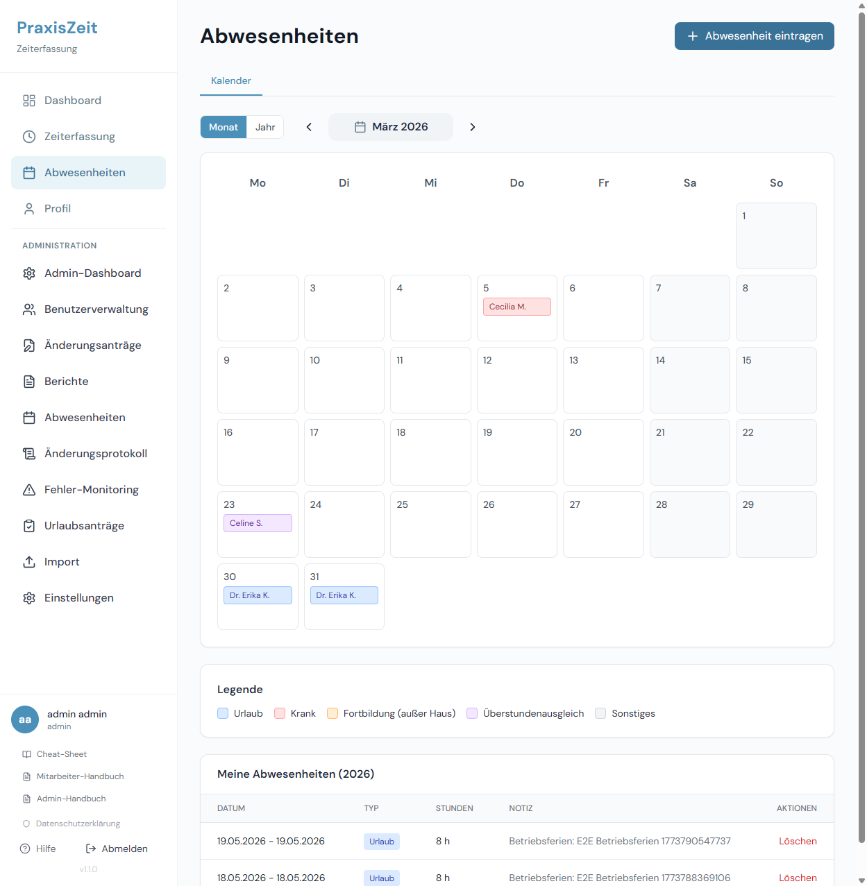

Die Seite zeigt zwei Tabs:

| Tab | Inhalt |
|-----|--------|
| **Kalender** | Monats- oder Jahresansicht aller Team-Abwesenheiten |
| **Meine Anträge** | Nur sichtbar wenn Genehmigungspflicht aktiv – Ihre Urlaubsanträge |

**Legende der Farben:**

| Farbe | Abwesenheitstyp |
|-------|----------------|
| Blau | Urlaub |
| Rosa/Rot | Krank |
| Orange | Fortbildung |
| Grau | Sonstiges |

---

### 4.1 Abwesenheit eintragen

Klicken Sie auf **+ Abwesenheit eintragen**.

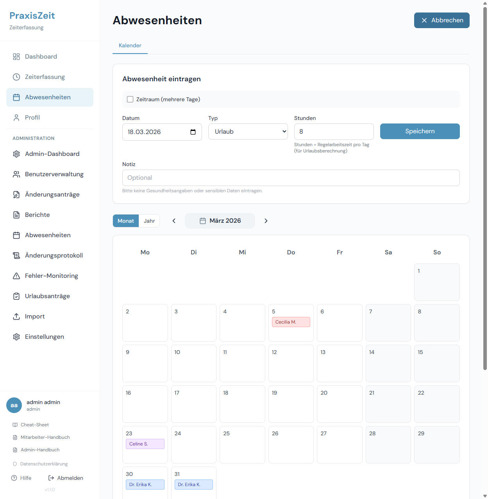

**Felder:**

1. **Datum** – Beginn der Abwesenheit
2. **Zeitraum** – Aktivieren Sie diese Option für mehrere Tage; Wochenenden und Feiertage werden automatisch ausgeschlossen
3. **Typ** – Urlaub / Krank / Fortbildung / Sonstiges
4. **Notiz** – Optional
5. **Speichern**

> **Hinweis zu Urlaubstagen:**
> Das System berechnet automatisch, wie viele Urlaubstage eingetragen werden und zieht diese von Ihrem Budget ab.

**Abwesenheitstypen:**

| Typ | Wann eintragen |
|-----|---------------|
| **Urlaub** | Genehmigter Erholungsurlaub |
| **Krank** | Krankheitstage – Krankmeldung nach Praxisregelung einreichen |
| **Fortbildung** | Externe Schulungen, Seminare, Pflichtfortbildungen |
| **Sonstiges** | Arzttermine, Behördengänge, sonstige Freistellungen |

> **Gut zu wissen – Kranktage und Stundensaldo:** Kranktage werden nach § 3 EntgFG als gearbeitete Stunden angerechnet (Soll-Stunden als Ist), sodass keine Minusstunden entstehen.

---

### 4.2 Urlaubsantrag stellen (bei Genehmigungspflicht)

Wenn Ihr Administrator die **Genehmigungspflicht für Urlaub** aktiviert hat:

1. Klicken Sie auf **+ Abwesenheit eintragen**
2. Wählen Sie Typ **Urlaub**, füllen Sie Datum und ggf. Zeitraum aus
3. Klicken Sie auf **Speichern**

Statt direkt eingetragen zu werden, erscheint die Meldung: **„Urlaubsantrag gestellt"**.

Die App wechselt automatisch zum Tab **„Meine Anträge"**, wo Sie den Status verfolgen können.

**Statusbedeutungen:**

| Status | Bedeutung |
|--------|-----------|
| **Offen** | Antrag wartet auf Entscheidung des Administrators |
| **Genehmigt** | Urlaub wurde genehmigt und in Ihrem Kalender eingetragen |
| **Abgelehnt** | Antrag abgelehnt – Ablehnungsgrund wird angezeigt |
| **Zurückgezogen** | Sie haben den Antrag selbst zurückgezogen |

**Antrag zurückziehen:** Unter **„Meine Anträge"** klicken Sie auf das Löschen-Symbol neben einem offenen Antrag und bestätigen.

---

### 4.3 Abwesenheit löschen

In der Listenansicht Ihrer Abwesenheiten befindet sich der Button **Löschen**. Bestätigen Sie die Löschung im Dialogfenster.

> Bereits vom Administrator bestätigte Einträge können nicht mehr selbst gelöscht werden. Wenden Sie sich an Ihren Administrator.

---

## 5. Profil & Passwort

Klicken Sie in der Navigation auf **Profil**.

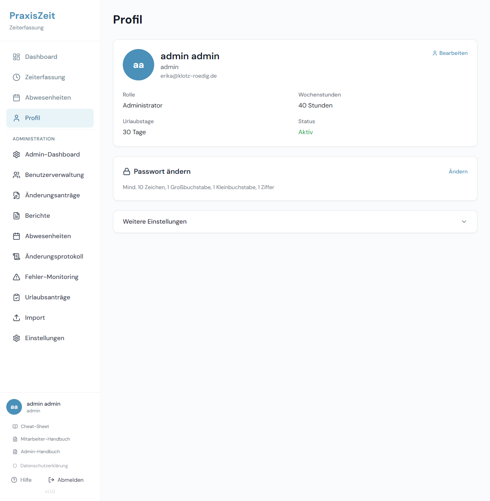

Hier sehen Sie Ihre **persönlichen Daten** (vom Administrator hinterlegt):

- Vor- und Nachname, Benutzername, E-Mail-Adresse
- Rolle, Wochenstunden, Urlaubstage, Status

### Passwort ändern

Klicken Sie in der Karte **Passwort ändern** auf **Ändern**.

1. Geben Sie Ihr **aktuelles Passwort** ein
2. Geben Sie ein **neues Passwort** ein
   - Mindestens 10 Zeichen
   - Mindestens 1 Großbuchstabe
   - Mindestens 1 Kleinbuchstabe
   - Mindestens 1 Ziffer
3. Wiederholen Sie das neue Passwort
4. Klicken Sie auf **Speichern**

> **Sicherheitshinweis:** Nach einer Passwortänderung werden alle anderen aktiven Sitzungen automatisch abgemeldet.

### Weitere Einstellungen

Unter **Weitere Einstellungen** (aufklappbar) können Sie persönliche Darstellungsoptionen anpassen, z. B. Ihre Kalenderfarbe im Teamkalender.

---

## 6. Mobil-Nutzung

PraxisZeit ist vollständig für mobile Geräte optimiert.

| Mobile Dashboard | Mobile Zeiterfassung | Navigation |
|:---:|:---:|:---:|
| 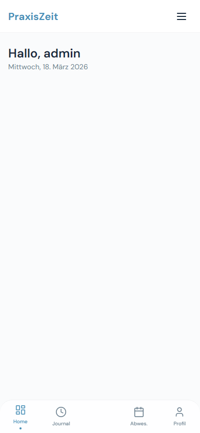 | 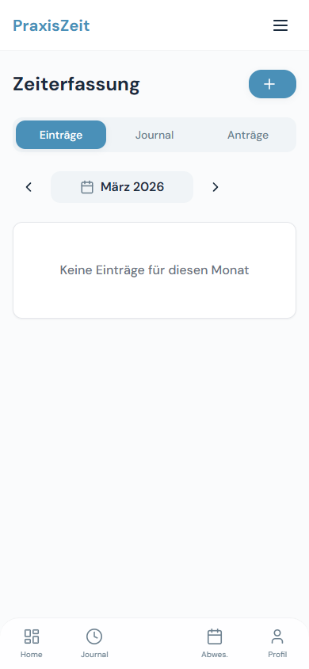 | 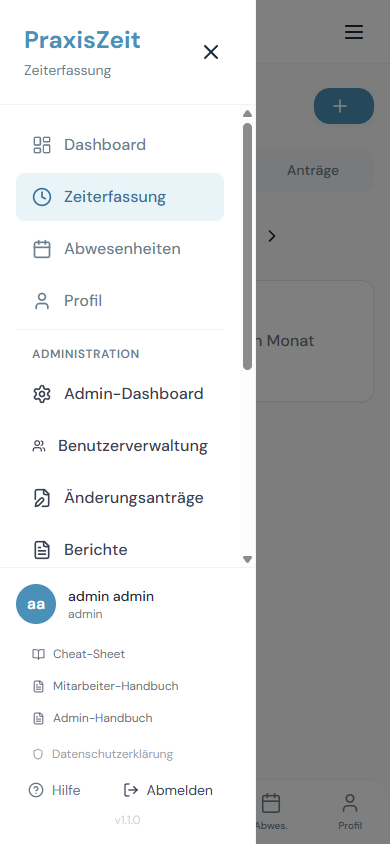 |

### Navigation auf dem Smartphone

Am oberen Rand erscheint ein **Hamburger-Menü** (☰). Tippen Sie darauf, um das vollständige Navigationsmenü zu öffnen.

Am unteren Rand befindet sich eine **Tab-Leiste** mit Direktzugriffen:

| Tab | Funktion |
|-----|---------|
| **Home** | Dashboard |
| **Journal** | Zeiterfassungs-Journal |
| **Abwes.** | Abwesenheitskalender |
| **Profil** | Ihr Profil |

### Neuen Eintrag auf dem Smartphone

Tippen Sie auf den **+ Button** oben rechts auf der Zeiterfassungsseite, um das Eingabeformular zu öffnen.

### Installation als App (PWA)

Auf unterstützten Geräten können Sie PraxisZeit wie eine App installieren:
- **Android (Chrome):** Tippen Sie auf „Zum Startbildschirm hinzufügen"
- **iOS (Safari):** Teilen-Symbol → „Zum Home-Bildschirm"

---

## 7. Häufige Fragen (FAQ)

**F: Ich sehe meinen Eintrag nicht mehr, obwohl ich ihn gespeichert habe.**
A: Überprüfen Sie, ob Sie den richtigen Monat anzeigen. Nutzen Sie die Pfeile `<` `>` neben dem Monatsnamen.

**F: Ich bekomme eine Warnung bei der Eingabe meiner Arbeitszeit.**
A: PraxisZeit prüft die gesetzlichen Grenzen:
- Netto > 8h: Hinweis (zulässig mit Ausgleich – § 3 ArbZG)
- Netto > 10h: Blockiert (Tageshöchstgrenze – § 3 ArbZG)
- Zu kurze Pause: Warnung (§ 4 ArbZG – bei >6h mind. 30 Min., bei >9h mind. 45 Min.)

**F: Wie berechnet sich mein Urlaubsanspruch?**
A: Ihr Urlaubsbudget richtet sich nach Ihrer vertraglichen Wochenstundenzahl. Bei Teilzeit wird es anteilig berechnet.

**F: Was bedeutet der rote „-" Wert bei Überstunden?**
A: Ein negativer Wert bedeutet, dass Sie weniger gearbeitet haben als Ihre Sollstunden.

**F: Kann ich eine Abwesenheit für mehrere Tage eintragen?**
A: Ja. Im Abwesenheitsformular aktivieren Sie die Option **Zeitraum** und geben Start- und Enddatum ein. Das System trägt nur Werktage (Mo–Fr) ein und überspringt Wochenenden und Feiertage.

**F: Wie stelle ich einen Korrekturantrag für einen alten Eintrag?**
A: Navigieren Sie zu **Zeiterfassung → Tab „Einträge"**, suchen Sie den betroffenen Eintrag und klicken Sie auf den **Änderungsantrag**-Button in der Aktionsspalte. Bei entsperrten Einträgen nutzen Sie direkt den **Bearbeiten**-Button.

**F: Was passiert bei Sonntagsarbeit?**
A: Sonntagsarbeit wird markiert. Als Ausgleich steht Ihnen gem. [§ 11 ArbZG](https://www.gesetze-im-internet.de/arbzg/__11.html) ein Ersatzruhetag zu (innerhalb von 2 Wochen).

**F: Ich habe mein Passwort vergessen.**
A: Wenden Sie sich an Ihren Administrator. Er kann Ihr Passwort zurücksetzen.

---

## Rechtliche Grundlagen

PraxisZeit unterstützt die Einhaltung des **Arbeitszeitgesetzes (ArbZG)**:

| Paragraph | Thema | Regelung |
|-----------|-------|----------|
| [§ 3 ArbZG](https://www.gesetze-im-internet.de/arbzg/__3.html) | Tagesarbeitszeit | Max. 8h/Tag (bis 10h mit 6-Monats-Ausgleich) |
| [§ 4 ArbZG](https://www.gesetze-im-internet.de/arbzg/__4.html) | Ruhepausen | >6h → 30 Min.; >9h → 45 Min. Pause |
| [§ 5 ArbZG](https://www.gesetze-im-internet.de/arbzg/__5.html) | Ruhezeit | Mind. 11h zwischen Arbeitsende und -beginn |
| [§ 9 ArbZG](https://www.gesetze-im-internet.de/arbzg/__9.html) | Sonn-/Feiertagsruhe | Grundsätzlich kein Arbeiten an Sonn-/Feiertagen |
| [§ 11 ArbZG](https://www.gesetze-im-internet.de/arbzg/__11.html) | Ersatzruhetag | Mindestens 15 Sonntage/Jahr frei |
| [§ 16 ArbZG](https://www.gesetze-im-internet.de/arbzg/__16.html) | Aufzeichnungspflicht | Alle Zeiten müssen 2 Jahre aufbewahrt werden |

Vollständiger Gesetzestext: [https://www.gesetze-im-internet.de/arbzg/](https://www.gesetze-im-internet.de/arbzg/BJNR117100994.html)

---

*PraxisZeit – Zeiterfassungssystem | Mitarbeiter-Handbuch v2.0 | März 2026*
