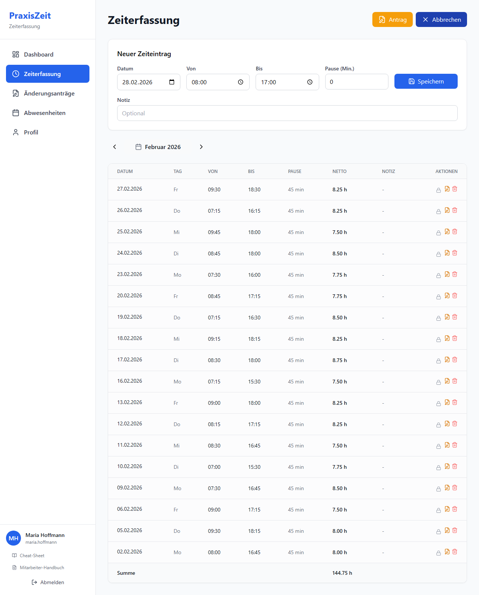
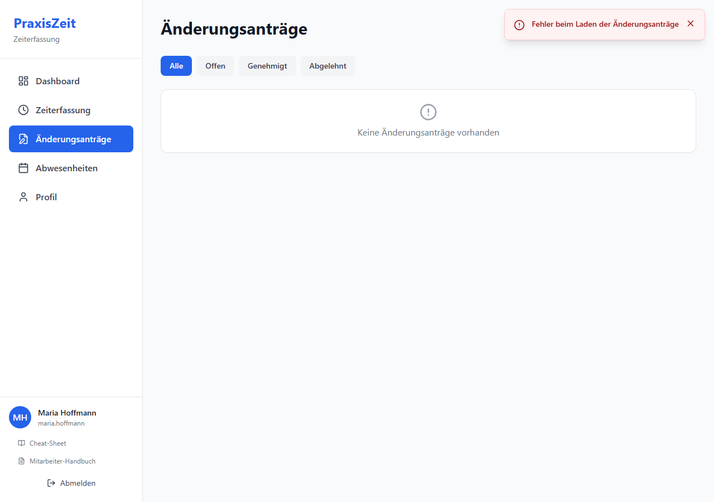

# PraxisZeit – Mitarbeiter-Handbuch

**Version:** 1.0 · **Stand:** Februar 2026
**System:** PraxisZeit Zeiterfassungssystem
**Zugangsdaten:** Benutzername und Passwort vom Administrator

---

## Inhaltsverzeichnis

1. [Anmelden](#1-anmelden)
2. [Dashboard – Die Übersicht](#2-dashboard--die-übersicht)
3. [Zeiterfassung](#3-zeiterfassung)
   - 3.1 [Arbeitszeit eintragen](#31-arbeitszeit-eintragen)
   - 3.2 [Eintrag bearbeiten oder löschen](#32-eintrag-bearbeiten-oder-löschen)
   - 3.3 [Korrekturantrag stellen](#33-korrekturantrag-stellen)
4. [Abwesenheiten](#4-abwesenheiten)
   - 4.1 [Abwesenheit eintragen](#41-abwesenheit-eintragen)
   - 4.2 [Urlaubsantrag stellen (bei Genehmigungspflicht)](#42-urlaubsantrag-stellen-bei-genehmigungspflicht)
   - 4.3 [Abwesenheit löschen](#43-abwesenheit-löschen)
5. [Korrekturanträge verwalten](#5-korrekturanträge-verwalten)
6. [Profil & Passwort](#6-profil--passwort)
7. [Mobil-Nutzung](#7-mobil-nutzung)
8. [Häufige Fragen (FAQ)](#8-häufige-fragen-faq)

---

## 1. Anmelden

Öffnen Sie PraxisZeit im Browser unter der Adresse, die Ihnen Ihr Administrator mitgeteilt hat (z. B. `http://praxiszeit.meinepraxis.de`).

**So melden Sie sich an:**

1. Geben Sie Ihren **Benutzernamen** ein (z. B. `maria.hoffmann`)
2. Geben Sie Ihr **Passwort** ein
3. Klicken Sie auf **Anmelden**

> **Passwort vergessen?** Wenden Sie sich an Ihren Administrator.
> Ein Link „Dokumentation" am unteren Rand öffnet dieses Handbuch direkt aus der App.

---

## 2. Dashboard – Die Übersicht

Nach der Anmeldung gelangen Sie automatisch zum Dashboard.

Das Dashboard zeigt Ihnen auf einen Blick:

### Kacheln (oben)

| Kachel | Was wird angezeigt |
|--------|-------------------|
| **Monatssaldo** | Soll- vs. Ist-Stunden des aktuellen Monats. Grün = Plus, Rot = Minus |
| **Überstundenkonto** | Kumulierter Saldo aller Monate in diesem Jahr |
| **Urlaubskonto** | Budget, verbrauchte und verbleibende Urlaubstage |
| **Urlaubscountdown** | Tage bis zum nächsten geplanten Urlaub |

> 💡 **Warum wird das Urlaubskonto in Tagen angezeigt?**
> Der Resturlaub richtet sich nach Ihrem individuellen Jahresbudget (Vollzeit vs. Teilzeit). Das Budget entspricht Ihren vertraglich vereinbarten Urlaubstagen.

### Monatsübersicht (Tabelle)

Zeigt die letzten Monate mit Soll, Ist, Saldo und kumuliertem Überstundenkonto.

- **Grün** = Plusstunden
- **Rot** = Minusstunden

### Jahresübersicht

Zeigt die Abwesenheitstage des laufenden Jahres nach Typ (Urlaub, Krank, Fortbildung, Sonstiges).

### Geplante Abwesenheiten im Team

Übersicht der in den nächsten 3 Monaten geplanten Abwesenheiten Ihrer Kolleginnen und Kollegen – so sehen Sie auf einen Blick, wer wann fehlt.

---

## 3. Zeiterfassung

Klicken Sie in der linken Navigation auf **Zeiterfassung**.

Die Zeiterfassung zeigt alle Einträge des aktuell gewählten Monats.

**Spalten der Tabelle:**

| Spalte | Bedeutung |
|--------|-----------|
| **Datum** | Arbeitstag |
| **Tag** | Wochentag (Mo, Di, ...) |
| **Von** | Arbeitsbeginn |
| **Bis** | Arbeitsende |
| **Pause** | Pausenzeit in Minuten |
| **Netto** | Tatsächliche Nettoarbeitszeit (ohne Pause) |
| **Notiz** | Optionaler Kommentar |
| **Aktionen** | Sperren, Korrekturantrag, Löschen |

**Monat wechseln:** Mit den Pfeilen `<` und `>` neben dem Monatsnamen blättern Sie zwischen den Monaten.

> **Rechtlicher Hintergrund:** Die Aufzeichnungspflicht der Arbeitszeit ergibt sich aus
> [§ 16 Abs. 2 ArbZG](https://www.gesetze-im-internet.de/arbzg/__16.html):
> *„Der Arbeitgeber ist verpflichtet, die über 8 Stunden hinausgehende Arbeitszeit … aufzuzeichnen."*
> PraxisZeit dokumentiert automatisch alle täglichen Zeiten und macht diese auf Verlangen abrufbar.

---

### 3.1 Arbeitszeit eintragen

Klicken Sie oben rechts auf **+ Neuer Eintrag**.

**Felder ausfüllen:**

1. **Datum** – Wählen Sie den Arbeitstag aus
2. **Von** – Arbeitsbeginn (Format: `08:00`)
3. **Bis** – Arbeitsende (Format: `17:00`)
4. **Pause (Min.)** – Pausenzeit in Minuten (z. B. `30`)
5. **Notiz** – Optional: Anmerkung zum Tag

Klicken Sie dann auf **Speichern**.

> ⚠️ **Warnung bei langen Arbeitszeiten:**
> PraxisZeit prüft Ihre Eingaben automatisch auf Einhaltung des Arbeitszeitgesetzes:
>
> - **> 8 Stunden Netto:** Sie erhalten einen Hinweis gem. [§ 3 ArbZG](https://www.gesetze-im-internet.de/arbzg/__3.html)
>   *„Die werktägliche Arbeitszeit der Arbeitnehmer darf 8 Stunden nicht überschreiten."* (Überschreitung bis 10h möglich, wenn Ausgleich erfolgt)
> - **> 10 Stunden Netto:** Eintrag wird blockiert (Tageshöchstgrenze nach § 3 ArbZG)
> - **Zu kurze Pause:** Warnung gem. [§ 4 ArbZG](https://www.gesetze-im-internet.de/arbzg/__4.html):
>   Bei > 6h Arbeit → mind. 30 Min. Pause; bei > 9h → mind. 45 Min. Pause

---

### 3.2 Eintrag bearbeiten oder löschen

In der Spalte **Aktionen** finden Sie drei Icons:

| Icon | Funktion |
|------|----------|
| 🔒 Schloss | Eintrag sperren (kann danach nur der Admin ändern) |
| 📝 Korrektur | Korrekturantrag stellen (wenn der Eintrag bereits gesperrt ist) |
| 🗑 Löschen | Eintrag löschen (nur wenn nicht gesperrt) |

> **Warum können gesperrte Einträge nicht direkt geändert werden?**
> Sobald ein Eintrag vom Administrator gesperrt wird, gilt er als bestätigt. Korrekturen erfordern dann einen formellen Antrag (→ [Abschnitt 3.3](#33-korrekturantrag-stellen)).
> Dies dient der Nachvollziehbarkeit gem. [§ 16 ArbZG](https://www.gesetze-im-internet.de/arbzg/__16.html) (Aufzeichnungspflicht).

---

### 3.3 Korrekturantrag stellen

Falls ein Eintrag gesperrt ist oder Sie nachträglich eine Korrektur beantragen möchten, klicken Sie oben rechts auf **Antrag** (orangener Button).

**Antrag ausfüllen:**

1. Wählen Sie den betreffenden **Zeiteintrag** (Datum)
2. Tragen Sie die **gewünschten neuen Zeiten** ein (Von, Bis, Pause)
3. Begründen Sie die Korrektur im Feld **Grund**
4. Klicken Sie auf **Absenden**

**Was danach passiert:**
- Der Antrag erscheint beim Administrator zur Prüfung
- Sie sehen den Status unter **Änderungsanträge** (→ [Abschnitt 5](#5-korrekturanträge-verwalten))
- Bei Ablehnung erhalten Sie eine Begründung

---

## 4. Abwesenheiten

Klicken Sie in der Navigation auf **Abwesenheiten**.

Die Seite zeigt zwei Tabs:

| Tab | Inhalt |
|-----|--------|
| **Kalender** | Monats- oder Jahresansicht aller Team-Abwesenheiten + Ihre eigenen Einträge |
| **Meine Anträge** | Nur sichtbar wenn Genehmigungspflicht aktiv – zeigt Ihre gestellten Urlaubsanträge |

**Legende der Farben:**

| Farbe | Abwesenheitstyp |
|-------|----------------|
| Blau | Urlaub |
| Rosa/Rot | Krank |
| Orange | Fortbildung |
| Grau | Sonstiges |

---

### 4.1 Abwesenheit eintragen

Klicken Sie auf **+ Abwesenheit eintragen**.

**Felder:**

1. **Datum** – Beginn der Abwesenheit
2. **Zeitraum** – Aktivieren Sie diese Option für mehrere Tage, dann erscheint ein Enddatum-Feld. Wochenenden und Feiertage werden automatisch ausgeschlossen.
3. **Typ** – Urlaub / Krank / Fortbildung / Sonstiges
4. **Notiz** – Optional (z. B. Krankheitsnotiz, Fortbildungsthema)
5. **Speichern**

> 📅 **Hinweis zu Urlaubstagen:**
> Das System berechnet automatisch, wie viele Urlaubstage eingetragen werden und zieht diese von Ihrem Budget ab. Das Budget richtet sich nach Ihrer wöchentlichen Arbeitszeit.

**Abwesenheitstypen und ihre Bedeutung:**

| Typ | Wann eintragen |
|-----|---------------|
| **Urlaub** | Genehmigter Erholungsurlaub |
| **Krank** | Krankheitstage (Bitte Krankmeldung gemäß Praxisregelung einreichen) |
| **Fortbildung** | Externe Schulungen, Seminare, Pflichtfortbildungen |
| **Sonstiges** | Arzttermine, Behördengänge, sonstige Freistellungen |

---

### 4.2 Urlaubsantrag stellen (bei Genehmigungspflicht)

Wenn Ihr Administrator die **Genehmigungspflicht für Urlaub** aktiviert hat, funktioniert das Einreichen von Urlaub anders:

1. Klicken Sie auf **+ Abwesenheit eintragen**
2. Wählen Sie Typ **Urlaub** und füllen Sie Datum, Zeitraum und Stunden aus
3. Klicken Sie auf **Speichern**

Statt direkt eingetragen zu werden erscheint die Meldung: **„Urlaubsantrag gestellt – wartet auf Genehmigung"**

Die App wechselt automatisch zum Tab **„Meine Anträge"**, wo Sie den Status Ihres Antrags verfolgen können.

**Statusbedeutungen:**

| Status | Bedeutung |
|--------|-----------|
| **Offen** | Antrag wartet auf Entscheidung des Administrators |
| **Genehmigt** | Urlaub wurde genehmigt und in Ihrem Kalender eingetragen |
| **Abgelehnt** | Antrag wurde abgelehnt – Ablehnungsgrund wird angezeigt |
| **Zurückgezogen** | Sie haben den Antrag selbst zurückgezogen |

**Antrag zurückziehen:**
Solange der Antrag noch **Offen** ist, können Sie ihn zurückziehen:
1. Tab **„Meine Anträge"** öffnen
2. Auf das **Löschen-Symbol** (🗑) neben dem Antrag klicken
3. Bestätigen

> **Hinweis:** Andere Abwesenheitstypen (Krank, Fortbildung, Sonstiges) sind nicht genehmigungspflichtig und werden weiterhin direkt eingetragen.

---

### 4.3 Abwesenheit löschen

In der Liste Ihrer Abwesenheiten befindet sich rechts der Button **Löschen**. Bestätigen Sie die Löschung im Dialogfenster.

> ⚠️ Einträge, die bereits vom Administrator bestätigt wurden, können nicht mehr selbst gelöscht werden. Wenden Sie sich in diesem Fall an Ihren Administrator.

---

## 5. Korrekturanträge verwalten

Klicken Sie in der Navigation auf **Änderungsanträge**.

Hier sehen Sie alle Ihre Korrekturanträge mit ihrem Status:

| Status | Bedeutung |
|--------|-----------|
| **Offen** | Antrag wartet auf Prüfung durch den Administrator |
| **Genehmigt** | Antrag wurde genehmigt, Zeitstempel wurde korrigiert |
| **Abgelehnt** | Antrag wurde abgelehnt – Begründung wird angezeigt |

**Filter:** Verwenden Sie die Tabs **Alle / Offen / Genehmigt / Abgelehnt**, um die Ansicht einzuschränken.

> **Tipp:** Bei einem abgelehnten Antrag lesen Sie die Begründung des Administrators. Häufige Gründe für Ablehnung:
> - Fehlender Nachweis für geänderte Pausenzeiten (§ 4 ArbZG)
> - Überschreitung der täglichen Höchstarbeitszeit (§ 3 ArbZG)
> - Zeitraum liegt zu weit in der Vergangenheit

---

## 6. Profil & Passwort

Klicken Sie in der Navigation auf **Profil**.

Hier sehen Sie Ihre **persönlichen Daten** (vom Administrator hinterlegt):

- Vor- und Nachname
- Benutzername
- E-Mail-Adresse (falls hinterlegt)
- Wöchentliche Soll-Stunden und Urlaubstage

### Passwort ändern

1. Geben Sie Ihr **aktuelles Passwort** ein
2. Geben Sie ein **neues Passwort** ein (mind. 10 Zeichen, Großbuchstabe, Kleinbuchstabe, Ziffer)
3. Wiederholen Sie das neue Passwort
4. Klicken Sie auf **Passwort ändern**

> 🔒 **Sicherheitshinweis:** Wählen Sie ein sicheres Passwort und geben Sie es nicht weiter. Nach einer Passwortänderung werden alle anderen aktiven Sitzungen automatisch abgemeldet.

---

## 7. Mobil-Nutzung

PraxisZeit ist vollständig für mobile Geräte optimiert.

| Mobile Dashboard | Mobile Zeiterfassung | Navigation |
|:---:|:---:|:---:|
|  |  |  |

**Navigation auf dem Smartphone:**

1. Tippen Sie auf das **Hamburger-Menü** (☰) oben links
2. Das Navigationsmenü öffnet sich von der Seite
3. Tippen Sie auf den gewünschten Bereich
4. Das Menü schließt sich automatisch

**Installation als App (PWA):**

Auf unterstützten Geräten (iOS/Android) können Sie PraxisZeit wie eine App installieren:
- **Android (Chrome):** Tippen Sie auf „Zum Startbildschirm hinzufügen"
- **iOS (Safari):** Teilen-Symbol → „Zum Home-Bildschirm"

---

## 8. Häufige Fragen (FAQ)

**F: Ich sehe meinen Eintrag nicht mehr, obwohl ich ihn gespeichert habe.**
A: Überprüfen Sie, ob Sie den richtigen Monat anzeigen. Nutzen Sie die Pfeile `<` `>` neben dem Monatsnamen.

**F: Ich bekomme eine Warnung bei der Eingabe meiner Arbeitszeit.**
A: PraxisZeit prüft die gesetzlichen Grenzen:
- Netto > 8h: Hinweis (zulässig, wenn Ausgleich vorhanden – § 3 ArbZG)
- Netto > 10h: Blockiert (Tageshöchstgrenze – § 3 ArbZG)
- Zu kurze Pause: Warnung (§ 4 ArbZG – bei >6h mind. 30 Min., bei >9h mind. 45 Min.)

**F: Wie berechnet sich mein Urlaubsanspruch?**
A: Ihr Urlaubsbudget richtet sich nach Ihrer vertraglichen Wochenstundenzahl. Bei Teilzeit wird es anteilig berechnet. Die genaue Einstellung nimmt Ihr Administrator vor.

**F: Was bedeutet der rote „-" Wert bei Überstunden?**
A: Ein negativer Wert bedeutet, dass Sie weniger gearbeitet haben als Ihre Sollstunden. Ein positiver Wert bedeutet Mehrarbeit (Überstunden).

**F: Kann ich eine Abwesenheit für mehrere Tage eintragen?**
A: Ja. Im Abwesenheitsformular aktivieren Sie die Option **Zeitraum** und geben Start- und Enddatum ein. Das System trägt automatisch nur Werktage (Mo–Fr) ein und überspringt Wochenenden und Feiertage.

**F: Was passiert bei Sonntagsarbeit?**
A: Sonntagsarbeit wird im System markiert. Ihr Administrator wird informiert. Als Ausgleich steht Ihnen gem. [§ 11 ArbZG](https://www.gesetze-im-internet.de/arbzg/__11.html) ein Ersatzruhetag zu (innerhalb von 2 Wochen, oder 8 Wochen bei Feiertagsarbeit).

**F: Ich habe mein Passwort vergessen.**
A: Wenden Sie sich an Ihren Administrator. Er kann Ihr Passwort zurücksetzen.

---

## Rechtliche Grundlagen

PraxisZeit unterstützt die Einhaltung des **Arbeitszeitgesetzes (ArbZG)**. Die wichtigsten Regelungen, die das System abbildet:

| Paragraph | Thema | Regelung |
|-----------|-------|----------|
| [§ 3 ArbZG](https://www.gesetze-im-internet.de/arbzg/__3.html) | Tagesarbeitszeit | Max. 8h/Tag (bis 10h mit 6-Monats-Ausgleich) |
| [§ 4 ArbZG](https://www.gesetze-im-internet.de/arbzg/__4.html) | Ruhepausen | >6h → 30 Min.; >9h → 45 Min. Pause |
| [§ 5 ArbZG](https://www.gesetze-im-internet.de/arbzg/__5.html) | Ruhezeit | Mind. 11h zwischen Arbeitsende und -beginn |
| [§ 9 ArbZG](https://www.gesetze-im-internet.de/arbzg/__9.html) | Sonn-/Feiertagsruhe | Grundsätzlich kein Arbeiten an Sonn-/Feiertagen |
| [§ 10 ArbZG](https://www.gesetze-im-internet.de/arbzg/__10.html) | Ausnahmen Sonntagsarbeit | Dokumentationspflicht bei Ausnahmen |
| [§ 11 ArbZG](https://www.gesetze-im-internet.de/arbzg/__11.html) | Ersatzruhetag | Mindestens 15 Sonntage/Jahr frei |
| [§ 16 ArbZG](https://www.gesetze-im-internet.de/arbzg/__16.html) | Aufzeichnungspflicht | Überstunden und alle Zeiten müssen 2 Jahre aufbewahrt werden |

Vollständiger Gesetzestext: [https://www.gesetze-im-internet.de/arbzg/](https://www.gesetze-im-internet.de/arbzg/BJNR117100994.html)

---

*PraxisZeit – Zeiterfassungssystem | Mitarbeiter-Handbuch v1.0 | Februar 2026*
