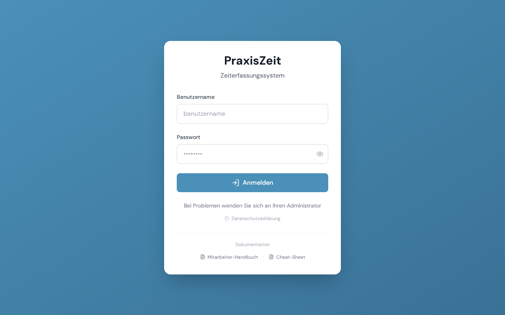
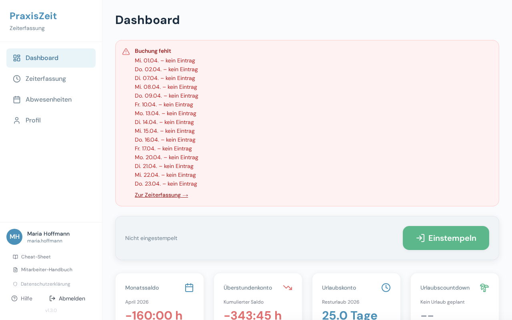
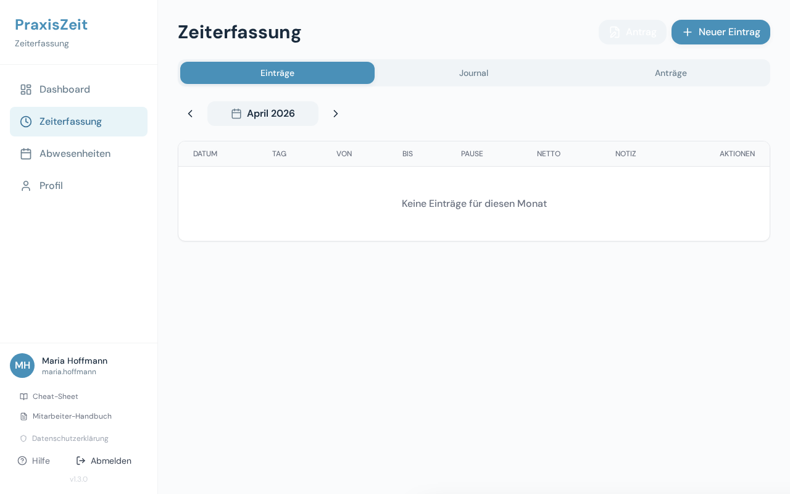
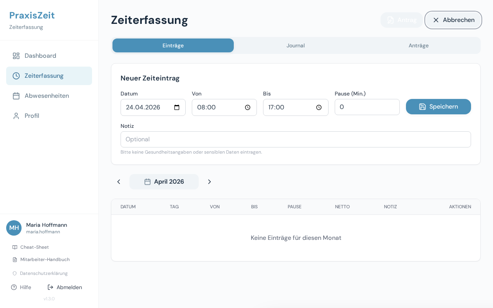
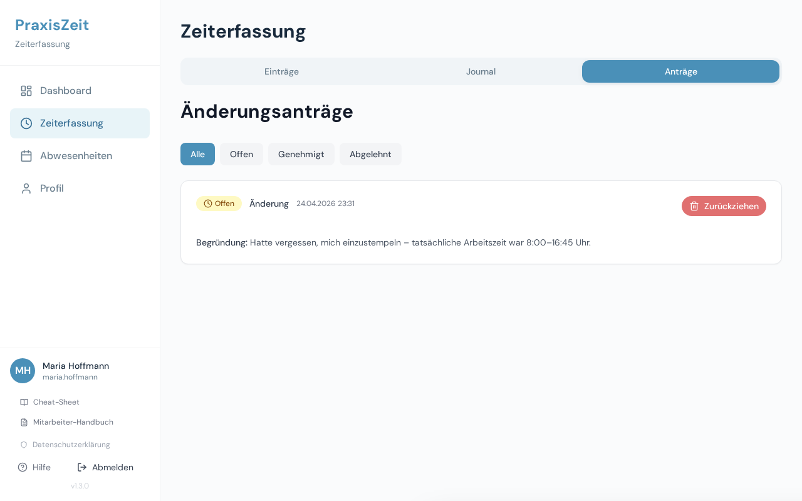
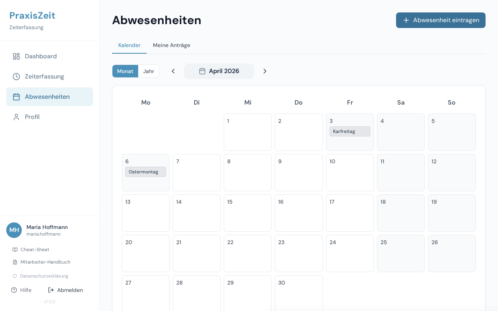
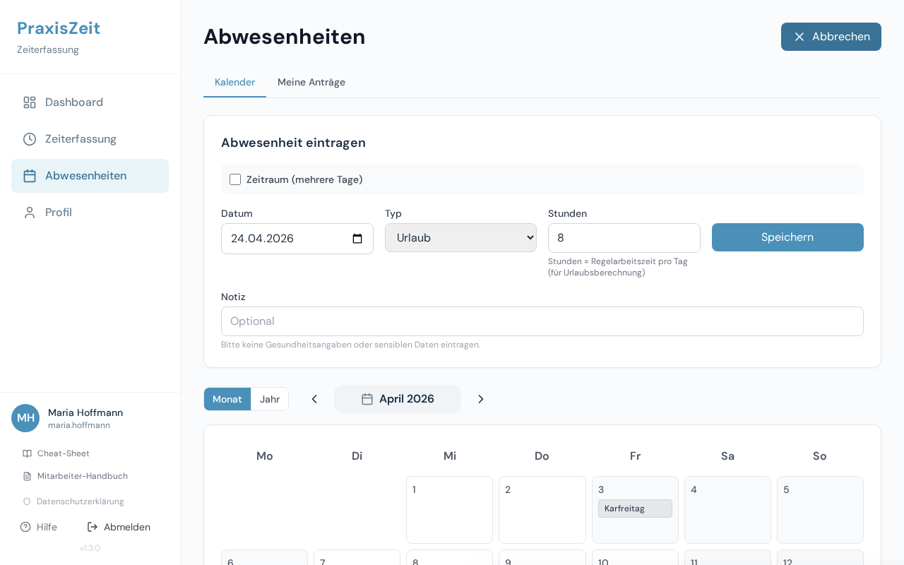
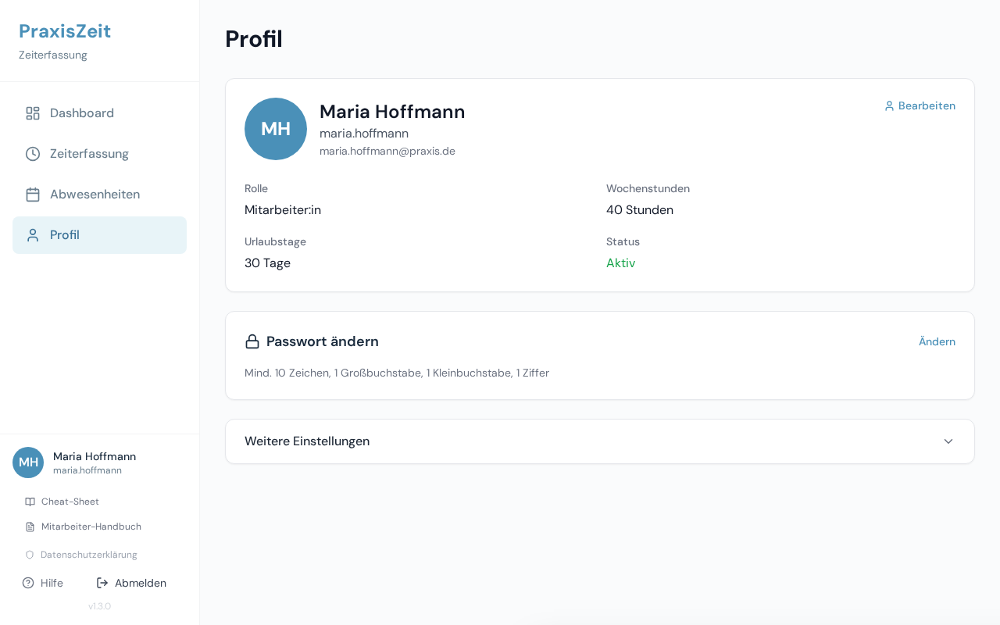
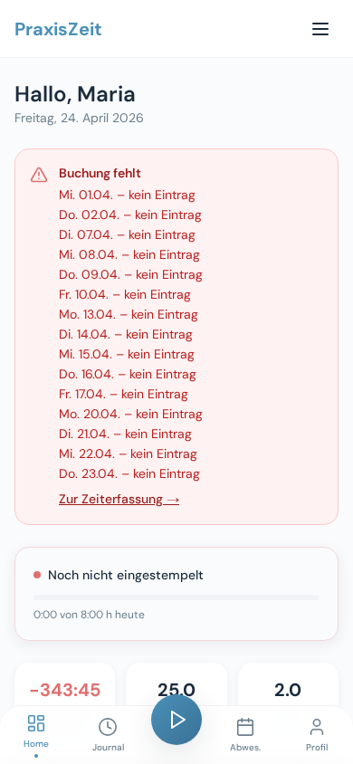
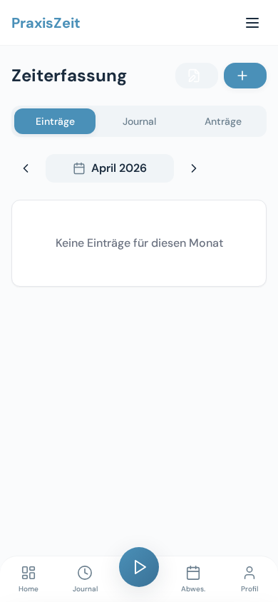

# PraxisZeit – Mitarbeiter-Handbuch

**Version:** 2.3 · **Stand:** Juni 2026 (PraxisZeit 1.9.0)
**System:** PraxisZeit Zeiterfassungssystem
**Zugangsdaten:** Benutzername und Passwort vom Administrator

---

## Inhaltsverzeichnis

1. [Anmelden](#1-anmelden)
2. [Dashboard – Die Übersicht](#2-dashboard--die-übersicht)
3. [Zeiterfassung](#3-zeiterfassung)
   - 3.1 [Ein- und Ausstempeln (Stoppuhr)](#31-ein--und-ausstempeln-stoppuhr)
   - 3.2 [Arbeitszeit von Hand eintragen](#32-arbeitszeit-von-hand-eintragen)
   - 3.3 [Soll-Arbeitszeiten und Anrechnung](#33-soll-arbeitszeiten-und-anrechnung)
   - 3.4 [Eintrag bearbeiten oder löschen](#34-eintrag-bearbeiten-oder-löschen)
   - 3.5 [Korrekturantrag stellen](#35-korrekturantrag-stellen)
   - 3.6 [Anträge verwalten (Anträge-Tab)](#36-anträge-verwalten-anträge-tab)
4. [Abwesenheiten](#4-abwesenheiten)
   - 4.1 [Abwesenheit eintragen](#41-abwesenheit-eintragen)
   - 4.2 [Urlaubsantrag stellen (bei Genehmigungspflicht)](#42-urlaubsantrag-stellen-bei-genehmigungspflicht)
   - 4.3 [Abwesenheit löschen](#43-abwesenheit-löschen)
   - 4.4 [So wird Ihr Urlaub berechnet](#44-so-wird-ihr-urlaub-berechnet)
5. [So berechnet PraxisZeit Ihre Stunden und Ihren Urlaub](#5-so-berechnet-praxiszeit-ihre-stunden-und-ihren-urlaub)
6. [Wenn für Sie keine Stunden gezählt werden](#6-wenn-für-sie-keine-stunden-gezählt-werden)
7. [Profil & Passwort](#7-profil--passwort)
8. [Mobil-Nutzung](#8-mobil-nutzung)
9. [Häufige Fragen (FAQ)](#9-häufige-fragen-faq)

---

## 1. Anmelden

Öffnen Sie PraxisZeit im Browser unter der Adresse, die Ihnen Ihr Administrator mitgeteilt hat (z. B. `http://praxiszeit.meinepraxis.de`).

**So melden Sie sich an:**

1. Geben Sie Ihren **Benutzernamen** ein (z. B. `maria.hoffmann`)
2. Geben Sie Ihr **Passwort** ein
3. Klicken Sie auf **Anmelden**

> **Passwort vergessen?** Wenden Sie sich an Ihren Administrator.
> Am unteren Rand der Seite finden Sie unter „Dokumentation" direkte Download-Links zum Handbuch und Cheat-Sheet.

---

## 2. Dashboard – Die Übersicht

Nach der Anmeldung gelangen Sie automatisch zum Dashboard.

Das Dashboard zeigt Ihnen auf einen Blick:

### Kacheln (oben)

| Kachel | Was wird angezeigt |
|--------|-------------------|
| **Tagessaldo** | Heutige Ist-Zeit vs. Tagessoll (grün = eingestempelt, rot = noch nicht eingestempelt an einem Arbeitstag) |
| **Monatssaldo** | Soll- vs. Ist-Stunden des aktuellen Monats (H:MM) |
| **Überstundenkonto** | Kumulierter Jahressaldo aller Monate |
| **Urlaubskonto** | Budget, verbrauchte und verbleibende Urlaubstage |

> **Monatssaldo nur bis zum letzten Arbeitstag:** Im **laufenden** Monat wird das Soll nur bis zum **letzten abgeschlossenen Arbeitstag** gezählt – Sie starten den Monat also **nicht** mit einem dicken Minus, sondern der Saldo baut sich Tag für Tag auf. Der heutige Tag zählt mit, sobald Sie **ausgestempelt** haben. Für **abgeschlossene** Monate entspricht der Saldo wie gewohnt dem vollen Monat.

> **Zeitanzeige:** Stunden werden im Format H:MM angezeigt (z. B. „8:30" für 8 Stunden 30 Minuten). Negative Salden werden mit einem Minus-Zeichen dargestellt (z. B. „-2:15").

> **Hinweis:** Falls Ihre Praxis für Sie **keine Stundenzählung** führt, fehlen die Kacheln **Tagessaldo**, **Monatssaldo** und **Überstundenkonto** – das ist bei Ihnen so eingestellt und kein Fehler. Ihr **Urlaubskonto** wird trotzdem geführt. Mehr dazu in [Abschnitt 6](#6-wenn-für-sie-keine-stunden-gezählt-werden).

### Monatsübersicht (Tabelle)

Zeigt die vergangenen Monate mit Soll, Ist, Saldo und kumuliertem Überstundenkonto.

- **Grün** = Plusstunden
- **Rot** = Minusstunden

### Jahresübersicht

Zeigt die Abwesenheitstage des laufenden Jahres nach Typ (Urlaub, Krank, Fortbildung, Sonstiges).

### Geplante Abwesenheiten im Team

Übersicht der in den nächsten 3 Monaten geplanten Abwesenheiten Ihrer Kolleginnen und Kollegen.

---

## 3. Zeiterfassung

Klicken Sie in der linken Navigation auf **Zeiterfassung**.

Die Seite gliedert sich in **drei Tabs**:

| Tab | Inhalt |
|-----|--------|
| **Einträge** | Monatsübersicht aller Zeiteinträge + Eingabeformular |
| **Journal** | Tagesjournal-Ansicht der Einträge |
| **Anträge** | Ihre gestellten Änderungsanträge |

**Spalten der Einträge-Tabelle:**

| Spalte | Bedeutung |
|--------|-----------|
| **Datum** | Arbeitstag |
| **Tag** | Wochentag (Mo, Di, ...) |
| **Von** | Arbeitsbeginn |
| **Bis** | Arbeitsende |
| **Pause** | Pausenzeit in Minuten |
| **Netto** | Tatsächliche Nettoarbeitszeit (ohne Pause) |
| **Notiz** | Optionaler Kommentar |
| **Aktionen** | Bearbeiten, Löschen, Korrekturantrag |

**Monat wechseln:** Mit den Pfeilen `<` und `>` neben dem Monatsnamen blättern Sie zwischen den Monaten.

> **Rechtlicher Hintergrund:** Die Aufzeichnungspflicht ergibt sich aus
> [§ 16 Abs. 2 ArbZG](https://www.gesetze-im-internet.de/arbzg/__16.html).
> PraxisZeit dokumentiert alle täglichen Zeiten und hält sie für 2 Jahre vor.

---

### 3.1 Ein- und Ausstempeln (Stoppuhr)

Am einfachsten erfassen Sie Ihre Arbeitszeit live mit der Stempeluhr. Sie finden den **Einstempeln**-Button auf dem Dashboard (am Smartphone zusätzlich über den großen Knopf unten in der Mitte).

**So stempeln Sie ein:**

1. Klicken bzw. tippen Sie auf **Einstempeln**.
2. Die Uhr beginnt zu laufen und zeigt Ihre heutige Arbeitszeit live an.

**So stempeln Sie aus:**

1. Klicken bzw. tippen Sie auf **Ausstempeln**.
2. Es erscheint ein Feld **Pause (Min.)** – tragen Sie hier ein, wie viele Minuten Pause Sie heute gemacht haben (z. B. `30`).
3. Klicken bzw. tippen Sie auf **Jetzt ausstempeln**.

> **Wichtig – Pause nacherfassen (§ 4 ArbZG):**
> Wenn Sie an einem Tag **mehr als 6 Stunden** gearbeitet haben, schreibt das Gesetz eine Pause vor (mind. 30 Min. bei mehr als 6 h, mind. 45 Min. bei mehr als 9 h). Tragen Sie deshalb beim Ausstempeln Ihre tatsächliche Pause ein.
>
> Reicht die eingetragene Pause nicht aus, erscheint ein gelber Hinweis. Sie haben dann **zwei Möglichkeiten**:
> 1. **Pause oben nachtragen** – wenn Sie tatsächlich länger Pause gemacht haben, korrigieren Sie einfach die Minuten.
> 2. **Begründung angeben** – falls eine Pause wirklich nicht möglich war, schreiben Sie in das Textfeld kurz, warum (z. B. „Notfall, keine Vertretung"). Diese **dokumentierte Ausnahme** wird gespeichert, und Sie können danach normal ausstempeln.
>
> Anders als früher genügt also kein flüchtiger Hinweis mehr – Sie müssen entweder die Pause eintragen **oder** die Ausnahme begründen, bevor das Ausstempeln abgeschlossen wird.

> **Verschrieben?** Mit **Abbrechen** schließen Sie das Pausenfeld wieder, ohne auszustempeln – die Uhr läuft weiter.

---

### 3.2 Arbeitszeit von Hand eintragen

Wenn Sie nicht gestempelt haben (z. B. einen vergangenen Tag nachtragen möchten), klicken Sie oben rechts auf **+ Neuer Eintrag**.

Das Eingabeformular erscheint direkt oberhalb der Eintrags-Tabelle.

**Felder ausfüllen:**

1. **Datum** – Wählen Sie den Arbeitstag aus (Vorbelegt: heute)
2. **Von** – Arbeitsbeginn (Format: `08:00`)
3. **Bis** – Arbeitsende (Format: `17:00`)
4. **Pause (Min.)** – Pausenzeit in Minuten (z. B. `30`)
5. **Notiz** – Optional: Anmerkung zum Tag (keine Gesundheitsdaten eintragen)

Klicken Sie auf **Speichern**. Mit **Abbrechen** (oben rechts) verwerfen Sie das Formular.

> **Warnung bei langen Arbeitszeiten:**
> PraxisZeit prüft Eingaben automatisch auf ArbZG-Einhaltung:
>
> - **> 8 Stunden Netto:** Hinweis gem. [§ 3 ArbZG](https://www.gesetze-im-internet.de/arbzg/__3.html)
> - **> 10 Stunden Netto:** Bei **manueller Eingabe** (wie hier) wird der Eintrag blockiert (Tageshöchstgrenze). Beim **Live-Ausstempeln** wird stattdessen nur gewarnt — die Zeit ist dann bereits geleistet und § 16-aufzeichnungspflichtig.
> - **Zu kurze Pause:** Warnung gem. [§ 4 ArbZG](https://www.gesetze-im-internet.de/arbzg/__4.html):
>   bei > 6h → mind. 30 Min.; bei > 9h → mind. 45 Min.

---

### 3.3 Soll-Arbeitszeiten und Anrechnung

Manche Praxen hinterlegen für einzelne Wochentage **feste Soll-Arbeitszeiten** (z. B. „Montag 8:00–17:00"). Ist das bei Ihnen eingestellt, gilt:

- **Zu früh eingestempelt:** Stempeln Sie deutlich **vor Ihrem Soll-Beginn** ein, wird die Zeit davor nicht als Arbeitszeit angerechnet. Ein kleiner **Puffer** (Standard 15 Minuten) ist erlaubt. Sie sehen dann den Hinweis: *„Du hast vor deinem Soll-Beginn eingestempelt – die Anrechnung beginnt ab dem frühestmöglichen Zeitpunkt."*
- **Zu spät ausgestempelt:** Bleiben Sie nach Ihrem **Soll-Ende** noch deutlich länger (über den Puffer hinaus), wird die Zeit danach ebenfalls nicht mitgezählt.
- In der Eintragsliste erkennen Sie das an einer kleinen Zusatzzeile unter der Uhrzeit, z. B. *„gestempelt 07:30 · angerechnet ab 07:45"*.

> **Ihre echte Stempelzeit geht nicht verloren:** Der Zeitpunkt, zu dem Sie tatsächlich gestempelt haben, bleibt immer gespeichert (gesetzlich vorgeschrieben, § 16 ArbZG). Für Ihr Stundenkonto wird nur die **angerechnete** Zeit verwendet.

> **Hinweis:** Diese Begrenzung ist **nur aktiv, wenn Ihre Praxis Soll-Zeiten für Sie hinterlegt hat**. Ist nichts hinterlegt, ändert sich für Sie nichts – dann zählt Ihre gestempelte Zeit ganz normal. Bei Fragen zu Ihren Soll-Zeiten wenden Sie sich an Ihren Administrator.

---

### 3.4 Eintrag bearbeiten oder löschen

In der Spalte **Aktionen** finden Sie Buttons je nach Zustand des Eintrags:

| Button | Funktion |
|--------|----------|
| **Bearbeiten** | Öffnet das Formular mit den bestehenden Werten (nur für entsperrte, aktuelle Einträge) |
| **Löschen** | Entfernt den Eintrag dauerhaft (nur wenn nicht gesperrt) |
| **Änderungsantrag** | Korrekturantrag stellen (für gesperrte oder ältere Einträge) |
| **Löschantrag** | Antrag auf Löschung eines gesperrten Eintrags stellen |

> **Warum können ältere Einträge nicht direkt geändert werden?**
> Nach einer Sperrfrist gelten Einträge als bestätigt. Korrekturen erfordern dann einen formellen Antrag (→ [Abschnitt 3.5](#35-korrekturantrag-stellen)).
> Dies dient der Nachvollziehbarkeit gem. [§ 16 ArbZG](https://www.gesetze-im-internet.de/arbzg/__16.html).

---

### 3.5 Korrekturantrag stellen

Wenn ein Eintrag gesperrt ist oder Sie nachträglich eine Korrektur beantragen möchten, klicken Sie in der Zeile des betroffenen Eintrags auf den Button **Änderungsantrag**.

Ein Dialog öffnet sich mit dem Vergleich von aktuellem und gewünschtem Eintrag:

1. Passen Sie die **Von**, **Bis** und **Pause**-Felder auf die korrekten Werte an
2. Tragen Sie eine **Begründung** ein (Pflichtfeld)
3. Klicken Sie auf **Antrag stellen**

Für eine vollständige Löschung eines gesperrten Eintrags klicken Sie stattdessen auf **Löschantrag**, geben eine Begründung ein und bestätigen.

> **Pflicht-Pause war nicht möglich? (§ 4 ArbZG):**
> Wenn Ihre korrigierten Zeiten die Pausenregel nicht erfüllen (mind. 30 Min. bei mehr als 6 h, mind. 45 Min. bei mehr als 9 h), wird Ihr Antrag **nicht einfach abgelehnt**. Stattdessen erscheint ein zusätzliches Feld **„Pflicht-Pause war nicht möglich – Begründung"**. Tragen Sie dort kurz ein, warum keine ausreichende Pause möglich war (z. B. „Notfall, keine Vertretung verfügbar"), und senden Sie den Antrag mit **Mit dokumentierter Ausnahme senden** ab. Die Abweichung wird dokumentiert und dem Administrator zur Genehmigung vorgelegt.

**Was danach passiert:**
- Der Antrag erscheint beim Administrator zur Prüfung
- Sie sehen den Status unter **Zeiterfassung → Tab „Anträge"**
- Bei Ablehnung erhalten Sie eine Begründung

---

### 3.6 Anträge verwalten (Anträge-Tab)

Wechseln Sie im Tab-Menü der Zeiterfassung auf **Anträge**.

Hier sehen Sie alle Ihre gestellten Korrekturanträge mit ihrem aktuellen Status:

| Status | Bedeutung |
|--------|-----------|
| **Offen** | Antrag wartet auf Prüfung durch den Administrator |
| **Genehmigt** | Antrag wurde genehmigt, Zeiteintrag wurde korrigiert |
| **Abgelehnt** | Antrag wurde abgelehnt – Begründung wird angezeigt |

**Filter:** Verwenden Sie die Tabs **Alle / Offen / Genehmigt / Abgelehnt**.

**Antrag zurückziehen:** Solange ein Antrag noch **Offen** ist, können Sie ihn über den Button **Zurückziehen** stornieren.

---

## 4. Abwesenheiten

Klicken Sie in der Navigation auf **Abwesenheiten**.

Die Seite zeigt zwei Tabs:

| Tab | Inhalt |
|-----|--------|
| **Kalender** | Monats- oder Jahresansicht aller Team-Abwesenheiten |
| **Meine Anträge** | Nur sichtbar wenn Genehmigungspflicht aktiv – Ihre Urlaubsanträge |

**Legende der Farben:**

| Farbe | Abwesenheitstyp |
|-------|----------------|
| Blau | Urlaub |
| Rosa/Rot | Krank |
| Orange | Fortbildung |
| Grau | Sonstiges |

> **Sondertage 24./31.12.:** Hat Ihre Praxis Heiligabend oder Silvester als arbeitsfrei oder halben Tag eingestellt, sind diese Tage im Kalender entsprechend markiert (grau „Heiligabend (frei)" bzw. „Silvester (½ Tag)") – ähnlich einem Feiertag.

---

### 4.1 Abwesenheit eintragen

Klicken Sie auf **+ Abwesenheit eintragen**.

**Felder:**

1. **Datum** – Beginn der Abwesenheit
2. **Zeitraum** – Aktivieren Sie diese Option für mehrere Tage; Wochenenden und Feiertage werden automatisch ausgeschlossen
3. **Typ** – Urlaub / Krank / Fortbildung / Sonstiges
4. **Notiz** – Optional
5. **Speichern**

> **Hinweis zu Urlaubstagen:**
> Das System berechnet automatisch, wie viele Urlaubstage eingetragen werden und zieht diese von Ihrem Budget ab.

**Abwesenheitstypen:**

| Typ | Wann eintragen |
|-----|---------------|
| **Urlaub** | Genehmigter Erholungsurlaub |
| **Krank** | Krankheitstage – Krankmeldung nach Praxisregelung einreichen |
| **Fortbildung** | Externe Schulungen, Seminare, Pflichtfortbildungen |
| **Sonstiges** | Arzttermine, Behördengänge, sonstige Freistellungen |

> **Eigene Gründe:** Hat Ihre Praxis zusätzliche Abwesenheitsgründe eingerichtet (z. B. „Schule"), erscheinen diese bei der Typ-Auswahl unter **„Eigene Gründe"**. Wählen Sie sie wie einen normalen Typ aus.

> **Gut zu wissen – Kranktage und Stundensaldo:** Kranktage werden nach § 3 EntgFG als gearbeitete Stunden angerechnet (Soll-Stunden als Ist), sodass keine Minusstunden entstehen.

---

### 4.2 Urlaubsantrag stellen (bei Genehmigungspflicht)

Wenn Ihr Administrator die **Genehmigungspflicht für Urlaub** aktiviert hat:

1. Klicken Sie auf **+ Abwesenheit eintragen**
2. Wählen Sie Typ **Urlaub**, füllen Sie Datum und ggf. Zeitraum aus
3. Klicken Sie auf **Speichern**

Statt direkt eingetragen zu werden, erscheint die Meldung: **„Urlaubsantrag gestellt"**.

Die App wechselt automatisch zum Tab **„Meine Anträge"**, wo Sie den Status verfolgen können.

**Statusbedeutungen:**

| Status | Bedeutung |
|--------|-----------|
| **Offen** | Antrag wartet auf Entscheidung des Administrators |
| **Genehmigt** | Urlaub wurde genehmigt und in Ihrem Kalender eingetragen |
| **Abgelehnt** | Antrag abgelehnt – Ablehnungsgrund wird angezeigt |
| **Zurückgezogen** | Sie haben den Antrag selbst zurückgezogen |

**Antrag zurückziehen:** Unter **„Meine Anträge"** klicken Sie auf das Löschen-Symbol neben einem offenen Antrag und bestätigen.

---

### 4.3 Abwesenheit löschen

In der Listenansicht Ihrer Abwesenheiten befindet sich der Button **Löschen**. Bestätigen Sie die Löschung im Dialogfenster.

> Bereits vom Administrator bestätigte Einträge können nicht mehr selbst gelöscht werden. Wenden Sie sich an Ihren Administrator.

---

### 4.4 So wird Ihr Urlaub berechnet

PraxisZeit führt Urlaub **nach Arbeitstagen** (Tagesprinzip nach § 3 BUrlG) – **nicht** nach Stunden:

- **Ein freier Arbeitstag = genau 1 Urlaubstag**, unabhängig davon, wie viele Stunden Sie an diesem Tag arbeiten würden. Ein 9-Stunden-Tag kostet genauso viel Urlaub wie ein 4-Stunden-Tag: **einen Tag**.
- Eine **freie Woche** kostet so viele Urlaubstage, wie Sie Arbeitstage in der Woche haben (5-Tage-Woche → 5 Tage, 3-Tage-Woche → 3 Tage).
- Ihr **Jahresanspruch** richtet sich nach der Zahl Ihrer Arbeitstage pro Woche (z. B. 5 Tage → 30 Tage, 3 Tage → anteilig 18 Tage). Den genauen Wert legt Ihr Administrator fest.
- Das **Urlaubskonto** auf dem Dashboard zeigt jederzeit Budget, genommene und verbleibende Tage.

> Intern rechnet das System mit Stunden (für die Soll-/Ist-Berechnung), Ihr Urlaubsverbrauch wird Ihnen aber immer in **ganzen Tagen** angezeigt.

---

## 5. So berechnet PraxisZeit Ihre Stunden und Ihren Urlaub

Dieser Abschnitt erklärt in einfachen Worten, wie die Werte auf Ihrem Dashboard zustande kommen.

### Ihr Tagessoll

Ihr **Tagessoll** ist die Stundenzahl, die Sie an einem Arbeitstag leisten sollen. Es ergibt sich aus Ihren Wochenstunden geteilt durch Ihre Arbeitstage pro Woche:

> **Tagessoll = Wochenstunden ÷ Arbeitstage pro Woche**

Beispiele: 40 h auf 5 Tage = **8 h/Tag**; 20 h auf 5 Tage = **4 h/Tag**; 24 h auf 3 Tage = **8 h/Tag**. Hat Ihre Praxis für Sie individuelle Tagesstunden hinterlegt (z. B. Mo/Di je 10 h, Mi 4 h), gilt der jeweils eingetragene Wert. An Wochenenden und Feiertagen ist das Tagessoll 0.

### Ihre Ist-Stunden

Ihr **Ist** ist Ihre tatsächlich erfasste Arbeitszeit: **(Ende − Beginn) − Pause** je Eintrag. Zusätzlich werden **Krankheit** und **Fortbildung** so angerechnet, als hätten Sie an diesen Tagen normal gearbeitet – sie zählen also zu Ihrem Ist.

### Saldo und Überstunden

- **Tagessaldo / Monatssaldo:** Ist − Soll. Ein **grüner** Saldo (+) bedeutet Mehrarbeit, ein **roter** (−) Minusstunden.
- **Überstundenkonto:** der fortlaufend aufsummierte Saldo seit Jahresbeginn – inklusive des Übertrags aus dem Vorjahr.

### Was passiert bei Abwesenheiten?

| Abwesenheit | Wirkung auf Ihre Stunden |
|---|---|
| **Urlaub** | Soll des Tages entfällt, 1 Urlaubstag wird abgezogen |
| **Krank** | Soll bleibt, wird als geleistet gutgeschrieben (kein Minus) |
| **Fortbildung** | zählt wie Arbeitszeit |
| **Bezahlte Freistellung / Sonstiges** | Soll des Tages entfällt, **kein** Urlaubsabzug |
| **Überstundenausgleich** | Soll bleibt, der Tag zählt als 0 Stunden → Ihr Überstundenkonto sinkt |

### Ihr Urlaub

Urlaub wird **nach Tagen** gezählt: 1 freier Arbeitstag = 1 Urlaubstag – egal, wie lang der Tag ist. Die Details stehen in [Abschnitt 4.4](#44-so-wird-ihr-urlaub-berechnet).

> **Kurzbeispiel (40 h / 5 Tage, Tagessoll 8 h):** In einem Monat mit 22 Werktagen, davon 1 Feiertag und 4 Urlaubstagen, bleiben 17 Soll-Tage → **136 h Soll**. Arbeiten Sie 137,5 h, steht Ihr Monatssaldo bei **+1,5 h**.

---

## 6. Wenn für Sie keine Stunden gezählt werden

Für manche Mitarbeitende führt die Praxis bewusst **keine Stundenzählung**. Das bedeutet:

- Es gibt **kein Soll/Ist** und **keine Überstunden** für Sie. Auf dem Dashboard fehlen die Kacheln **Tagessaldo**, **Monatssaldo** und **Überstundenkonto**, und auch der Stempel-Button (Ein-/Ausstempeln) wird nicht angezeigt.
- **Urlaub und Krankheit werden trotzdem erfasst** – und zwar **tagebasiert**: 1 freier Arbeitstag = 1 Urlaubstag (ein Halbtag zählt als voller Tag). Ihr **Urlaubskonto** auf dem Dashboard funktioniert wie bei allen anderen.
- Sie nutzen den Bereich **Abwesenheiten** ganz normal (siehe [Abschnitt 4](#4-abwesenheiten)) – nur die reine Arbeitszeit-Erfassung entfällt.

> **Ist das ein Fehler?** Nein. Wenn bei Ihnen die Stunden- und Überstundenanzeige fehlt, ist das eine bewusste Einstellung Ihrer Praxis für Ihren Account. Bei Fragen wenden Sie sich an Ihren Administrator.

---

## 7. Profil & Passwort

Klicken Sie in der Navigation auf **Profil**.

Hier sehen Sie Ihre **persönlichen Daten** (vom Administrator hinterlegt):

- Vor- und Nachname, Benutzername, E-Mail-Adresse
- Rolle, Wochenstunden, Urlaubstage, Status

### Passwort ändern

Klicken Sie in der Karte **Passwort ändern** auf **Ändern**.

1. Geben Sie Ihr **aktuelles Passwort** ein
2. Geben Sie ein **neues Passwort** ein
   - Mindestens 10 Zeichen
   - Mindestens 1 Großbuchstabe
   - Mindestens 1 Kleinbuchstabe
   - Mindestens 1 Ziffer
3. Wiederholen Sie das neue Passwort
4. Klicken Sie auf **Speichern**

> **Sicherheitshinweis:** Nach einer Passwortänderung werden alle anderen aktiven Sitzungen automatisch abgemeldet.

### Zwei-Faktor-Authentifizierung (2FA)

Sie können Ihr Konto zusätzlich mit einem Einmal-Code aus einer **Authenticator-App** (z. B. Google Authenticator, Authy) absichern. Ist 2FA aktiv, benötigen Sie beim Login neben Benutzername und Passwort einen wechselnden 6-stelligen Code.

**2FA aktivieren** (Karte **Zwei-Faktor-Authentifizierung** im Profil):

1. Klicken Sie auf **„2FA aktivieren"**.
2. **Scannen Sie den angezeigten QR-Code** mit Ihrer Authenticator-App – alternativ tragen Sie den angezeigten Schlüssel manuell ein.
3. Geben Sie den **6-stelligen Code** aus der App ein und bestätigen Sie mit **„Bestätigen & 2FA aktivieren"**.

**Login mit aktiver 2FA:** Geben Sie wie gewohnt Benutzername und Passwort ein. Anschließend werden Sie nach dem **6-stelligen Code** aus Ihrer Authenticator-App gefragt.

**2FA deaktivieren:** Klicken Sie auf **„2FA deaktivieren"** und bestätigen Sie zur Sicherheit Ihr **aktuelles Passwort**.

> **Tipp:** Bewahren Sie Ihr Smartphone bzw. die Authenticator-App sicher auf. Verlieren Sie den Zugang zur App, wenden Sie sich an Ihren Administrator – er kann Ihr Konto zurücksetzen.

### Weitere Einstellungen

Unter **Weitere Einstellungen** (aufklappbar) können Sie persönliche Darstellungsoptionen anpassen, z. B. Ihre Kalenderfarbe im Teamkalender.

---

## 8. Mobil-Nutzung

PraxisZeit ist vollständig für mobile Geräte optimiert.

| Mobile Dashboard | Mobile Zeiterfassung | Navigation |
|:---:|:---:|:---:|
|  |  |  |

### Navigation auf dem Smartphone

Am oberen Rand erscheint ein **Hamburger-Menü** (☰). Tippen Sie darauf, um das vollständige Navigationsmenü zu öffnen.

Am unteren Rand befindet sich eine **Tab-Leiste** mit Direktzugriffen:

| Tab | Funktion |
|-----|---------|
| **Home** | Dashboard |
| **Journal** | Zeiterfassungs-Journal |
| **Abwes.** | Abwesenheitskalender |
| **Profil** | Ihr Profil |

### Neuen Eintrag auf dem Smartphone

Tippen Sie auf den **+ Button** oben rechts auf der Zeiterfassungsseite, um das Eingabeformular zu öffnen.

### Schnell aufs Smartphone öffnen (QR-Code)

Sie müssen die Server-Adresse nicht abtippen: Auf der **Login-Seite** gibt es den
Link **„Auf dem Smartphone öffnen (QR-Code)"**. Er zeigt einen QR-Code mit der
Adresse genau dieser PraxisZeit-Installation.

1. Öffnen Sie PraxisZeit am PC über die richtige Adresse (z. B. `https://192.168.178.50`).
2. Klicken Sie auf **„Auf dem Smartphone öffnen (QR-Code)"**.
3. Scannen Sie den QR-Code mit der **Kamera** Ihres Smartphones — der Handy-Browser
   öffnet dieselbe Login-Seite.
4. Melden Sie sich dort wie gewohnt mit **Benutzername und Passwort** an.

> Der QR-Code **öffnet nur die Seite** — er meldet Sie nicht automatisch an. Ihr
> Smartphone muss im selben Netzwerk (Praxis-WLAN) sein wie der Server, und bei
> einem selbstsignierten Zertifikat bestätigen Sie einmalig die Sicherheitswarnung.

### Installation als App (PWA)

Auf unterstützten Geräten können Sie PraxisZeit wie eine App installieren:
- **Android (Chrome):** Tippen Sie auf „Zum Startbildschirm hinzufügen"
- **iOS (Safari):** Teilen-Symbol → „Zum Home-Bildschirm"

---

## 9. Häufige Fragen (FAQ)

**F: Ich sehe meinen Eintrag nicht mehr, obwohl ich ihn gespeichert habe.**
A: Überprüfen Sie, ob Sie den richtigen Monat anzeigen. Nutzen Sie die Pfeile `<` `>` neben dem Monatsnamen.

**F: Ich bekomme eine Warnung bei der Eingabe meiner Arbeitszeit.**
A: PraxisZeit prüft die gesetzlichen Grenzen:
- Netto > 8h: Hinweis (zulässig mit Ausgleich – § 3 ArbZG)
- Netto > 10h: bei **manueller Eingabe** blockiert; beim **Live-Ausstempeln** nur Warnung, weil die Zeit bereits geleistet ist (Tageshöchstgrenze – § 3 ArbZG)
- Zu kurze Pause: Warnung (§ 4 ArbZG – bei >6h mind. 30 Min., bei >9h mind. 45 Min.)

**F: Beim Ausstempeln werde ich nach meiner Pause gefragt – was muss ich eintragen?**
A: Tragen Sie im Feld **Pause (Min.)** ein, wie viele Minuten Sie heute Pause gemacht haben. Bei mehr als 6 Stunden Arbeit verlangt das Gesetz eine Pause (§ 4 ArbZG). Reicht Ihre Eingabe nicht aus, können Sie entweder die Pausenminuten korrigieren **oder** im erscheinenden Textfeld kurz begründen, warum keine Pause möglich war. Erst danach ist das Ausstempeln abgeschlossen.

**F: Warum steht bei meinem Eintrag „gestempelt 07:30 · angerechnet ab 07:45"?**
A: Ihre Praxis hat für diesen Wochentag eine Soll-Arbeitszeit hinterlegt. Wenn Sie deutlich vor dem Soll-Beginn ein- oder nach dem Soll-Ende ausstempeln, wird nur bis zu einem kleinen Puffer (Standard 15 Min.) angerechnet. Ihre tatsächliche Stempelzeit bleibt aber gespeichert. Siehe [Abschnitt 3.3](#33-soll-arbeitszeiten-und-anrechnung).

**F: Wie berechnet sich mein Urlaubsanspruch?**
A: Ihr Urlaubsbudget richtet sich nach Ihrer vertraglichen Wochenstundenzahl. Bei Teilzeit wird es anteilig berechnet. Verbraucht wird **tagebasiert**: 1 freier Arbeitstag = 1 Urlaubstag (siehe [Abschnitt 4.4](#44-so-wird-ihr-urlaub-berechnet)).

**F: Bei mir fehlen die Stunden- und Überstundenkacheln. Ist das kaputt?**
A: Nein. Für manche Mitarbeitende führt die Praxis keine Stundenzählung. Dann entfallen Soll/Ist, Überstunden und der Stempel-Button; Urlaub und Krankheit werden weiter tagebasiert geführt. Mehr dazu in [Abschnitt 6](#6-wenn-für-sie-keine-stunden-gezählt-werden).

**F: Was bedeutet der rote „-" Wert bei Überstunden?**
A: Ein negativer Wert bedeutet, dass Sie weniger gearbeitet haben als Ihre Sollstunden.

**F: Kann ich eine Abwesenheit für mehrere Tage eintragen?**
A: Ja. Im Abwesenheitsformular aktivieren Sie die Option **Zeitraum** und geben Start- und Enddatum ein. Das System trägt nur Werktage (Mo–Fr) ein und überspringt Wochenenden und Feiertage.

**F: Wie stelle ich einen Korrekturantrag für einen alten Eintrag?**
A: Navigieren Sie zu **Zeiterfassung → Tab „Einträge"**, suchen Sie den betroffenen Eintrag und klicken Sie auf den **Änderungsantrag**-Button in der Aktionsspalte. Bei entsperrten Einträgen nutzen Sie direkt den **Bearbeiten**-Button.

**F: Was passiert bei Sonntagsarbeit?**
A: Sonntagsarbeit wird markiert. Als Ausgleich steht Ihnen gem. [§ 11 ArbZG](https://www.gesetze-im-internet.de/arbzg/__11.html) ein Ersatzruhetag zu (innerhalb von 2 Wochen).

**F: Ich habe mein Passwort vergessen.**
A: Wenden Sie sich an Ihren Administrator. Er kann Ihr Passwort zurücksetzen.

---

## Rechtliche Grundlagen

PraxisZeit unterstützt die Einhaltung des **Arbeitszeitgesetzes (ArbZG)**:

| Paragraph | Thema | Regelung |
|-----------|-------|----------|
| [§ 3 ArbZG](https://www.gesetze-im-internet.de/arbzg/__3.html) | Tagesarbeitszeit | Max. 8h/Tag (bis 10h mit 6-Monats-Ausgleich) |
| [§ 4 ArbZG](https://www.gesetze-im-internet.de/arbzg/__4.html) | Ruhepausen | >6h → 30 Min.; >9h → 45 Min. Pause |
| [§ 5 ArbZG](https://www.gesetze-im-internet.de/arbzg/__5.html) | Ruhezeit | Mind. 11h zwischen Arbeitsende und -beginn |
| [§ 9 ArbZG](https://www.gesetze-im-internet.de/arbzg/__9.html) | Sonn-/Feiertagsruhe | Grundsätzlich kein Arbeiten an Sonn-/Feiertagen |
| [§ 11 ArbZG](https://www.gesetze-im-internet.de/arbzg/__11.html) | Ersatzruhetag | Mindestens 15 Sonntage/Jahr frei |
| [§ 16 ArbZG](https://www.gesetze-im-internet.de/arbzg/__16.html) | Aufzeichnungspflicht | Alle Zeiten müssen 2 Jahre aufbewahrt werden |

Vollständiger Gesetzestext: [https://www.gesetze-im-internet.de/arbzg/](https://www.gesetze-im-internet.de/arbzg/BJNR117100994.html)

---

## Schichtplan (falls Ihre Praxis ihn nutzt)

Nutzt Ihre Praxis die **Schichtplanung**, erscheint links der Menüpunkt
**Schichtplan**. Dort sehen Sie die aktiven Wochenpläne als Übersicht: welcher
Arbeitsplatz (z. B. Tresen, Labor) wann besetzt ist und wer eingeteilt ist.

Auf dem **Dashboard** zeigt die Karte **„Deine Einteilung heute"** Ihre heutigen
Einsätze mit Arbeitsplatz und Uhrzeit. Unter **Profil → „Meine Einweisungen"**
sehen Sie, für welche Arbeitsplätze Sie eingewiesen sind (pflegt Ihr Administrator).

Die Schichtplanung ist ein reines Planungswerkzeug und verändert **nicht** Ihre
erfassten Arbeitszeiten, Ihren Urlaub oder Ihr Überstundenkonto. Die Einteilung
legt Ihr Administrator fest.

---

*PraxisZeit – Zeiterfassungssystem | Mitarbeiter-Handbuch v2.4 | Juni 2026 (PraxisZeit 1.11.0)*
